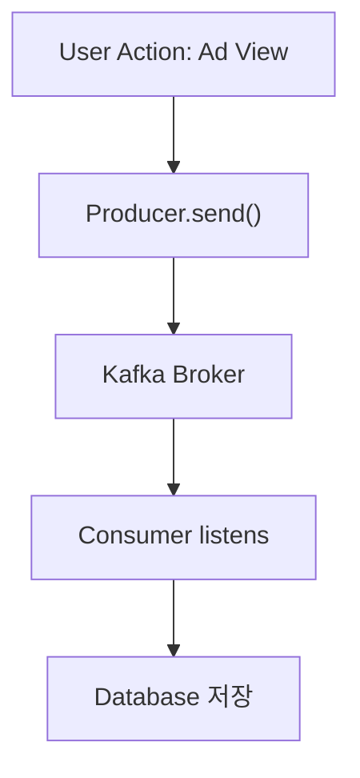

## Kafka 기본 개념
---

### 1. 메시지 큐 vs. 스트리밍 플랫폼

* **메시지 큐 (Message Queue)**

  * **용도**: 생산자(Producer)와 소비자(Consumer) 사이의 일시적 버퍼 역할.
  * **특징**:

    * 메시지를 일대일 혹은 일대다로 전달
    * 소비자가 메시지를 꺼내면 큐에서 사라짐
    * 주로 작업 분산, 비동기 처리에 사용

* **스트리밍 플랫폼 (Streaming Platform)**

  * **용도**: 대용량 실시간 데이터 흐름을 저장하고, 다수의 애플리케이션이 원하는 시점에 데이터를 처리할 수 있도록 지원
  * **특징**:

    * 메시지가 삭제되지 않고 **commit log**(커밋 로그)에 쌓임
    * 각 소비자가 **독립적인 오프셋**을 관리
    * 리플레이(replay) 및 기간 기반 보존(retention) 기능 제공
    * 실시간 스트림 처리(예: Kafka Streams, ksqlDB)와 연계

---

### 2. 핵심 용어 설명

| 용어            | 설명                                                              |
| ------------- | --------------------------------------------------------------- |
| **Topic**     | 메시지를 논리적으로 구분하는 카테고리. 예: `ad-impressions`, `order-events`       |
| **Partition** | 토픽 내 물리적 분할 단위. 파티션마다 별도의 로그가 존재하며 순차적 쓰기/읽기가 가능. 병렬 처리의 기본 단위. |
| **Offset**    | 파티션 내에서 각 메시지의 고유 위치(인덱스). 소비자는 이 오프셋을 기반으로 어디까지 읽었는지 관리.       |

> **배경 지식**
> Kafka는 내부적으로 **분산 커밋 로그**를 구현하여, 데이터를 순차적으로 저장하고 소비자의 읽기 위치(offset)를 관리합니다. 이를 통해 높은 처리량과 내결함성을 동시에 달성할 수 있습니다.

---

### 3. 추가 학습 주제 제안

1. **Producer & Consumer API** (Spring Kafka)
2. **Consumer Group**: 부하 분산 및 장애 허용
3. **Replication & ISR**(In-Sync Replicas)
4. **Retention Policy**: 용량/기간 기반 데이터 보관
5. **Delivery Semantics**: at-least-once, at-most-once, exactly-once
6. **Schema Registry** & Avro/JSON Schema
7. **Kafka Streams / ksqlDB**
8. **모니터링 & 운영**: JMX, 컨슈머 그룹 지연(Lag) 모니터링

---

### 4. 흐름도 (Mermaid)
광고 통계 처리


---

### 5. 예제 코드 (Kotlin)

#### 5.1. As-Is: 동기적 데이터 저장

```kotlin
// 비즈니스 도메인: 광고 노출(Impression) 저장
@Service
class AdService(
    private val adImpressionRepository: AdImpressionRepository
) {
    fun recordImpression(adId: String, userId: String) {
        val impression = AdImpressionEntity(
            adId = adId,
            userId = userId,
            timestamp = Instant.now()
        )
        // 즉시 DB 저장 → 확장성, 장애 시 지연 발생
        adImpressionRepository.save(impression)
    }
}
```

#### 5.2. To-Be: Kafka 기반 비동기 처리

```kotlin
// 메시지 Payload 정의
data class AdImpressionEvent(
    val adId: String,
    val userId: String,
    val timestamp: Instant
)

// 1) Producer: 이벤트 발행
@Service
class AdEventProducer(
    private val kafkaTemplate: KafkaTemplate<String, AdImpressionEvent>
) {
    fun sendImpression(adId: String, userId: String) {
        val event = AdImpressionEvent(adId, userId, Instant.now())
        // "ad-impressions" 토픽, key: adId → 같은 adId끼리 같은 파티션에 쓰임
        kafkaTemplate.send("ad-impressions", adId, event)
    }
}

// 2) Consumer: 이벤트 수신 및 DB 저장
@Service
class AdEventConsumer(
    private val adImpressionRepository: AdImpressionRepository
) {
    @KafkaListener(topics = ["ad-impressions"], groupId = "stats-service")
    fun listen(event: AdImpressionEvent) {
        val entity = AdImpressionEntity(
            adId = event.adId,
            userId = event.userId,
            timestamp = event.timestamp
        )
        adImpressionRepository.save(entity)
    }
}
```

* **장점**

  * **비동기**: Producer와 Consumer가 독립적으로 확장 가능
  * **내결함성**: 브로커 장애 시 재시도, 재플레이 가능
  * **병렬 처리**: 파티션 단위로 Consumer Group 확장

---

### 6. 요약

* **메시지 큐 vs 스트리밍**: 큐는 일시적 버퍼, 스트리밍은 커밋 로그 기반 실시간 플랫폼
* **토픽/파티션/오프셋**: 데이터 분류·병렬 처리·읽기 위치 관리의 핵심 구성 요소
* **예제**: 동기 저장(as-is)에서 Kafka 기반 비동기 처리(to-be)로 전환하여 확장성과 내결함성 확보
* **다음 스텝**: Producer/Consumer API 심화, Consumer Group, 복제, 전송 보증(Delivery Semantics) 등

이제 실제 Kafka 설정과 Spring Kafka 연동 코드를 함께 살펴보면 더욱 실무 감각을 익힐 수 있습니다. 궁금한 부분이 있으면 언제든 알려주세요!
