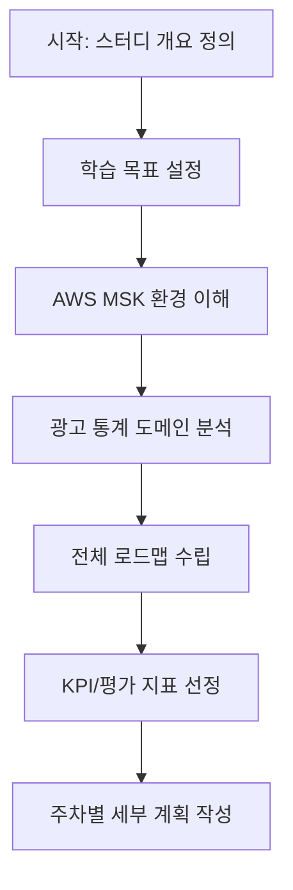

아래는 1일차 “스터디 개요 및 목표 설정” 세션의 구성안입니다.

---

## 1. 정의 및 개념 정리

### 1.1 학습 목표(Learning Objectives)

* **Kafka 이해**: 스트리밍 플랫폼으로서의 Kafka 역할과 장단점 파악
* **Spring Boot 연동 준비**: `spring-kafka` 모듈 기반의 프로듀서/컨슈머 개발 기반 마련
* **운영 환경 숙지**: AWS MSK(Amazon Managed Streaming for Apache Kafka) 아키텍처와 설정
* **도메인 이해**: 광고 통계용 이벤트(클릭·노출·전환) 분석 요구사항 정리
* **성과 측정 지표**: 처리량(Throughput), 지연(Latency), 오류율(Error Rate) 등 KPI 수립

### 1.2 운영 환경(AWS MSK) 개요

* **MSK란?**

  * AWS에서 제공하는 완전관리형 Kafka 서비스
  * 클러스터 프로비저닝, 소프트웨어 패치, 모니터링 자동화
* **주요 구성요소**

  * **Brokers**: Kafka 노드
  * **Zookeeper/KRaft**: 메타데이터 관리
  * **IAM & VPC**: 네트워크·보안
* **설정 포인트**

  * 클러스터 크기(인스턴스 타입·수)
  * 보안(TLS, SASL, IAM 역할)
  * 스케일 아웃 전략

### 1.3 도메인(광고 통계) 개요

* **이벤트 종류**

  * **노출(Impression)**, **클릭(Click)**, **전환(Conversion)**
* **분석 요구사항**

  * 실시간 집계: 분·시간 단위 지표
  * 정확성 보장: 순서 보장, 재처리(idempotence)
  * 확장성: 트래픽 급증 대응

---

## 2. 전체 로드맵 & 평가 지표 수립



* **KPI 예시**

  * 처리량: 초당 메시지 처리량(msg/s) ≥ 10,000
  * 지연: 평균 처리 지연(latency) ≤ 200ms
  * 가용성: 연간 가동 시간 ≥ 99.9%

---

## 3. 추가 제안 학습 주제

1. **Schema Registry**: Avro/Protobuf 기반 스키마 관리
2. **보안 심화**: ACL, 암호화 옵션(SASL\_SSL)
3. **모니터링 파이프라인**: JMX → Micrometer → Prometheus → Grafana
4. **테스트 전략**: `Embedded Kafka 테스트`, 컨슈머 오프셋 리셋
5. **인프라 코드**: Terraform/CloudFormation로 MSK 프로비저닝

---

## 4. 예제 코드 (Kotlin)

비즈니스 도메인: 광고 이벤트 집계 서비스

### 4.1 As-Is: 인메모리 동기 집계

```kotlin
data class AdEvent(val adId: String, val type: EventType, val timestamp: Instant)

enum class EventType { IMPRESSION, CLICK, CONVERSION }

class AdStatisticsService {
    // 단순 동기식 Map 기반 집계
    private val counts = mutableMapOf<String, Int>()

    fun recordEvent(event: AdEvent) {
        val current = counts.getOrDefault(event.adId, 0)
        counts[event.adId] = current + 1
    }

    fun getCount(adId: String): Int =
        counts.getOrDefault(adId, 0)
}
```

### 4.2 To-Be: Spring Kafka 기반 비동기 집계

```kotlin
@Service
class KafkaAdStatisticsService(
    private val kafkaTemplate: KafkaTemplate<String, AdEvent>
) {
    // Kafka로 이벤트 발행
    fun sendEvent(event: AdEvent) =
        kafkaTemplate.send("ad-events", event.adId, event)

    // Kafka 컨슈머: listener 방식
    @KafkaListener(topics = ["ad-events"], groupId = "stats-group")
    fun listen(event: AdEvent) {
        recordEvent(event)
    }

    // 안전한 동시성 처리
    private val counts = ConcurrentHashMap<String, AtomicInteger>()

    private fun recordEvent(event: AdEvent) {
        counts.computeIfAbsent(event.adId) { AtomicInteger(0) }
              .incrementAndGet()
    }

    fun getCount(adId: String): Int =
        counts[adId]?.get() ?: 0
}
```

> **설명**
>
> * As-Is: 단일 인스턴스 Map, 순서 보장·재시도 미지원
> * To-Be: KafkaListener 기반 비동기 처리, 멀티 인스턴스 확장 가능, `ConcurrentHashMap` + `AtomicInteger`로 동시성 안전

---

## 5. 요약

* **학습 목표**: Kafka 개념, Spring 연동, AWS MSK 이해, 광고 통계 요건 정리
* **로드맵**: 4주(20회차), 기초 → 연동 → 튜닝 → 고급 기능
* **KPI**: 처리량, 지연, 가용성 등 주요 지표 수립
* **예제**: As-Is(동기 Map 집계) vs To-Be(KafkaListener 기반 비동기 집계)

이제 다음 세션부터 본격적으로 Kafka 기본 개념과 환경 구축을 시작해 보겠습니다! 😊
