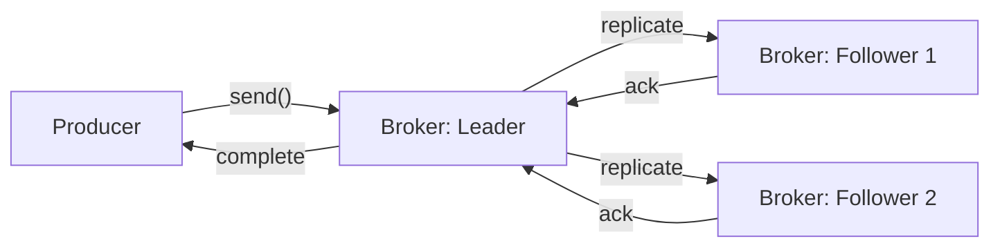
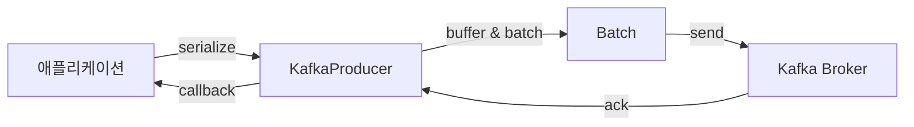

## 1. Kafka 브로커(Broker)

* **정의**
  Kafka 클러스터를 구성하는 서버 단위. 메시지의 `저장·전달`을 책임진다.
* **주요 역할**

  1. **Partition 관리**: 각 토픽의 파티션 데이터를 디스크에 지속화(Persistence)
  2. **Leader 선출**: ZooKeeper(혹은 KRaft)와 협력하여 파티션별 `Leader 결정`
  3. **Replication 중계**: Leader에 저장된 데이터를 `Follower에 복제`

---

## 2. 리더/팔로워 복제(Replication)

* **Leader vs Follower**

  * Leader: 해당 파티션의 쓰기·읽기 요청을 모두 처리
  * Follower: Leader로부터 데이터를 복제(append-only)
* **ISR(In-Sync Replicas)**
  Leader와 데이터 동기화가 완료된 Replica 목록
* **Ack 레벨**

  * `acks=0`: 요청만 받고 리턴
  * `acks=1`: Leader에 저장되면 리턴
  * `acks=all`: ISR 내 모든 Replica에 복제되면 리턴
* **Replication Flow**




---

## 3. 프로듀서(Producer) 동작 원리

1. **직렬화(Serialization)**

   * 키·값을 byte\[]로 변환 (e.g. StringSerializer, JsonSerializer)
2. **파티셔닝(Partitioning)**

   * 키 기반(default), 라운드로빈, 사용자 정의 파티셔너(Custom Partitioner)
3. **버퍼링 및 배칭(Batching)**

   * 메모리 버퍼에 쌓인 메시지를 배치 압축
4. **요청 전송(Request)**

   * `RecordAccumulator` → `Sender` 스레드가 배치를 Broker에 전송
5. **확인(Acknowledgement)**

   * 설정한 `acks` 레벨에 따라 Producer에 콜백



---

## 4. 컨슈머(Consumer) 동작 원리

1. **폴링(Polling)**

   * 주기적으로 `poll()` 호출해 배치 메시지 수신
2. **오프셋 관리(Offset Management)**

   * 자동 커밋(`enable.auto.commit=true`) 또는 수동 커밋
3. **컨슈머 그룹(Consumer Group)**

   * 한 토픽 파티션을 그룹 내 1개 인스턴스가 처리 → 병렬 처리
4. **리밸런싱(Rebalancing)**

   * 멤버 증감 시 파티션 할당 재조정 → `onPartitionsRevoked`/`onPartitionsAssigned`

---

## 5. 추가로 학습할 만한 주제

* **ISR 동기화 트레이드오프**: `min.insync.replicas` 설정
* **Exactly-Once Semantics(EOS)**: 트랜잭셔널 프로듀서
* **Partition Assignment Strategy**: Range vs RoundRobin vs Sticky
* **KRaft 모드**: ZooKeeper 없는 Kafka 컨트롤러
* **Consumer Rebalance 콜백 활용법**: 상태 저장 복구
* **Metrics & 모니터링**: JMX, Cruise Control

---

## 6. 예제 코드 (Kotlin) – 광고 클릭 이벤트 도메인

### 6.1 As-Is: 단순 동기 전송

```kotlin
data class AdClickEvent(val adId: String, val userId: String, val timestamp: Long)

class SimpleProducer {
    private val props = Properties().apply {
        put("bootstrap.servers", "localhost:9092")
        put("key.serializer", StringSerializer::class.java.name)
        put("value.serializer", JsonSerializer::class.java.name)
        put("acks", "all")
    }
    private val producer = KafkaProducer<String, AdClickEvent>(props)

    fun sendClick(event: AdClickEvent) {
        val record = ProducerRecord("ad-clicks", event.adId, event)
        // 동기 전송 (블로킹)
        producer.send(record).get()  
        println("Sent: $event")
    }
}
```

### 6.2 To-Be: Spring Kafka + 비동기 에러 핸들링

```kotlin
@Configuration
class KafkaConfig {
    @Bean
    fun producerFactory(): ProducerFactory<String, AdClickEvent> {
        val props = mapOf(
            ProducerConfig.BOOTSTRAP_SERVERS_CONFIG to "localhost:9092",
            ProducerConfig.KEY_SERIALIZER_CLASS_CONFIG to StringSerializer::class,
            ProducerConfig.VALUE_SERIALIZER_CLASS_CONFIG to JsonSerializer::class
        )
        return DefaultKafkaProducerFactory(props)
    }

    @Bean
    fun kafkaTemplate(): KafkaTemplate<String, AdClickEvent> =
        KafkaTemplate(producerFactory())
}

@Service
class AdClickProducer(private val kafkaTemplate: KafkaTemplate<String, AdClickEvent>) {
    fun sendClick(event: AdClickEvent) {
        kafkaTemplate.send("ad-clicks", event.adId, event)
            .addCallback(
                { recordMetadata ->
                    println("Sent async to partition=${recordMetadata.partition()}, offset=${recordMetadata.offset()}")
                },
                { ex ->
                    // 실패 재시도 or 로깅
                    println("Failed to send $event: ${ex.message}")
                }
            )
    }
}
```

---

## 7. 요약

1. **브로커**는 토픽 파티션 저장·Leader 선출·복제 중계 역할.
2. **Leader/팔로워 복제**를 통해 가용성·내구성 확보하며, ISR과 `acks` 설정으로 데이터 안전성 조절.
3. **프로듀서**는 직렬화→파티셔닝→배칭→전송→확인 순으로 메시지를 전송.
4. **컨슈머**는 `poll()`로 메시지 읽고, 오프셋을 커밋하며, 컨슈머 그룹 단위로 파티션을 분배.
5. **추가 학습**으로 EOS, Partition Assignment, KRaft, 모니터링 등을 추천.
6. **예제 코드**를 통해 단순 동기 전송에서 Spring Kafka 기반 비동기 전송으로 개선하는 패턴을 살펴봤습니다.

오늘 학습하신 내용을 바탕으로, 실제 프로젝트에 적용해 보시면서 ISR 상태 확인, 커밋 전략, 트랜잭션 프로듀서 등을 단계적으로 실습해 보시면 좋겠습니다!
