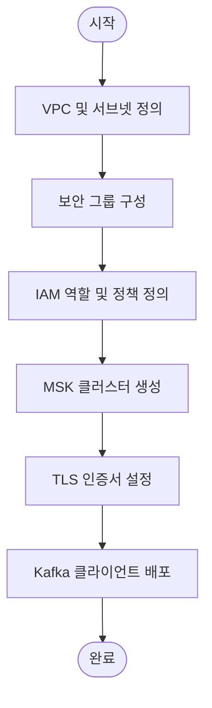

## 1. AWS MSK 개요

* **Managed Streaming for Apache Kafka (MSK)**

  * AWS가 완전 관리형으로 제공하는 Apache Kafka 서비스
  * 사용자는 클러스터 프로비저닝, 패치, 모니터링, 확장 등을 AWS에게 위임 가능
  * 고가용성(여러 AZ 배포), 보안(암호화·인증·ACL), 모니터링(CloudWatch) 기본 제공

* **핵심 개념**

  * **Broker**: 메시지를 저장·전달하는 서버 인스턴스
  * **Topic & Partition**: 메시지 논리적 그룹 → 분산 저장 단위
  * **Zookeeper**: 메타데이터 관리 (MSK Serverless 사용 시 AWS가 내부 관리)
  * **Provisioned vs. Serverless**: 용량 고정형 vs. 자동 확장형

## 2. 주요 설정 항목

### 2.1 MSK 클러스터 생성

* **Configurations**:

  * 브로커 수, 인스턴스 유형, 스토리지(I/O 성능)
  * 자동 확장(Provisioned) or 서버리스(Serverless)
* **과정**:

  1. AWS 콘솔/CLI에서 `create-cluster` 호출
  2. 클러스터 이름, Kafka 버전, Broker 인스턴스 타입 지정

### 2.2 VPC 및 서브넷 구성

* **이유**: 네트워크 격리, 사설 서브넷에서만 접근 허용
* **구성**:

  * 최소 2개 이상의 AZ에 걸쳐 각각 사설 서브넷 2개 이상
  * 라우팅 테이블에 인터넷 게이트웨이 대신 NAT 게이트웨이 또는 VPC 엔드포인트

### 2.3 보안 그룹(Security Group)

* **역할**: 인바운드/아웃바운드 트래픽 제어
* **설정 예시**:

  * 인바운드: Kafka 포트 `9092`, TLS 포트 `9094` 허용 (MSK 브로커 → 클라이언트)
  * 출처: 애플리케이션이 위치한 EC2/ENI 보안 그룹 ID

### 2.4 IAM 권한

* **관리 작업**: 클러스터 생성·삭제 등은 `AmazonMSKFullAccess` 또는 최소 권한 정책
* **브로커 접근 제어**:

  * MSK IAM 인증(SCRAM-SHA, IAM) 사용 시
  * Client IAM 역할에 `kafka-cluster:Connect` 권한 부여

### 2.5 TLS 설정

* **암호화 in-transit**: TLS 1.2+ 필수
* **인증 방법**:

  * **서버 인증서**: AWS Certificate Manager(ACM)에서 발급
  * **클라이언트 인증서**(Mutual TLS): 자체 CA로 서명된 클라이언트 인증서 사용
* **Java 설정** (예)

  ```properties
  security.protocol=SSL
  ssl.truststore.location=/path/to/truststore.jks
  ssl.truststore.password=changeit
  ssl.keystore.location=/path/to/keystore.jks
  ssl.keystore.password=changeit
  ```

---

## 3. 추가 학습 추천 주제

* **모니터링 & 로깅**: CloudWatch, Prometheus + Grafana 연동
* **스키마 레지스트리**: Confluent Schema Registry를 통한 Avro/JSON 스키마 관리
* **Kafka ACL**: 토픽·그룹별 권한 제어
* **MSK Connect**: 데이터베이스/데이터 웨어하우스로 연동
* **테마파티션 설계 & 리텐션 정책**: 파티션 수, 데이터 보존 기간 튜닝

---

## 4. 흐름도 (Mermaid)



---

## 5. 예제 코드 (Kotlin)

### As-Is: 순수 Kafka 클라이언트 직접 사용

```kotlin
data class AdEvent(val adId: String, val timestamp: Long, val impressions: Int)

// 프로듀서 설정
val props = Properties().apply {
    put("bootstrap.servers", "b-1.msk-cluster:9094")
    put("security.protocol", "SSL")
    put("ssl.truststore.location", "/etc/ssl/truststore.jks")
    put("ssl.truststore.password", "changeit")
    put("key.serializer", StringSerializer::class.java.name)
    put("value.serializer", JsonSerializer::class.java.name)
}
val producer = KafkaProducer<String, AdEvent>(props)

// 메시지 전송
val event = AdEvent("AD123", System.currentTimeMillis(), 1000)
val record = ProducerRecord("ad-events", event.adId, event)
producer.send(record).get()
producer.close()
```

### To-Be: Spring Kafka + 도메인 서비스 활용

```kotlin
@Service
class AdEventPublisher(
    private val kafkaTemplate: KafkaTemplate<String, AdEvent>
) {
    fun publish(event: AdEvent) {
        kafkaTemplate.send("ad-events", event.adId, event)
            .addCallback(
                { result -> log.info("Sent: ${event.adId} to ${result?.producerRecord()?.topic()}") },
                { ex -> log.error("Failed to send ${event.adId}", ex) }
            )
    }
}

@RestController
@RequestMapping("/ads")
class AdController(private val publisher: AdEventPublisher) {
    @PostMapping("/{adId}/impression")
    fun recordImpression(@PathVariable adId: String): ResponseEntity<String> {
        val event = AdEvent(adId, System.currentTimeMillis(), 1)
        publisher.publish(event)
        return ResponseEntity.ok("Impression recorded for $adId")
    }
}
```

* **장점**: 의존성 주입, 오류 처리, 비즈니스 레이어 분리, 테스트 용이성

---

## 6. 요약

* **MSK**: 완전 관리형 Kafka 서비스, 고가용성·보안·모니터링 기본 제공
* **네트워크**: VPC 내 사설 서브넷, 보안 그룹으로 접근 제어
* **권한**: IAM으로 관리 작업·클러스터 접근 권한 설정
* **TLS**: 암호화 in-transit, 서버·클라이언트 인증서 구성
* **추가**: 모니터링, 스키마 레지스트리, ACL, Connect 등 확장 학습

