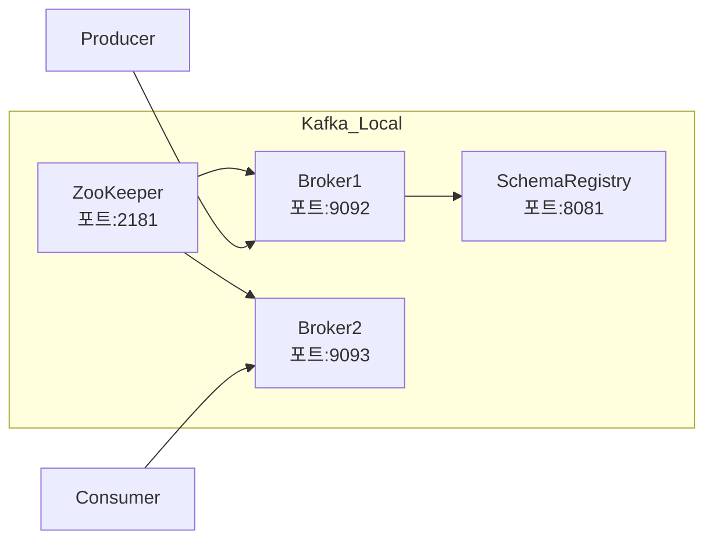

## 5일차: 로컬 개발 환경 구축

### 1. 학습 목표 및 추가 제안

* **Docker Compose**를 이용해 Kafka를 단일 모드 및 클러스터 모드로 실행
* **Schema Registry**와 **Zookeeper**(또는 **KRaft**)를 포함한 간단 데모
* **추가 학습 제안**

    * KRaft 모드(Kafka Raft Metadata)로 ZooKeeper 없이 실행하기
    * TLS/SSL 및 SASL을 통한 보안 설정
    * Kafka Connect나 JMX를 이용한 모니터링

---

### 2. 핵심 개념 및 배경 지식

#### 2.1 Docker Compose

* **정의**: 여러 개의 컨테이너 서비스를 하나의 `docker-compose.yml` 파일로 정의하고 동시에 띄우는 도구
* **구성 요소**

    * `services`: 컨테이너별 이미지, 환경변수, 포트, 의존성
    * `networks`/`volumes`: 네트워크 격리 및 데이터 지속화
* **동작**:

    1. `docker-compose up` → CLI가 Docker Engine API 호출
    2. 각 서비스별 컨테이너 생성 → 네트워크/볼륨 연결 → 컨테이너 시작

#### 2.2 Kafka 단일 모드 vs 클러스터 모드

* **단일 모드**:

    * Broker 하나만 띄워 개발·테스트 용도
    * 설정이 단순, 오프셋 토픽 복제 인수=1
* **클러스터 모드**:

    * Broker 여러 대 구성 → 파티션 복제, 리더·팔로워 분리
    * 고가용성·확장성 확보

#### 2.3 Zookeeper vs KRaft

|          | ZooKeeper 기반         | KRaft 모드             |
| -------- | -------------------- | -------------------- |
| 메타데이터 관리 | 외부 ZooKeeper 클러스터 필요 | Kafka 내장 컨트롤러 사용     |
| 설정 복잡도   | ZooKeeper 별도 관리 필요   | 단일 프로세스로 단순화         |
| Kafka 버전 | 모든 버전 지원             | Kafka 3.3 이상에서 사용 가능 |

#### 2.4 Schema Registry

* **역할**: Avro/JSON/Protobuf 스키마를 중앙 저장소에 보관 → Producer/Consumer간 스키마 호환성 관리
* **주요 기능**

    * 스키마 버전 관리
    * 호환성(Compatibility) 모드 설정 (BACKWARD, FORWARD 등)
    * HTTP REST API 제공

---

### 3. Docker Compose 예제 (`docker-compose.yml`)

```yaml
version: "3.8"
services:
  zookeeper:
    image: confluentinc/cp-zookeeper:8.1.0
    container_name: zookeeper
    ports:
      - "2181:2181"
    environment:
      ZOOKEEPER_CLIENT_PORT: 2181
      ZOOKEEPER_TICK_TIME: 2000

  kafka:
    image: confluentinc/cp-kafka:8.1.0
    container_name: kafka-broker
    depends_on:
      - zookeeper
    ports:
      - "9092:9092"
    environment:
      KAFKA_BROKER_ID: 1
      KAFKA_ZOOKEEPER_CONNECT: "zookeeper:2181"
      KAFKA_ADVERTISED_LISTENERS: PLAINTEXT://broker:9092,PLAINTEXT_HOST://localhost:9092
      KAFKA_LISTENER_SECURITY_PROTOCOL_MAP: PLAINTEXT:PLAINTEXT,PLAINTEXT_HOST:PLAINTEXT
      KAFKA_OFFSETS_TOPIC_REPLICATION_FACTOR: 1

  schema-registry:
    image: confluentinc/cp-schema-registry:8.1.0
    container_name: schema-registry
    depends_on:
      - zookeeper
      - kafka
    ports:
      - "8081:8081"
    environment:
      SCHEMA_REGISTRY_HOST_NAME: schema-registry
      SCHEMA_REGISTRY_KAFKASTORE_CONNECTION_URL: "zookeeper:2181"
      SCHEMA_REGISTRY_LISTENERS: "http://0.0.0.0:8081"

networks:
  default:
    name: kafka-network
```

* **클러스터 모드 확장**: `kafka2`, `kafka3` 서비스를 추가하고 `KAFKA_BROKER_ID`, `KAFKA_OFFSETS_TOPIC_REPLICATION_FACTOR`, `KAFKA_ZOOKEEPER_CONNECT` 등을 조정

---

### 4. 전체 아키텍처 흐름도 (Mermaid)



---

### 5. 예제 코드 (Kotlin + Spring Kafka)

#### 도메인: 광고 통계 이벤트 (`ImpressionEvent`)

```kotlin
data class ImpressionEvent(
    val adId: String,
    val mediaId: String,
    val timestamp: Long,
    val impressions: Int
)
```

#### 5.1 As-Is (String 직렬화)

```kotlin
@Service
class ImpressionProducer(
    private val kafkaTemplate: KafkaTemplate<String, String>
) {
    fun send(event: ImpressionEvent) {
        val payload = listOf(
            event.adId,
            event.mediaId,
            event.timestamp,
            event.impressions
        ).joinToString(",")
        kafkaTemplate.send("impression-topic", payload)
    }
}
```

#### 5.2 To-Be (Avro + Schema Registry)

1. **Avro 스키마** (`src/main/avro/ImpressionEvent.avsc`)

   ```json
   {
     "namespace": "com.example.kafka.avro",
     "type": "record",
     "name": "ImpressionEvent",
     "fields": [
       {"name": "adId", "type": "string"},
       {"name": "mediaId", "type": "string"},
       {"name": "timestamp", "type": "long"},
       {"name": "impressions", "type": "int"}
     ]
   }
   ```
2. **Spring 설정** (`application.yml`)

   ```yaml
   spring:
     kafka:
       bootstrap-servers: localhost:9092
       producer:
         key-serializer: io.confluent.kafka.serializers.KafkaAvroSerializer
         value-serializer: io.confluent.kafka.serializers.KafkaAvroSerializer
         properties:
           schema.registry.url: http://localhost:8081
       consumer:
         key-deserializer: io.confluent.kafka.serializers.KafkaAvroDeserializer
         value-deserializer: io.confluent.kafka.serializers.KafkaAvroDeserializer
         properties:
           schema.registry.url: http://localhost:8081
         group-id: impression-group
   ```
3. **Producer**

   ```kotlin
   @Service
   class AvroImpressionProducer(
       private val kafkaTemplate: KafkaTemplate<String, ImpressionEvent>
   ) {
       fun send(event: ImpressionEvent) {
           kafkaTemplate.send("impression-topic-avro", event.adId, event)
       }
   }
   ```
4. **Consumer**

   ```kotlin
   @Service
   class AvroImpressionConsumer {
       @KafkaListener(topics = ["impression-topic-avro"])
       fun listen(event: ImpressionEvent) {
           // 비즈니스 로직: 예를 들어 DB 저장 또는 통계 집계
           println("Received Avro event: $event")
       }
   }
   ```

---

### 6. 요약

1. **Docker Compose**로 Kafka 단일/클러스터 모드, ZooKeeper/KRaft 이해
2. **Schema Registry** 설정 및 Avro 스키마 관리
3. **Kotlin** Spring Kafka 예제(as-is/to-be)를 통해 스키마 기반 직렬화 적용
4. 추가로 보안 설정, 모니터링, KRaft 모드 실행 등을 학습하면 실전 환경으로 확대 가능

