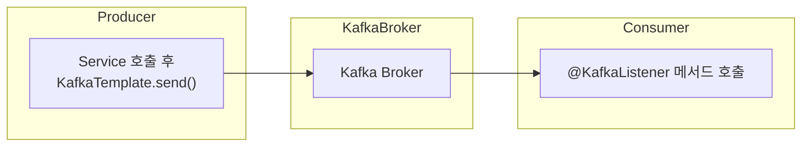

## 학습 목표

* `spring-kafka` 의존성 구조와 주요 프로퍼티 이해
* 메시지 발행을 담당하는 `KafkaTemplate` 개념 파악
* 메시지 수신을 담당하는 `@KafkaListener` 개념 및 내부 동작 원리 이해

---

## 1. `spring-kafka` 의존성 및 내부 구조

### 1.1 의존성

* Gradle
```kotlin
dependencies {
  implementation("org.springframework.kafka:spring-kafka")
  // Spring Boot 사용 시
  implementation("org.springframework.boot:spring-boot-starter")
}
```
* Maven

```xml
<dependency>
<groupId>org.springframework.kafka</groupId>
<artifactId>spring-kafka</artifactId>
<version>2.9.0</version>
</dependency>
```

> **구성 요소**
>
> * **spring-kafka**: Spring 추상화 + Kafka 클라이언트 래퍼
> * **kafka-clients**: 실제 Kafka 프로듀서/컨슈머 로직

### 1.2 주요 내부 빈(Auto-Configuration)

* `KafkaAutoConfiguration`

    * `ProducerFactory<K, V>` → `KafkaTemplate<K, V>`
    * `ConsumerFactory<K, V>` → `ConcurrentKafkaListenerContainerFactory<K, V>`

```java
// (spring-kafka 내부, 의사 코드)
@Bean
fun kafkaTemplate(pf: ProducerFactory<String, String>): KafkaTemplate<String, String> =
    KafkaTemplate(pf)

@Bean
fun kafkaListenerContainerFactory(cf: ConsumerFactory<String, String>): ConcurrentKafkaListenerContainerFactory<String, String> {
    val factory = ConcurrentKafkaListenerContainerFactory<String, String>()
    factory.consumerFactory = cf
    return factory
}
```

---

## 2. 주요 프로퍼티

| 프로퍼티 키                                     | 설명                 | 기본값 / 예시                                                        |
| ------------------------------------------ | ------------------ | --------------------------------------------------------------- |
| `spring.kafka.bootstrap-servers`           | Kafka 브로커 주소       | `localhost:9092`                                                |
| `spring.kafka.producer.key-serializer`     | 프로듀서 Key 직렬화 클래스   | `org.apache.kafka.common.serialization.StringSerializer`        |
| `spring.kafka.producer.value-serializer`   | 프로듀서 Value 직렬화 클래스 | `org.springframework.kafka.support.serializer.JsonSerializer`   |
| `spring.kafka.consumer.key-deserializer`   | 컨슈머 Key 역직렬화 클래스   | `org.apache.kafka.common.serialization.StringDeserializer`      |
| `spring.kafka.consumer.value-deserializer` | 컨슈머 Value 역직렬화 클래스 | `org.springframework.kafka.support.serializer.JsonDeserializer` |
| `spring.kafka.consumer.group-id`           | 컨슈머 그룹 ID          | `group1`                                                        |
| `spring.kafka.consumer.auto-offset-reset`  | 오프셋 리셋 정책          | `earliest` / `latest`                                           |
| `spring.kafka.listener.concurrency`        | 리스너 병렬 소비 스레드 수    | `3`                                                             |
| `spring.kafka.listener.ack-mode`           | 오프셋 커밋 방식          | `RECORD` / `BATCH` / `MANUAL`                                   |


## 3. `KafkaTemplate` 개념 및 동작 원리

* **역할**: Kafka로 메시지를 발행(publish)
* **주요 메서드**:

```kotlin
fun send(topic: String, data: V): ListenableFuture<SendResult<K, V>>
```
* **내부 흐름**:

1. `KafkaTemplate.send()` 호출
2. `ProducerFactory.createProducer()`로 프로듀서 인스턴스 획득
3. Kafka 클러스터로 메시지 전송 (비동기)
4. `ListenableFuture`로 전송 결과 리스닝

---

## 4. `@KafkaListener` 개념 및 동작 원리

* **역할**: 특정 토픽의 메시지를 수신하여 메서드로 전달
* **어노테이션 속성**:

  * `topics`: 구독할 토픽 목록
  * `groupId`: 컨슈머 그룹
  * `containerFactory`: 사용할 컨테이너 팩토리 빈
* **내부 흐름**:

  1. 애플리케이션 시작 시 `KafkaListenerAnnotationBeanPostProcessor` 탐지
  2. 각 `@KafkaListener`에 대해 `MessageListenerContainer` 생성
  3. 컨테이너가 토픽을 구독하고, 메시지 수신 시 해당 메서드 호출

---

## 5. 학습 흐름도 (Mermaid)



---

## 6. 도메인 예제 코드 (Kotlin)

### 6.1 As-Is (동기 저장 방식)

```kotlin
data class AdClickDto(val adId: String, val userId: String, val timestamp: Long)

@Service
class AdService(private val adRepository: AdRepository) {
    fun recordClick(dto: AdClickDto) {
        // 동기 DB 저장
        adRepository.save(AdClick(
            adId = dto.adId,
            userId = dto.userId,
            clickedAt = Instant.ofEpochMilli(dto.timestamp)
        ))
    }
}
```

### 6.2 To-Be (Kafka 기반 비동기 처리)

```kotlin
data class AdClickEvent(val adId: String, val userId: String, val clickedAt: Instant)

@Service
class AdService(private val kafkaTemplate: KafkaTemplate<String, AdClickEvent>) {
    fun recordClick(dto: AdClickDto) {
        val event = AdClickEvent(
            adId = dto.adId,
            userId = dto.userId,
            clickedAt = Instant.ofEpochMilli(dto.timestamp)
        )
        kafkaTemplate.send("ad-click-topic", event)
            .addCallback(
                { result -> log.info("전송 성공: $result") },
                { ex -> log.error("전송 실패", ex) }
            )
    }
}

@Component
class AdClickListener(
    private val adRepository: AdRepository
) {
    @KafkaListener(topics = ["ad-click-topic"], groupId = "ad-group")
    fun listen(event: AdClickEvent) {
        // 비즈니스 로직 처리
        adRepository.save(AdClick(
            adId = event.adId,
            userId = event.userId,
            clickedAt = event.clickedAt
        ))
    }
}
```

---

## 7. 추가 학습 제안

* **트랜잭션 처리**: `ChainedKafkaTransactionManager`
* **에러 핸들링 & 재시도**: `SeekToCurrentErrorHandler`, DLQ 설정
* **테스트 지원**: Embedded Kafka, `@EmbeddedKafka`
* **스키마 관리**: Avro/JSON Schema Registry 연동
* **메트릭 & 모니터링**: Micrometer 연동

---

## 8. 요약 정리

1. **의존성**: `spring-kafka` + `kafka-clients`
2. **Auto-Config**: `KafkaTemplate`, `MessageListenerContainer` 빈 자동 등록
3. **주요 프로퍼티**: 브로커 주소, 직렬화/역직렬화, 그룹 ID, 병렬 스레드, ACK 모드
4. **KafkaTemplate**: 메시지 발행 → `ProducerFactory` → 비동기 전송
5. **@KafkaListener**: 메시지 수신 → 컨테이너 → 리스너 메서드 호출
6. **도메인 적용**: 광고 클릭 이벤트를 Kafka로 발행 후 별도 컨슈머에서 DB 저장