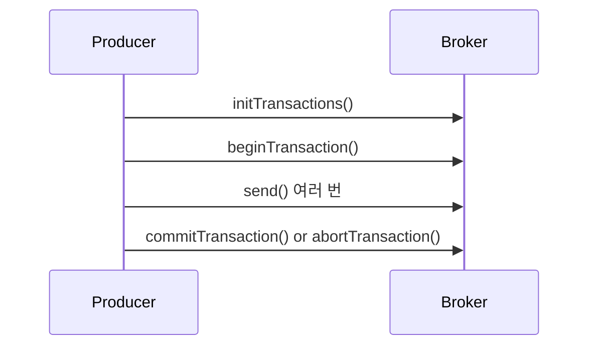
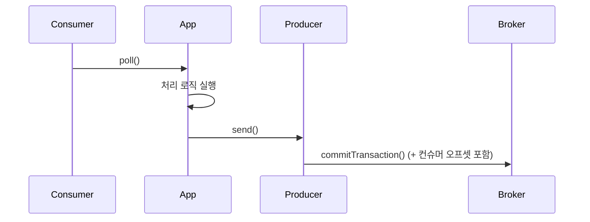

# 📘 제8장 — 정확히 한 번 전달 (Exactly Once Semantics, EOS)

---

## 🧩 8.1 메시지 전송 보장 (Delivery Semantics)

| 유형                | 설명                   | 문제점            |
| ----------------- | -------------------- | -------------- |
| **At most once**  | 최대 한 번 — 중복 X, 유실 가능 | 신뢰성 낮음         |
| **At least once** | 최소 한 번 — 유실 X, 중복 가능 | 대부분 기본값        |
| **Exactly once**  | 정확히 한 번              | 구현 복잡, 카프카가 해결 |

Kafka는 0.11 버전부터 **프로듀서·컨슈머·브로커 수준의 조합**으로 EOS를 보장함.

---

## ⚙️ 8.2 중복 문제의 원인

### 📍 1. 프로듀서 재시도

* 전송 도중 ACK 미수신 → 재전송 발생
* 브로커는 동일 메시지를 다시 수신 → 중복 기록 가능

### 📍 2. 컨슈머 재처리

* 오프셋 커밋 전에 장애 발생 → 동일 데이터 재처리

---

### 🧠 해결 원리

1. **프로듀서 멱등성 (Idempotence)**
2. **트랜잭션 프로듀서 + 컨슈머**
3. **읽고 쓰기(Read-Process-Write) 시 트랜잭션 유지**

---

## 🔁 8.3 프로듀서 멱등성 (Idempotent Producer)

### 📍 개념

> 동일 메시지를 여러 번 전송해도 브로커는 단 한 번만 기록.

### 💡 동작 방식

* 각 프로듀서 인스턴스는 `PID`(Producer ID)를 가짐.
* 각 파티션별로 `sequence number`를 관리.
* 브로커는 (PID, Partition, SeqNo) 조합으로 중복 감지.

| 설정                                      | 값      | 설명      |
| --------------------------------------- | ------ | ------- |
| `enable.idempotence`                    | `true` | 멱등성 활성화 |
| `acks`                                  | `all`  | 필수 조합   |
| `max.in.flight.requests.per.connection` | ≤ 5    | 순서 보장   |

> ⚠️ PID는 프로듀서 재시작 시 변경됨 → 재시작 간에는 EOS 불가.
> 트랜잭션 API로만 세션을 이어갈 수 있음.

---

### 🚀 예제 (Kotlin)

```kotlin
val props = Properties().apply {
    put("bootstrap.servers", "localhost:9092")
    put("enable.idempotence", "true")
    put("acks", "all")
    put("max.in.flight.requests.per.connection", "5")
    put("key.serializer", "org.apache.kafka.common.serialization.StringSerializer")
    put("value.serializer", "org.apache.kafka.common.serialization.StringSerializer")
}
val producer = KafkaProducer<String, String>(props)
producer.send(ProducerRecord("payments", "order-001", "paid"))
```

> 💬 **결과:** 동일 메시지 전송 시에도 Kafka는 중복 기록하지 않음.

---

## 🧮 8.4 트랜잭션 프로듀서 (Transactional Producer)

Kafka는 단일 프로듀서 세션 내에서 여러 토픽·파티션에 걸친 메시지를
**트랜잭션 단위로 원자적(atomic)으로 기록** 가능.

---

### ⚙️ 설정

| 설정                       | 설명                    |
| ------------------------ | --------------------- |
| `transactional.id`       | 트랜잭션 식별자 (프로듀서 세션 고유) |
| `enable.idempotence`     | 자동 활성화됨               |
| `acks=all`               | 필수                    |
| `transaction.timeout.ms` | 트랜잭션 만료시간 (기본 1분)     |

---

### 🔄 트랜잭션 처리 흐름



* `commitTransaction()` → 모든 메시지 원자적 커밋
* `abortTransaction()` → 전체 롤백

---

### 🚀 예제 (Kotlin)

```kotlin
val props = Properties().apply {
    put("bootstrap.servers", "localhost:9092")
    put("transactional.id", "payment-tx-1")
    put("key.serializer", "org.apache.kafka.common.serialization.StringSerializer")
    put("value.serializer", "org.apache.kafka.common.serialization.StringSerializer")
}
val producer = KafkaProducer<String, String>(props)
producer.initTransactions()

try {
    producer.beginTransaction()
    producer.send(ProducerRecord("orders", "order-001", "confirmed"))
    producer.send(ProducerRecord("payments", "order-001", "paid"))
    producer.commitTransaction()
} catch (e: Exception) {
    producer.abortTransaction()
}
```

> 💬 **결과:** 두 토픽 모두 성공 또는 둘 다 실패 (원자성 보장)

---

## 🔄 8.5 트랜잭션 컨슈머 (Transactional Consumer)

### 📍 개념

> 트랜잭션 프로듀서가 보낸 메시지 중 “커밋된 것만” 읽도록 보장.

| 설정                | 설명                                    |
| ----------------- | ------------------------------------- |
| `isolation.level` | `read_committed` / `read_uncommitted` |
| 기본값               | `read_uncommitted` (모든 메시지 읽음)        |

> 💡 `read_committed` 로 설정 시:
>
> * `commitTransaction()` 된 메시지만 읽음
> * `abortTransaction()` 된 메시지는 무시

---

### 🚀 예제

```kotlin
val props = Properties().apply {
    put("bootstrap.servers", "localhost:9092")
    put("group.id", "payment-processor")
    put("isolation.level", "read_committed")
    put("key.deserializer", "org.apache.kafka.common.serialization.StringDeserializer")
    put("value.deserializer", "org.apache.kafka.common.serialization.StringDeserializer")
}
val consumer = KafkaConsumer<String, String>(props)
consumer.subscribe(listOf("payments"))
```

---

## 🔁 8.6 읽고 쓰기 트랜잭션 (Consume → Process → Produce)

Kafka는 “컨슈머 + 프로듀서”의 트랜잭션 결합으로
**Exactly Once Processing (EOP)**을 완성함.

---

### 🔄 프로세스 흐름



> 컨슈머 오프셋 커밋도 트랜잭션 내에 포함 가능!
> → **“이 메시지는 처리 완료”가 완벽히 일관성 있게 반영**

---

### 🚀 예제 (Kotlin)

```kotlin
producer.initTransactions()
while (true) {
    val records = consumer.poll(Duration.ofMillis(100))
    producer.beginTransaction()
    for (record in records) {
        val output = process(record.value()) // 가공 로직
        producer.send(ProducerRecord("processed", record.key(), output))
    }
    producer.sendOffsetsToTransaction(
        consumer.assignment().associateWith { tp ->
            OffsetAndMetadata(consumer.position(tp))
        },
        consumer.groupMetadata()
    )
    producer.commitTransaction()
}
```

> 💬 **결과:**
>
> * 메시지 중복, 유실 없이 처리
> * 컨슈머 오프셋도 일관되게 커밋

---

## 🔐 8.7 제약사항 및 트레이드오프

| 항목         | 설명                                     |
| ---------- | -------------------------------------- |
| 트랜잭션 유지 시간 | `transaction.timeout.ms` 초과 시 자동 abort |
| 성능         | 추가 로그 기록 → 지연 약간 증가                    |
| 호환성        | Kafka 0.11 이상 필요                       |
| 운영 난이도     | transactional.id 충돌, timeout 관리 필요     |

> 💡 트랜잭션은 “모든 문제의 해답”이 아님 —
> 대부분의 파이프라인은 멱등성 + 재시도 로직만으로 충분함.

---

## 🧭 전체 요약표

| 섹션      | 핵심 주제                | 요약                         |
| ------- | -------------------- | -------------------------- |
| **8.1** | 전달 보장 모델             | at most/least/exactly once |
| **8.2** | 중복 원인                | 재시도, 커밋 순서 문제              |
| **8.3** | 멱등성 프로듀서             | PID + SeqNo로 중복 제거         |
| **8.4** | 트랜잭션 프로듀서            | 원자적 commit/abort 지원        |
| **8.5** | 트랜잭션 컨슈머             | read_committed로 필터링        |
| **8.6** | Consume-Produce 트랜잭션 | 완전한 Exactly Once 처리        |
| **8.7** | 제약사항                 | 성능·운영 복잡성 고려 필요            |

---

## 💡 내 생각 (ChatGPT 첨언)

> Kafka의 EOS는 DB 트랜잭션과 달리 “분산 스트림에서의 원자성 보장”이라는 점이 핵심입니다.
> 실제 운영에서는 **idempotent + retries + DLQ + offset commit**으로 충분한 경우가 많고,
> EOS는 **정확히 한 번만 필요한 고가용 데이터 파이프라인(결제, 로그 집계 등)** 에서만 활성화하는 것이 좋습니다.

---

## 📚 참고 링크

* [KIP-98: Exactly Once Semantics](https://cwiki.apache.org/confluence/display/KAFKA/KIP-98)
* [Confluent Blog: Transactions in Apache Kafka](https://www.confluent.io/blog/transactions-apache-kafka/)
* [Kafka Docs: Transactions and Idempotence](https://kafka.apache.org/documentation/#producerconfigs_enable.idempotence)

