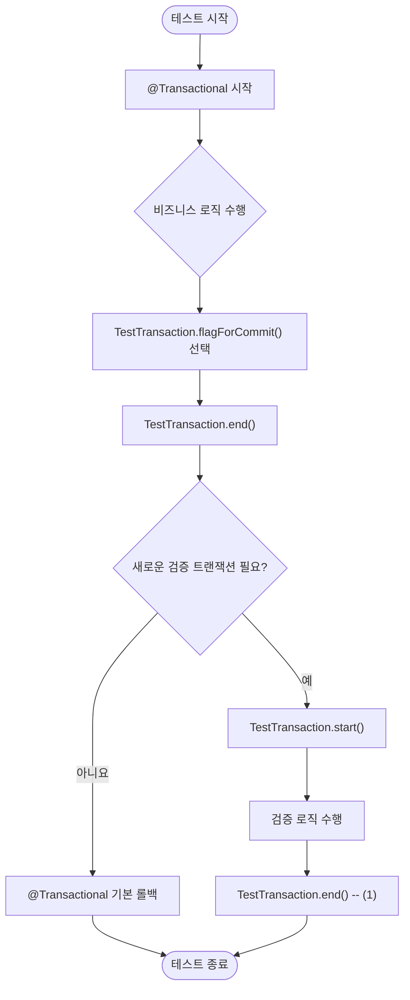

아래는 Spring 기반의 트랜잭션 테스트 전략에 대한 11일차 학습 자료입니다.

---

## 1. 정의 및 개념

### Spring TestContext와 트랜잭션

* **TestContext**
  `@SpringBootTest`, `@WebMvcTest` 등으로 생성된 테스트 컨텍스트를 관리하는 프레임워크
* **TransactionalTestExecutionListener**
  각 테스트 메서드 실행 전후에 트랜잭션을 시작하고(또는 종료) 롤백하도록 하는 리스너
* **기본 동작**

    1. 테스트 메서드 시작 전 트랜잭션 시작
    2. 테스트 메서드 종료 시 자동으로 롤백
    3. 데이터 정합성을 유지하며 각 테스트를 독립적으로 실행

### 왜 트랜잭션 테스트가 필요한가?

* 테스트 간 데이터 오염 방지
* 반복 실행 시 DB 상태를 깔끔하게 유지
* 비즈니스 로직의 트랜잭션 경계 검증

---

## 2. `@Transactional` 테스트

### 사용 방법

```kotlin
@SpringBootTest
@Transactional  // 클래스 또는 메서드 단위로 지정
class YourServiceTest { … }
```

* **기본 동작**: 각 테스트 메서드가 끝나면 자동 롤백
* **장점**

    * 수작업 DB 클린업 불필요
    * 테스트 독립성 보장
* **단점**

    * 트랜잭션 경계 외부의 로직(예: 비동기, 별도 DataSource)은 검증 불가
    * 커밋이 필요한 검증 시 `TestTransaction` API 사용

---

## 3. `TestTransaction` API 활용

`org.springframework.test.context.transaction.TestTransaction`을 통해

* **명시적 커밋**
* **부분 롤백**
* **트랜잭션 경계 전환**

```kotlin
// 트랜잭션 분리: 테스트 메서드 내에서 직접 트랜잭션 제어
TestTransaction.flagForCommit()  // 이 테스트 메서드는 커밋  
TestTransaction.end()            // 현재 트랜잭션 종료

TestTransaction.start()          // 새로운 트랜잭션 시작
// … 검증 로직 …
TestTransaction.end()
```

---

## 4. 추가 학습 제안

* **@Commit / @Rollback**: 테스트 단위로 롤백 여부 지정
* **Propagation / Isolation Level 테스트**: 다양한 전파·격리 속성 검증
* **DBUnit, Testcontainers**: 외부 DB와 연동된 통합 테스트
* **TransactionSynchronizationManager** 내부 동작 분석

---

## 5. 트랜잭션 테스트 흐름 (Mermaid)




### (1) TestTransaction.end 내부 동작
커밋 플래그가 설정되어 있다면 (`TestTransaction.flagForCommit()` 호출) -> 현재 트랜잭션을 `커밋`
2. 커밋 플래그가 없다면 -> 현재 트랜잭션을 `롤백`


---

## 6. 예제 코드 (Kotlin, as-is → to-be)

### 6.1. 도메인: `Order`

```kotlin
@Entity
data class Order(
    @Id @GeneratedValue
    val id: Long? = null,
    val itemName: String,
    val quantity: Int
)
```

### 6.2. 서비스 & 리포지토리

```kotlin
@Service
class OrderService(private val repo: OrderRepository) {
  fun placeOrder(order: Order): Order = repo.save(order)
}
```

```kotlin
interface OrderRepository : JpaRepository<Order, Long>
```

---

### 6.3. As-Is: 수동 클린업 방식

```kotlin
@SpringBootTest
class OrderServiceTest {
  @Autowired lateinit var svc: OrderService
  @Autowired lateinit var repo: OrderRepository

  @BeforeEach
  fun cleanup() {
    repo.deleteAll()
  }

  @Test
  fun `주문 저장 후 조회`() {
    // given
    val order = Order(itemName = "Book", quantity = 1)

    // when
    svc.placeOrder(order)

    // then
    val all = repo.findAll()
    assertThat(all).hasSize(1)
  }
}
```

---

### 6.4. To-Be: `@Transactional` + `TestTransaction`

```kotlin
@SpringBootTest
@Transactional
class OrderServiceTransactionalTest {
  @Autowired lateinit var svc: OrderService
  @Autowired lateinit var repo: OrderRepository

  @Test
  fun `기본 롤백 확인`() {
    // given
    svc.placeOrder(Order(itemName = "Pen", quantity = 2))

    // then
    assertThat(repo.findAll()).hasSize(1)
    // 테스트 완료 후 자동 롤백 → DB는 빈 상태 유지
  }

  @Test
  fun `명시적 커밋 후 검증`() {
    // given
    svc.placeOrder(Order(itemName = "Notebook", quantity = 3))

    // 명시적 커밋
    TestTransaction.flagForCommit()
    TestTransaction.end()            // 현재 트랜잭션 커밋

    // 새로운 트랜잭션에서 검증
    TestTransaction.start()
    val all = repo.findAll()
    assertThat(all).hasSize(1)
    TestTransaction.end()            // 검증용 트랜잭션 롤백
  }
}
```

---

## 7. 요약

1. **`@Transactional` 테스트**: 자동 롤백으로 클린 DB 유지
2. **`TestTransaction` API**: 테스트 중간에 커밋/롤백 제어
3. **추가 학습**: 격리 수준, 전파 속성, 외부 DB 연동 테스트
4. **실습 예제**: as-is(수동 클린업) → to-be(자동 롤백 + 명시 커밋)

위 흐름대로 직접 코드를 실행해 보시고, Spring TestContext의 내부 구현(`TransactionalTestExecutionListener`, `TestContextTransactionUtils`)을 살펴보시면 더 깊은 이해가 가능합니다.
