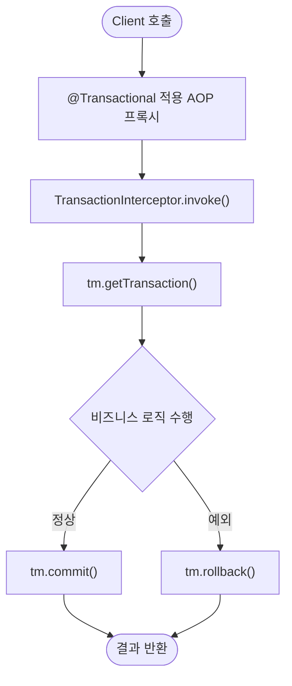

## 1. 슬로우 쿼리 모니터링

### 개념 및 배경

* **슬로우 쿼리**: 실행 시간이 임계치(예: 500ms)를 초과한 SQL
* **모니터링 목적**: 병목 식별 → 인덱스 튜닝, 쿼리 리팩토링
* **주요 방안**:

    * **DB 레벨**: MySQL `slow_query_log`, PostgreSQL `pg_stat_statements`
    * **애플리케이션 레벨**:

        * JDBC 드라이버 로깅 (`spring.jpa.properties.hibernate.generate_statistics`)
        * 프록시 라이브러리: P6Spy, Datasource-proxy
        * AOP 기반 인터셉터로 실행 시간 측정

### 내부 구현 (예시)

* **As-Is**: 단순 `JdbcTemplate.query()` 만 사용
* **To-Be**: AOP 인터셉터로 실행 시간 측정 후, threshold 초과 시 WARN 로깅

```kotlin
// As-Is: 단순 DAO
@Repository
class OrderRepository(
    private val jdbc: NamedParameterJdbcTemplate
) {
    fun findOrdersByStatus(status: String): List<Order> {
        val sql = "SELECT * FROM orders WHERE status = :status"
        return jdbc.query(sql, mapOf("status" to status)) { rs, _ ->
            Order(rs.getLong("id"), rs.getString("status"), rs.getTimestamp("created_at").toLocalDateTime())
        }
    }
}
```

```kotlin
// To-Be: AOP로 슬로우 쿼리 모니터링
@Aspect
@Component
class QueryMonitoringAspect(
    @Value("\${app.query.slow-threshold-ms}") private val thresholdMs: Long
) {
    @Around("execution(* com.example.repository.*.*(..))")
    fun monitorQuery(joinPoint: ProceedingJoinPoint): Any? {
        val start = System.currentTimeMillis()
        val result = joinPoint.proceed()
        val elapsed = System.currentTimeMillis() - start
        if (elapsed > thresholdMs) {
            val method = "${joinPoint.signature.declaringType.simpleName}.${joinPoint.signature.name}"
            log.warn("Slow Query detected: $method took ${elapsed}ms")
        }
        return result
    }
}
```

---

## 2. 트랜잭션 로그·AOP 포인트컷 분석

### 개념 및 배경

* **트랜잭션 로그**:

    * Spring의 `PlatformTransactionManager` 내부에서 `commit()`/`rollback()` 호출 기록
    * `TransactionAspectSupport` → `TransactionInterceptor` → 실제 매니저 호출
* **AOP 포인트컷**:

    * `@Transactional` 어노테이션이 붙은 메서드에 대한 어드바이스 적용 지점
    * 기본 포인트컷: `@annotation(org.springframework.transaction.annotation.Transactional)`

### Flowchart (Mermaid)



---

## 3. 추가 학습 제안

1. **메트릭 기반 Alerting**

    * Prometheus → Grafana 대시보드
    * Alertmanager → Slack/Email 알림
2. **분산 추적 (Distributed Tracing)**

    * Spring Cloud Sleuth + Zipkin
    * 각 서비스 호출 간 레이턴시 분석
3. **로그 집계 및 분석**

    * ELK 스택(Elasticsearch, Logstash, Kibana)
    * Kibana 대시보드에서 에러 패턴 및 트렌드 파악

---

## 4. 예제 도메인: 주문 처리(Order Processing)

### 비즈니스 시나리오

* `OrderService.placeOrder()` 에서 주문 저장 후, 재고 확인
* 재고 조회 쿼리가 간헐적 슬로우 쿼리 발생 가능

### As-Is 코드

```kotlin
@Service
class OrderService(
    private val orderRepo: OrderRepository,
    private val inventoryRepo: InventoryRepository
) {
    @Transactional
    fun placeOrder(request: OrderRequest) {
        orderRepo.save(request.toOrder())
        val item = inventoryRepo.findByProductId(request.productId)
        if (item.stock < request.quantity) throw IllegalStateException("재고 부족")
        inventoryRepo.decreaseStock(request.productId, request.quantity)
    }
}
```

### To-Be 코드 (모니터링 추가)

1. **슬로우 쿼리 AOP**: 위 `QueryMonitoringAspect` 적용
2. **트랜잭션 로그 AOP**: 트랜잭션 시작/커밋/롤백 로깅

```kotlin
@Aspect
@Component
class TransactionLoggingAspect {
    private val log = LoggerFactory.getLogger(this::class.java)

    @Around("@annotation(txn: org.springframework.transaction.annotation.Transactional)")
    fun logTransaction(joinPoint: ProceedingJoinPoint, txn: org.springframework.transaction.annotation.Transactional): Any? {
        log.info(">>> Transaction START: ${joinPoint.signature}")
        return try {
            val result = joinPoint.proceed()
            log.info(">>> Transaction COMMIT: ${joinPoint.signature}")
            result
        } catch (ex: Throwable) {
            log.info(">>> Transaction ROLLBACK: ${joinPoint.signature} due to ${ex.javaClass.simpleName}")
            throw ex
        }
    }
}
```

---

## 5. 요약

| 구분          | As-Is           | To-Be                         | 비고             |
| ----------- | --------------- | ----------------------------- | -------------- |
| 슬로우 쿼리 모니터링 | 단순 DAO 호출       | AOP로 실행 시간 측정 + WARN 로깅       | P6Spy 등 대체 가능  |
| 트랜잭션 로그 분석  | Spring 내부 처리 숨김 | AOP로 START/COMMIT/ROLLBACK 로깅 | 로그 중앙집계와 연동 추천 |
| 추가 학습       | –               | 메트릭·Alerting, 분산 추적, ELK      | 운영환경 적용 시 필수   |

이번 학습을 통해 **애플리케이션 레벨의 모니터링**과 **트랜잭션 처리 투명성**을 높여, 장애 발생 시 빠른 원인 분석과 대응이 가능해집니다.
