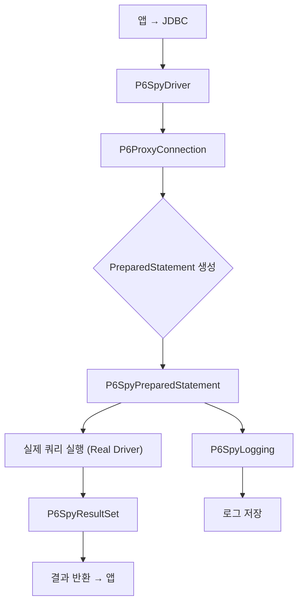

## 1. 주요 특징

P6Spy는 애플리케이션과 실제 JDBC 드라이버 사이에 프록시 레이어를 두어, 실행되는 모든 SQL을 가로채고 로그로 남겨주는 오픈소스 라이브러리입니다. 주로 다음과 같은 목적에 사용됩니다:

* **실행된 SQL 확인**: 애플리케이션에서 나가는 모든 쿼리(PreparedStatement 포함)를 로깅
* **파라미터 바인딩 보기**: SQL 내 `?` 플레이스홀더에 바인딩된 실제 값까지 함께 출력
* **성능 분석**: 쿼리 실행 시간, 커넥션 할당/반환 타이밍 등을 측정

| 특징          | 설명                                               |
| ----------- | ------------------------------------------------ |
| 투명한 설치      | 애플리케이션 코드 변경 없이 `드라이버 클래스만 바꿔주면` 동작                |
| 커스텀 로거      | 로그 포맷, 로거 구현체(콘솔, 파일, SLF4J 등) 직접 설정 가능          |
| 필터링         | 특정 카테고리(SELECT/UPDATE/DDL 등)나 네임스페이스별로 로깅 on/off |
| 성능 오버헤드 최소화 | 경량 프록시로 설계되어, `프로덕션에도 무난히 사용` 가능                   |

---

## 2. Spring Boot + Kotlin 연동 예제

### 1) 의존성 추가 (Gradle)

```kotlin
dependencies {
    implementation("com.p6spy:p6spy:3.9.1")
    // 혹은 P6Spy Spring Boot 스타터 이용
    implementation("com.p6spy:p6spy-spring-boot-starter:1.8.1")
}
```

### 2) 드라이버 설정

`application.yml` 또는 `application.properties` 에서 DataSource 드라이버를 P6Spy로 교체합니다.

```yaml
spring:
  datasource:
    driver-class-name: com.p6spy.engine.spy.P6SpyDriver
    url: jdbc:p6spy:mysql://localhost:3306/mydb
    username: user
    password: pass
```

### 3) p6spy.properties (src/main/resources)

```properties
# 기본 로거 구현체를 SLF4J로
logMessageFormat=com.p6spy.engine.spy.appender.SingleLineFormat
appender=com.p6spy.engine.spy.appender.Slf4JLogger

# 느린 쿼리 기준 (ms)
executionThreshold=500

# 로깅할 카테고리 선택 (예: SELECT, UPDATE, DDL, COMMIT 등)
# category.exclude=TRACE,INFO
include=com.p6spy.engine.logging.P6LogFactory

# SQL 출력 시 바인딩 파라미터도 함께
module.log=com.p6spy.engine.logging.P6LogFactory
```

> **Tip**: `executionThreshold`를 설정하면 threshold 이상 걸린 쿼리에만 WARN 레벨 로그를 남기도록 할 수 있습니다.

### 4) 커스텀 로거 (선택)

특정 포맷이나 `다른 출력 방식`이 필요하다면, `com.p6spy.engine.spy.appender.MessageFormattingStrategy`를 구현해서 `logMessageFormat`에 지정할 수 있습니다.

```kotlin
class MyP6SpyFormatter : MessageFormattingStrategy {
    override fun formatMessage(
        connectionId: Int, now: String, elapsed: Long,
        category: String, prepared: String, sql: String, url: String
    ): String {
        return "[$now] ($elapsed ms) $category: $sql"
    }
}
```

`p6spy.properties`:

```properties
logMessageFormat=com.example.monitoring.MyP6SpyFormatter
```

---

## 3. P6Spy 동작 흐름 (Mermaid)


### P6spyResult?
P6Spy가 반환하는 `P6SpyResultSet`은 표준 `java.sql.ResultSet` 인터페이스를 구현한 프록시 객체이기 때문에, 기존에 JPA나 순수 JDBC 코드에서 사용하던 `ResultSet`과 완전히 호환됩니다.

* **인터페이스 구현**
  P6Spy의 `P6SpyResultSet` 클래스는 내부적으로 실제 JDBC 드라이버가 반환한 `ResultSet`을 감싸(wrap)고, `java.sql.ResultSet`의 모든 메서드를 오버라이드(프록시)하도록 구현되어 있습니다.

  ```java
  public class P6SpyResultSet implements ResultSet {
      private final ResultSet realResultSet;
      // ...
      @Override
      public boolean next() throws SQLException {
          return realResultSet.next();
      }
      @Override
      public String getString(int columnIndex) throws SQLException {
          return realResultSet.getString(columnIndex);
      }
      // java.sql.ResultSet의 모든 메서드를 동일하게 위임(delegate)
  }
  ```

* **JPA와의 투명성**
  JPA 구현체(Hibernate, EclipseLink 등)도 내부적으로는 JDBC `ResultSet`을 사용해서 데이터를 매핑합니다.
  P6Spy를 드라이버 레벨에 끼워 넣으면, JPA가 요청한 쿼리가 P6Spy의 `P6SpyPreparedStatement` → `P6SpyResultSet`을 거쳐 실제 드라이버(`realResultSet`)로 전달되므로,
  JPA 코드는 전혀 수정 없이(P6Spy 적용만으로) 기존과 동일하게 동작합니다.

* **정리**

    1. `P6SpyResultSet` 은 `java.sql.ResultSet` 인터페이스를 그대로 구현
    2. 내부에서 실제 `ResultSet` 인스턴스에 모든 호출을 위임(delegate)
    3. JPA/Hibernate는 전혀 인지하지 못하고 평소처럼 `ResultSet`을 사용 → 완전 투명

따라서, P6Spy를 도입하셔도 기존의 JDBC 코드나 JPA 기반 데이터 접근 로직에 전혀 영향을 주지 않고, 단지 로그/모니터링 레이어만 추가된다고 보시면 됩니다.


---

## 4. 활용 팁

1. **프로덕션 환경**에서도 가볍게 켜두고, `executionThreshold`만 조정해 두면 느린 쿼리만 걸러내 분석 가능
2. **ELK/Fluentd** 같은 로그 집계 시스템과 연동해, 쿼리별 실행 시간 히스토그램을 시각화
3. **Spring Actuator** 메트릭과 결합해, P6Spy 로그를 Prometheus로 스크랩 → Grafana 대시보드 구축

---

### 요약

* P6Spy는 JDBC 사이에 끼어 SQL/파라미터/실행 시간을 투명하게 로깅
* 드라이버 클래스와 `p6spy.properties` 설정만으로 손쉽게 연동 가능
* `executionThreshold` 등으로 느린 쿼리만 추려낼 수 있어 모니터링에 최적
* 로깅 포맷·출력 방식을 커스터마이징 가능하며, ELK/Grafana 등 외부 툴과 연계 활용

이제 P6Spy로 애플리케이션에서 나가는 모든 SQL을 실시간 가시화하고, 성능 병목을 빠르게 찾아내 보세요!

## 내생각
> 이건 현재 프로젝트에 적용해봐도 될듯 하다. 도전!