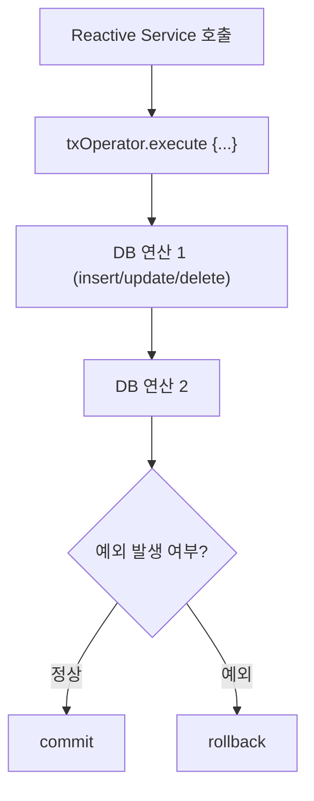

## 📌 1. 리액티브 트랜잭션이란?

### 🔸 전통 트랜잭션 vs 리액티브 트랜잭션

| 구분     | 전통 트랜잭션                      | 리액티브 트랜잭션                        |
| ------ | ---------------------------- | -------------------------------- |
| 기반     | 쓰레드 바인딩                      | 논블로킹, 이벤트 루프                     |
| 처리 방식  | `@Transactional` 선언적 처리      | `TransactionalOperator` 프로그래밍 방식 |
| 커넥션 관리 | ThreadLocal                  | Context 바인딩                      |
| 예외 처리  | 명시적 rollback / checked 예외 지원 | `.doOnError` 및 체인 rollback 처리    |

---

## 📌 2. 핵심 개념: `TransactionalOperator`

Spring의 리액티브 트랜잭션 관리를 위한 핵심 유틸입니다.

```kotlin
val txOperator = TransactionalOperator.create(r2dbcTransactionManager)
```

* `txOperator.execute { txStatus -> publisher }`
* 트랜잭션 범위를 명시적으로 지정
* rollback은 예외 또는 `txStatus.setRollbackOnly()`로 수행

---

## 📌 3. 리액티브 트랜잭션 흐름 (Mermaid)



---

## 📌 4. 실습 준비: R2DBC + PostgreSQL + Spring Boot

### 🔸 Gradle

```kotlin
dependencies {
    implementation("org.springframework.boot:spring-boot-starter-data-r2dbc")
    implementation("io.r2dbc:r2dbc-postgresql")
    runtimeOnly("org.postgresql:postgresql")
}
```

---

## 📌 5. 예제 도메인 소개

* `User`가 `Wallet`을 생성하고 일정 금액을 충전하는 로직
* 충전 중 예외가 발생하면 모든 처리는 rollback 되어야 함

---

## 📌 6. 예제 코드: As-Is (트랜잭션 없이)

### ✅ 도메인

```kotlin
data class User(val id: Long, val name: String)
data class Wallet(val id: Long, val userId: Long, val balance: Int)
```

### ✅ 서비스

```kotlin
fun charge(userId: Long, amount: Int): Mono<Void> {
    return walletRepository.findByUserId(userId)
        .flatMap { wallet ->
            walletRepository.updateBalance(wallet.id, wallet.balance + amount)
        }
        .then(Mono.error(RuntimeException("임의 예외"))) // rollback 안됨
}
```

### ❌ 문제점:

* 트랜잭션이 없어 중간 예외 발생해도 update가 DB에 반영됨

---

## 📌 7. 예제 코드: To-Be (TransactionalOperator 적용)

### ✅ 설정

```kotlin
@Bean
fun transactionalOperator(tm: R2dbcTransactionManager): TransactionalOperator {
    return TransactionalOperator.create(tm)
}
```

### ✅ 개선된 서비스

```kotlin
fun charge(userId: Long, amount: Int): Mono<Void> {
    return txOperator.execute { status ->
        walletRepository.findByUserId(userId)
            .flatMap { wallet ->
                walletRepository.updateBalance(wallet.id, wallet.balance + amount)
            }
            .then(Mono.error(RuntimeException("충전 실패")))
    }.then() // rollback 자동 수행
}
```

---

## 📌 8. 추가로 학습할 내용 제안

| 주제                                          | 이유                                           |
| ------------------------------------------- | -------------------------------------------- |
| ✅ ConnectionFactory vs DataSource           | 리액티브에서는 `ConnectionFactory`를 사용              |
| ✅ `DatabaseClient` vs `R2dbcEntityTemplate` | 선언적/SQL 기반 DB 처리 방식 차이                       |
| ✅ ContextPropagation & ReactorContext       | 트랜잭션 정보는 ThreadLocal 대신 Reactor Context로 전달됨 |
| ✅ Kotlin Coroutines + R2DBC                 | `suspend` 방식과 `reactor` 방식 통합 고려             |

---

## 📌 9. 요약 정리

| 항목    | 내용                                                 |
| ----- | -------------------------------------------------- |
| 목적    | 논블로킹 환경에서의 트랜잭션 보장                                 |
| 핵심 도구 | `TransactionalOperator`, `R2dbcTransactionManager` |
| 예외 처리 | `.doOnError`, 예외 리턴 시 rollback                     |
| 사용 이유 | Reactor 환경에서 선언적 `@Transactional`이 동작하지 않기 때문      |
| 사용 방식 | `txOperator.execute { publisher }`로 트랜잭션 범위 명시     |

---

필요하시면 이 로직을 기반으로 한 테스트 코드나 코루틴 적용 예제도 추가로 제공드릴 수 있어요. 다음으로 확장하고 싶은 방향이 있다면 알려주세요!
