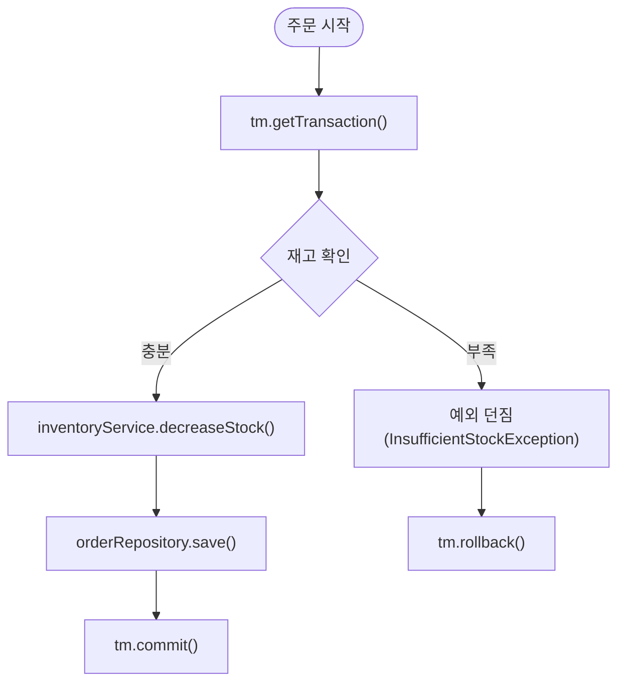

**1. 종합 실습 미니 프로젝트 소개**
간단한 “온라인 서점 주문 처리” 미니 프로젝트를 통해, **주문 생성 → 재고 차감 → 주문 저장** 흐름에 트랜잭션을 적용해 봅니다.

* **도메인**: `Order`, `OrderItem`, `Inventory`
* **서비스**: `OrderService`
* **레포지토리**: Spring Data JPA 기반

---

**2. 주요 개념 & 배경 지식**

1. **트랜잭션 정의**

    * 데이터베이스 상 일련의 작업을 원자(Atomic) 단위로 묶는 기능
    * ACID 보장

        * Atomicity: 전부 실행되거나 전부 롤백
        * Consistency: 일관성 유지
        * Isolation: 동시성 제어
        * Durability: 커밋 후 영구 보존

2. **Spring 트랜잭션**

    * **`@Transactional`**: 선언적 트랜잭션
    * **PlatformTransactionManager**: 내부적으로 이용되는 추상 레이어
    * **전파(Propagation), 격리(Isolation), 타임아웃(timeout)** 속성 설정 가능

3. **적용 배경**

    * 오류 발생 시 데이터 불일치 방지
    * 여러 DB 작업을 하나의 단위로 묶어 일관성 획득

---

**3. Mermaid 흐름도**



---

**4. 예제 코드 (Kotlin, As-Is → To-Be)**

<details>
<summary>🟡 As-Is (트랜잭션 미적용)</summary>

```kotlin
@Service
class OrderService(
    private val inventoryRepo: InventoryRepository,
    private val orderRepo: OrderRepository
) {
    fun placeOrder(userId: Long, bookId: Long, qty: Int) {
        // 1. 재고 확인
        val inv = inventoryRepo.findByBookId(bookId)
            ?: throw IllegalStateException("재고 정보 없음")
        if (inv.stock < qty) {
            throw InsufficientStockException("재고 부족")
        }

        // 2. 재고 차감
        inv.stock -= qty
        inventoryRepo.save(inv)

        // 3. 주문 저장
        val order = Order(userId = userId, items = listOf(OrderItem(bookId, qty)))
        orderRepo.save(order)
        // → 여기서 재고 차감 성공했어도, orderRepo.save() 에 오류 나면 재고는 롤백되지 않음
    }
}
```

</details>

<details>
<summary>🟢 To-Be (@Transactional 적용)</summary>

```kotlin
@Service
class OrderService(
    private val inventoryRepo: InventoryRepository,
    private val orderRepo: OrderRepository
) {
    @Transactional
    fun placeOrder(userId: Long, bookId: Long, qty: Int) {
        // 1. 재고 확인
        val inv = inventoryRepo.findByBookId(bookId)
            ?: throw IllegalStateException("재고 정보 없음")
        if (inv.stock < qty) {
            throw InsufficientStockException("재고 부족")
        }

        // 2. 재고 차감
        inv.stock -= qty
        inventoryRepo.save(inv)

        // 3. 주문 저장
        val order = Order(userId = userId, items = listOf(OrderItem(bookId, qty)))
        orderRepo.save(order)
        // → 예외 발생 시 save(inv) + save(order)가 함께 롤백됨
    }
}
```

**주요 변경점**

* `@Transactional` 한 줄로 **원자성** 보장
* 예외 발생 시 자동 롤백 기능 활용

---

**5. 스터디 회고 & 추가 학습 로드맵**

| 내용        | 회고                                                             | 추가 학습 제안                                                                                                                                                                                                         |
| :-------- | :------------------------------------------------------------- | :--------------------------------------------------------------------------------------------------------------------------------------------------------------------------------------------------------------- |
| **학습 성과** | - 트랜잭션 기본 개념 완벽 이해<br>- Spring 선언적 트랜잭션 적용 경험                  | 1. **격리 수준(Isolation)**: 성능·교착(lock) 트레이드오프 실습<br>2. **전파 모드(Propagation)**: 복합 서비스 간 nested 사례 구현<br>3. **분산 트랜잭션(JTA/XA, Saga)**: 마이크로서비스 간 일관성 유지<br>4. **Reactive 트랜잭션**: `TransactionalOperator` + R2DBC 심화 |
| **실습 소감** | - As-Is → To-Be 패턴으로 단순 명료함 체감<br>- 선언적 방식 코드가 훨씬 깔끔           | 1. **트랜잭션 모니터링**: APM 도구 연동 (Zipkin, Sleuth)<br>2. **테스트**: `TestTransaction` API로 트랜잭션 테스트 전략 강화                                                                                                                |
| **다음 목표** | - 중첩 트랜잭션 및 저장점(savepoint) 실습<br>- 장애 시 보상 처리(CQRS, Outbox 패턴) | *1주차*: 分산 트랜잭션 패턴 실습<br>*2주차*: Reactive + R2DBC 완전정복<br>*3주차*: Spring Batch 트랜잭션 관리                                                                                                                              |

---

**6. 요약**

1. **미니 프로젝트**: 온라인 서점 주문 흐름에 트랜잭션 적용
2. **핵심 개념**: ACID, 선언적 트랜잭션(`@Transactional`), 롤백 보장
3. **As-Is → To-Be**: 수작업 재고 차감/주문 저장 → `@Transactional`으로 원자성 확보
4. **Mermaid 시각화**: 트랜잭션 시작, 재고 확인, 커밋/롤백 플로우
5. **추가 로드맵**: 분산 트랜잭션, Reactive 트랜잭션, 트랜잭션 테스트 & 모니터링

