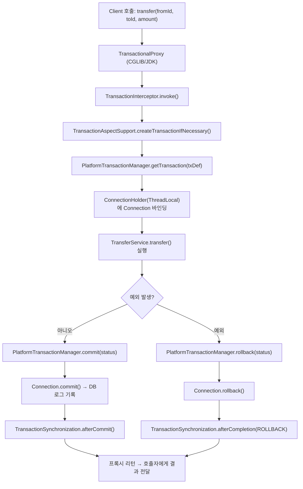

### 1. Spring 트랜잭션 아키텍처 정의 및 개념

**Spring 트랜잭션 관리**는

* **선언적(Declarative)**: `@Transactional` + AOP 프록시를 통해 비즈니스 메서드에 트랜잭션 경계를 선언
* **프로그래밍적(Programmatic)**: `PlatformTransactionManager` 또는 `TransactionTemplate`을 직접 사용해 코드 안에서 트랜잭션을 제어

#### 주요 컴포넌트

* **PlatformTransactionManager**

    * JDBC → `DataSourceTransactionManager`
    * JPA  → `JpaTransactionManager`
    * JTA  → `JtaTransactionManager`
* **TransactionInterceptor**

    * `@Transactional` 메서드를 가로채 트랜잭션 시작·커밋·롤백 호출
* **TransactionSynchronizationManager**

    * 현재 스레드에 바인딩된 트랜잭션 리소스(`Connection`, `Session`)와 설정(`readOnly`, `isolation`)을 관리

---

### 2. 배경 지식

1. **추상화의 필요성**

    * JDBC/JTA API에 직접 의존하면 벤더별 코드가 뒤섞이고, 테스트·전환이 어려워짐
    * Spring 추상화 덕분에 `PlatformTransactionManager`만 바꾸면 다양한 환경(JDBC, JPA, 분산)에 대응 가능

2. **AOP 기반 동작 흐름**

    1. `@EnableTransactionManagement` → `TransactionInterceptor` 빈 등록
    2. 비즈니스 메서드 호출 시 AOP 프록시가 `invoke()`
    3. 프록시 내부에서 `PlatformTransactionManager.getTransaction()` → `doBegin()`
    4. 메서드 정상 종료 → `commit()` 호출, 예외 발생 → `rollback()` 호출

3. **내구성(Durability) 이해**

    * `PlatformTransactionManager.commit()` 내부에서 최종적으로 DB 커넥션의 `commit()`을 호출
    * 데이터베이스 엔진이 디스크에 로그를 남겨 커밋 후에도 영구 보존 보장

---

### 3. Durability 구현 코드 살펴보기

```java
// AbstractPlatformTransactionManager (Spring Framework)
protected void doCommit(DefaultTransactionStatus status) {
    // (1) 트랜잭션 동기화 BeforeCompletion 호출
    triggerBeforeCommit(status);
    triggerBeforeCompletion(status);

    // (2) 실제 커밋: DataSourceTransactionManager나 JtaTransactionManager가 오버라이드
    doCommit(status);

    // (3) 트랜잭션 동기화 AfterCompletion 호출
    triggerAfterCommit(status);
    triggerAfterCompletion(status);
}

// DataSourceTransactionManager 내부
@Override
protected void doCommit(DefaultTransactionStatus status) {
    ConnectionHolder conHolder = (ConnectionHolder) status.getTransaction();
    try {
        conHolder.getConnection().commit();  // <-- 여기서 DB에 commit 명령, 로그에 내구성 확보
    } catch (SQLException ex) {
        throw new CannotCommitException("Could not commit JDBC transaction", ex);
    }
}
```

* `conHolder.getConnection().commit()` 이 실제 DB 엔진에 커밋을 요청합니다.
* DB 엔진은 로그(undo/redo) 파일에 기록을 남겨 장애 발생 시 복구할 수 있도록 합니다.

---

### 4. 예제 코드 (AS-IS → TO-BE)

#### 도메인: 은행 계좌 이체 서비스

##### 4.1 AS-IS (프로그래밍적 JDBC 트랜잭션)

```kotlin
@Service
class TransferService(
    private val dataSource: DataSource,
    private val accountRepo: AccountRepository
) {
    fun transfer(fromId: Long, toId: Long, amount: BigDecimal) {
        val conn = dataSource.connection.apply { autoCommit = false }
        try {
            // 출금
            val from = accountRepo.findById(conn, fromId)
            if (from.balance < amount) throw IllegalStateException("잔액 부족")
            accountRepo.updateBalance(conn, fromId, from.balance - amount)

            // 입금
            val to = accountRepo.findById(conn, toId)
            accountRepo.updateBalance(conn, toId, to.balance + amount)

            conn.commit()
        } catch (ex: Exception) {
            conn.rollback()
            throw ex
        } finally {
            conn.close()
        }
    }
}
```

> **단점**: JDBC API와 예외 처리, 리소스 관리를 직접 모두 처리해야 하므로 코드가 장황하고 실수 가능성이 높음.

---

##### 4.2 TO-BE (선언적 Spring 트랜잭션)

```kotlin
@Configuration
@EnableTransactionManagement
class TransactionConfig {
    @Bean
    fun txManager(dataSource: DataSource): PlatformTransactionManager =
        DataSourceTransactionManager(dataSource)
}

@Service
class TransferService(
    private val accountRepo: AccountRepository
) {
    @Transactional
    fun transfer(fromId: Long, toId: Long, amount: BigDecimal) {
        // 출금
        val from = accountRepo.findById(fromId)
            .orElseThrow { IllegalArgumentException("계좌 없음: $fromId") }
        if (from.balance < amount) throw IllegalStateException("잔액 부족")
        accountRepo.save(from.copy(balance = from.balance - amount))

        // 입금
        val to = accountRepo.findById(toId)
            .orElseThrow { IllegalArgumentException("계좌 없음: $toId") }
        accountRepo.save(to.copy(balance = to.balance + amount))

        // 예외 발생 시 자동으로 rollback
    }
}
```

* `@Transactional` 덕분에 메서드 진입 시 스프링이 트랜잭션을 시작, 정상 종료 시 커밋, 예외 발생 시 롤백
* 비즈니스 로직만 집중하고, 리소스 및 예외 관리는 프레임워크가 대신 처리


아래는 `@Transactional`이 붙은 `transfer()` 메서드가 호출됐을 때 스프링 프레임워크 내부에서 어떤 순서로, 어떤 컴포넌트들이 관여하여 트랜잭션을 시작·커밋·롤백하는지 시각화한 흐름도입니다.



---

## 각 단계 상세 설명

1. **클라이언트 호출**

    * 애플리케이션 코드(Controller, Scheduler, 다른 서비스 등)에서 `transfer()`를 직접 호출.

2. **AOP 프록시 단계**

    * `@EnableTransactionManagement` → `TransactionProxyFactoryBean`이 `TransferService`를 감싸는 프록시 빈 생성
    * 호출은 실제 `TransferService`가 아니라 이 프록시를 통해 이뤄짐.

3. **TransactionInterceptor.invoke()**

    * 프록시에서 `MethodInterceptor`로 등록된 `TransactionInterceptor`가 가로채
    * 메서드, 클래스레벨의 트랜잭션 설정(`@Transactional` 속성) 읽어 `TransactionAspectSupport`로 전달.

4. **트랜잭션 시작**

    * `TransactionAspectSupport.createTransactionIfNecessary()` 호출
        *   AOP 프록시가 @Transactional 이 붙은 메서드를 가로챌 때 실제로 트랜잭션을 시작(또는 기존 트랜잭션에 참여)할지 결정
    * `PlatformTransactionManager.getTransaction(txDefinition)`
        * `DataSourceTransactionManager`일 경우 내부에서 JDBC `Connection`을 꺼내 `setAutoCommit(false)`
        * 트랜잭션 메타정보(격리레벨, 읽기전용 등) 설정
    * 생성된 `ConnectionHolder`를 `TransactionSynchronizationManager`의 ThreadLocal에 바인딩

5. **비즈니스 로직 실행**

    * 이제 원본 `transfer()` 메서드가 호출되어 DB 접근(JPA 리포지토리)이 진행
    * `accountRepo.save()` 등으로 영속성 컨텍스트에 변경 기록

6. **정상 종료 vs 예외 분기**

    * 로직이 예외 없이 끝나면 `commit()`, 중간에 예외가 터지면 `rollback()`

7. **커밋 시나리오**

    * `DataSourceTransactionManager.commit()` → `Connection.commit()` 호출
    * DB는 로그 파일(undo/redo)을 통해 영구 저장(내구성 보장)
    * `TransactionSynchronization`에 등록된 후처리(예: `@TransactionalEventListener`) 수행

8. **롤백 시나리오**

    * `DataSourceTransactionManager.rollback()` → `Connection.rollback()`
    * 모든 변경사항(영속성 컨텍스트 반영 포함)이 취소
    * `afterCompletion(STATUS_ROLLED_BACK)` 콜백 실행

9. **프록시 리턴**

    * 메서드가 정상 반환되거나 예외가 전파된 뒤, AOP 프록시가 호출 스택을 정리하고 결과를 호출자에게 전달

---

### 요약

* **AOP 프록시**가 `@Transactional`을 감지해 진입부터 종료까지 트랜잭션 경계를 자동으로 관리
* **PlatformTransactionManager**를 통해 트랜잭션 시작(`getTransaction`), 커밋/롤백(`commit`/`rollback`)
* **Connection.commit()** 시 DB가 로그를 기록해 **내구성(Durability)** 보장
* 트랜잭션 상태와 리소스 관리는 **TransactionSynchronizationManager**의 ThreadLocal 바인딩으로 스레드 안전하게 유지
* 이런 구조 덕분에 비즈니스 코드는 **트랜잭션 선언만** 해두면, 스프링이 복잡한 커밋·롤백·리소스 관리를 대신 처리해 줍니다.


---

### 5. 요약

1. **Spring 트랜잭션 아키텍처**

    * 선언적(`@Transactional` + AOP) vs 프로그래밍적(`PlatformTransactionManager`) 관리
    * 핵심 컴포넌트: TransactionInterceptor, PlatformTransactionManager, TransactionSynchronizationManager

2. **내구성(Durability)**

    * `DataSourceTransactionManager.commit()` → `Connection.commit()` 호출 → DB 로그에 기록
    * 커밋 후에도 로그 기반 복구로 데이터 영구 보존

3. **AS-IS vs TO-BE 비교**

    * 직접 JDBC 트랜잭션 관리 코드 → `@Transactional` 선언만으로 간결·안전하게 전환
    * 비즈니스 로직에만 집중 → 예외 시 자동 롤백으로 데이터 일관성 확보
