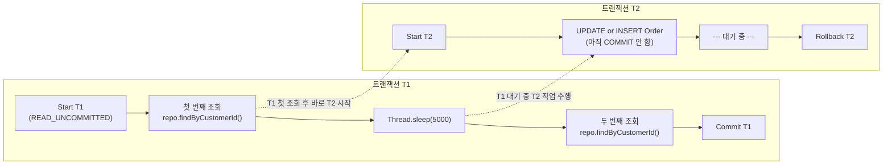
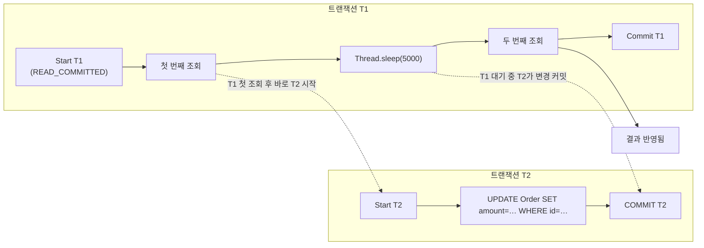
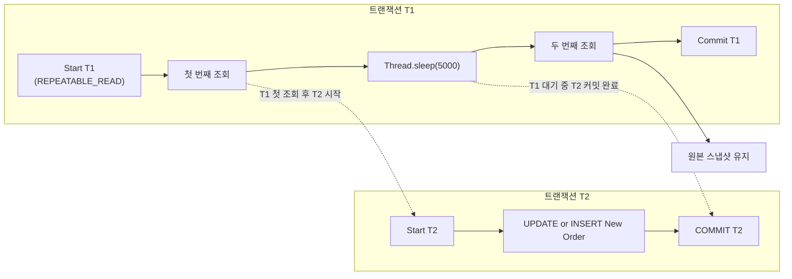
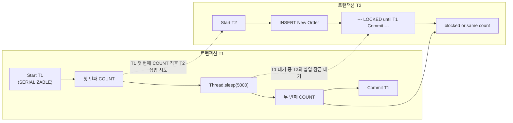

## 1. Isolation Level 정의 및 개념

* **ACID 중 ‘I(Isolation)’**
  여러 트랜잭션이 동시에 실행될 때, 서로의 중간 상태(커밋 전 변경)를 보지 않도록 보장하여 일관성을 유지합니다.

* **주요 격리 레벨과 방지 현상**

  | 격리 수준                 | 설명                                   | 방지 가능한 현상                                         |
      | --------------------- | ------------------------------------ | ------------------------------------------------- |
  | **READ\_UNCOMMITTED** | 커밋되지 않은 다른 트랜잭션의 변경까지 읽음             | – Dirty Read                                      |
  | **READ\_COMMITTED**   | 오직 커밋된 변경만 읽음 (대부분 DB의 기본값)          | Dirty Read<br>– Non-repeatable Read               |
  | **REPEATABLE\_READ**  | 트랜잭션 시작 시점의 스냅샷으로 반복 읽기 보장           | Dirty Read<br>Non-repeatable Read                 |
  | **SERIALIZABLE**      | 완전한 순차 실행처럼 행동, 범위 잠금(range lock) 사용 | Dirty Read<br>Non-repeatable Read<br>Phantom Read |

* **읽기 현상**

    * **Dirty Read**: 롤백될 수도 있는 데이터를 읽음
    * **Non-repeatable Read**: 같은 조회가 두 번 이상 실행될 때 결과가 달라짐
    * **Phantom Read**: 같은 조건의 집계(예: COUNT) 결과가 중간에 삽입/삭제로 달라짐

---

## 2. 배경 지식: MVCC vs Lock 기반 제어

1. **MVCC(Multi-Version Concurrency Control)**

    * 각 트랜잭션이 시작 시점의 **스냅샷**을 읽음
    * 쓰기 시점에는 버전 충돌 검사 → Non-repeatable Read, Dirty Read 방지

2. **락(Lock) 기반 제어**

    * 행(row) 혹은 범위(range)에 대한 공유/배타 잠금
    * `SERIALIZABLE`에서 Phantom을 방지하기 위해 **Gap Lock** 사용

3. **데드락(Deadlock)**

    * 두 트랜잭션이 서로가 잡은 락을 해제하기 기다리며 교착
    * DB가 한쪽을 롤백하여 풀어줌

---

## 3. Spring Transaction 내 Isolation 구현

Spring 의 `DataSourceTransactionManager` 는 트랜잭션 시작 시에 JDBC `Connection` 의 격리 수준을 직접 설정합니다. 핵심 로직(간략화):

```java
protected void doBegin(Object transaction, TransactionDefinition definition) {
    Connection con = DataSourceUtils.getConnection(dataSource);
    // …
    int isolationLevel = definition.getIsolationLevel();
    if (isolationLevel != TransactionDefinition.ISOLATION_DEFAULT) {
        con.setTransactionIsolation(isolationLevel);
    }
    // …
}
```

* `TransactionDefinition.ISOLATION_DEFAULT` 이 아니면, `Connection#setTransactionIsolation(...)` 호출
* 트랜잭션 종료 시 원래 수준으로 복원

이를 통해 `@Transactional(isolation = Isolation.X)` 옵션이 실제 JDBC 레벨 격리로 이어집니다.

---

## 3. 데모 DB 테스트 가이드

### 3.1 교착(Deadlock) 테스트

1. **세션1**:

   ```sql
   SET TRANSACTION ISOLATION LEVEL REPEATABLE READ;
   BEGIN;
   UPDATE account SET balance = balance - 100 WHERE id = 1;
   ```
2. **세션2**:

   ```sql
   SET TRANSACTION ISOLATION LEVEL REPEATABLE READ;
   BEGIN;
   UPDATE account SET balance = balance - 100 WHERE id = 2;
   ```
3. **세션1**에서:

   ```sql
   UPDATE account SET balance = balance + 100 WHERE id = 2;  -- 대기
   ```
4. **세션2**에서:

   ```sql
   UPDATE account SET balance = balance + 100 WHERE id = 1;  -- 교착 발생, DB가 한쪽 트랜잭션 롤백
   ```

### 3.2 팬텀(Phantom Read) 테스트

1. **세션1**:

   ```sql
   SET TRANSACTION ISOLATION LEVEL READ COMMITTED;
   BEGIN;
   SELECT COUNT(*) FROM orders WHERE customer_id = 42;  -- 1회 조회
   ```
2. **세션2**:

   ```sql
   BEGIN;
   INSERT INTO orders(customer_id, amount) VALUES (42, 500);
   COMMIT;
   ```
3. **세션1**:

   ```sql
   SELECT COUNT(*) FROM orders WHERE customer_id = 42;  -- READ_COMMITTED: 2 (팬텀 발생)
   ```
4. 동일 절차를 **ISOLATION LEVEL SERIALIZABLE** 로 실행 시, 삽입이 블록되거나 에러 발생해 팬텀 방지

---

## 4. 예제 코드 (Kotlin, Domain 기반, As-Is vs To-Be)

### 4.1 도메인: 은행 계좌(Account)

```kotlin
@Entity
data class Account(
    @Id @GeneratedValue
    val id: Long = 0,
    val accountNumber: String,
    var balance: Long
)
```

```kotlin
interface AccountRepository : JpaRepository<Account, Long> {
    fun findByAccountNumber(accountNumber: String): Account?
}
```

### 4.2 As-Is: 기본 격리 (DB 디폴트, 보통 READ\_COMMITTED)

```kotlin
@Service
class AccountServiceAsIs(
    private val repo: AccountRepository
) {
    /**
     * 같은 트랜잭션 내에서 두 번 읽기: 중간에 다른 트랜잭션이 커밋하면 값이 바뀜
     */
    @Transactional
    fun checkBalanceTwice(accountNumber: String) {
        val first = repo.findByAccountNumber(accountNumber)!!.balance
        println("첫 번째 조회: $first")
        Thread.sleep(5000)  // 다른 트랜잭션 개입 시간 확보
        val second = repo.findByAccountNumber(accountNumber)!!.balance
        println("두 번째 조회: $second")
    }
}
```

### 4.3 To-Be: REPEATABLE\_READ 적용

```kotlin
@Service
class AccountServiceToBe(
    private val repo: AccountRepository
) {
    /**
     * Isolation.REPEATABLE_READ: 트랜잭션 시작 시점 스냅샷 고정
     */
    @Transactional(isolation = Isolation.REPEATABLE_READ)
    fun checkBalanceRepeatable(accountNumber: String) {
        val first = repo.findByAccountNumber(accountNumber)!!.balance
        println("첫 번째 조회: $first")
        Thread.sleep(5000)
        val second = repo.findByAccountNumber(accountNumber)!!.balance
        println("두 번째 조회: $second")  // 항상 first == second
    }
}
```


## 5. 격리 수준별 예제
## READ\_UNCOMMITTED

### 도메인 설명

* **Domain**: 주문(`Order`) 조회
* **시나리오**: 고객 주문 목록을 두 번 조회하는 동안, 다른 트랜잭션에서 주문 정보를 수정(또는 삽입)하지만 아직 커밋 전인 상태도 읽을 수 있는지 확인

### Flow Chart (Mermaid)



### 예제 코드

```kotlin
/**
 * Domain: Order 엔티티
 */
@Entity
data class Order(
    @Id @GeneratedValue
    val id: Long = 0,
    val customerId: Long,
    val product: String,
    var amount: Int
)

interface OrderRepository : JpaRepository<Order, Long> {
    fun findByCustomerId(customerId: Long): List<Order>
}

/**
 * As-Is(Read Uncommitted):
 * - 트랜잭션이 커밋되지 않은 변경도 읽음 → Dirty Read 발생 가능
 */
@Service
class OrderServiceReadUncommitted(
    private val repo: OrderRepository
) {
    @Transactional(isolation = Isolation.READ_UNCOMMITTED)
    fun demonstrateDirtyRead(customerId: Long) {
        val first = repo.findByCustomerId(customerId)
        println("첫 번째 조회: $first")
        
        // 외부에서 T2가 주문을 수정/삽입(커밋 전)한 상태를 기다림
        Thread.sleep(5000)
        
        val second = repo.findByCustomerId(customerId)
        println("두 번째 조회: $second")
    }
}
```

### 동작 설명

1. T1이 READ\_UNCOMMITTED 격리로 주문을 조회 → 원래 데이터 출력
2. T1이 대기 중인 동안, T2가 같은 주문 테이블을 수정 또는 새 주문을 삽입(아직 커밋 전)
3. T1이 두 번째 조회 시, T2 커밋 전 변경 사항까지 보임 → **Dirty Read** 발생

### 추가 코멘트

* Dirty Read 예제는 MySQL/InnoDB 등에서 동작 여부가 다를 수 있음
* 실제 테스트 시, T2는 별도 세션(또는 터미널)에서 수동으로 수행

---

## READ\_COMMITTED

### 도메인 설명

* **Domain**: 주문(`Order`) 조회
* **시나리오**: 같은 트랜잭션 내 두 번 조회 시, 중간에 커밋된 데이터만 반영되는지 확인 (Non-repeatable Read)

### Flow Chart



### 예제 코드

```kotlin
@Service
class OrderServiceReadCommitted(
    private val repo: OrderRepository
) {
    /**
     * READ_COMMITTED:
     * - Dirty Read 방지
     * - Non-repeatable Read 발생 가능
     */
    @Transactional(isolation = Isolation.READ_COMMITTED)
    fun demonstrateNonRepeatableRead(customerId: Long) {
        val first = repo.findByCustomerId(customerId)
        println("첫 번째 조회: $first")
        
        Thread.sleep(5000)  // T2가 커밋할 시간 확보
        
        val second = repo.findByCustomerId(customerId)
        println("두 번째 조회: $second")
    }
}
```

### 동작 설명

* T2가 중간에 커밋한 변경(수정/삭제/삽입)이 두 번째 조회에 반영됨 → **Non-repeatable Read**

### 출력 예시

```
첫 번째 조회: [Order(id=1, customerId=42, product="Pen", amount=10)]
두 번째 조회: [Order(id=1, customerId=42, product="Pen", amount=15)]
```

---

## REPEATABLE\_READ

### 도메인 설명

* **Domain**: 주문(`Order`) 조회
* **시나리오**: 트랜잭션 시작 시점의 스냅샷 고정 → 같은 트랜잭션 내 모든 조회가 일관된 결과 보장

### Flow Chart



### 예제 코드

```kotlin
@Service
class OrderServiceRepeatableRead(
    private val repo: OrderRepository
) {
    /**
     * REPEATABLE_READ:
     * - Dirty Read, Non-repeatable Read 방지
     */
    @Transactional(isolation = Isolation.REPEATABLE_READ)
    fun demonstrateRepeatableRead(customerId: Long) {
        val first = repo.findByCustomerId(customerId)
        println("첫 번째 조회: $first")
        
        Thread.sleep(5000)  // T2가 중간 커밋해도
        
        val second = repo.findByCustomerId(customerId)
        println("두 번째 조회: $second")  // 항상 first와 동일
    }
}
```

### 출력 예시

```
첫 번째 조회: [Order(id=1, customerId=42, product="Pen", amount=10)]
두 번째 조회: [Order(id=1, customerId=42, product="Pen", amount=10)]
```

---

## SERIALIZABLE

### 도메인 설명

* **Domain**: 주문(`Order`) 개수 조회
* **시나리오**: 같은 조건의 레코드 수를 두 번 조회 → 다른 트랜잭션의 삽입(커밋)으로 증가하지 않고, 범위 잠금으로 삽입 시도 자체가 차단되어 **팬텀 리드(Phantom Read)** 방지

### Flow Chart



### 예제 코드

```kotlin
interface OrderRepository : JpaRepository<Order, Long> {
    fun findByCustomerId(customerId: Long): List<Order>
    fun countByCustomerId(customerId: Long): Long
}

@Service
class OrderServiceSerializable(
    private val repo: OrderRepository
) {
    /**
     * SERIALIZABLE:
     * - Dirty, Non-repeatable, Phantom Read 모두 방지
     */
    @Transactional(isolation = Isolation.SERIALIZABLE)
    fun demonstratePhantomPrevention(customerId: Long) {
        val firstCount = repo.countByCustomerId(customerId)
        println("첫 번째 Count: $firstCount")
        
        Thread.sleep(5000)  // T2의 INSERT가 대기됨
        
        val secondCount = repo.countByCustomerId(customerId)
        println("두 번째 Count: $secondCount")  // 항상 firstCount == secondCount
    }
}
```

### 출력 예시

```
첫 번째 Count: 2
두 번째 Count: 2
```

### 추가 코멘트

* **`SERIALIZABLE 모드는 성능 오버헤드가 크므로`**, 실제 대규모 환경에서는 신중히 선택
* Phantom Read 테스트 시, `T2 인서트가 블록`되거나 직후 예외가 발생할 수 있음

---

### 전체 정리

| 격리 수준             | 방지 현상                               | 예제 행동                            |
| :---------------- | :---------------------------------- | :------------------------------- |
| READ\_UNCOMMITTED | Dirty Read                          | 커밋 전 변경까지 조회                     |
| READ\_COMMITTED   | Dirty Read                          | 커밋 후 변경 반영 → Non-repeatable Read |
| REPEATABLE\_READ  | Dirty, Non-repeatable Read          | 스냅샷 고정 → 같은 결과                   |
| SERIALIZABLE      | Dirty, Non-repeatable, Phantom Read | 범위 잠금 → 삽입 차단 또는 일관된 카운트         |

위 예제와 플로우 차트를 통해, 각 격리 수준이 트랜잭션 간 읽기 일관성에 어떻게 영향을 주는지 명확히 이해할 수 있습니다.


---

## 5. 요약

* **Isolation 4단계**: READ\_UNCOMMITTED → READ\_COMMITTED → REPEATABLE\_READ → SERIALIZABLE
* 배경
    * MVCC(스냅샷) vs 락 기반(범위 잠금)
    * 데드락 주의
* **방지 현상**:
    * READ\_COMMITTED: Dirty Read 방지
    * REPEATABLE\_READ: Non-repeatable Read 방지
    * SERIALIZABLE: Phantom Read 방지
* **Spring 구현**: `DataSourceTransactionManager#doBegin` 에서 JDBC `Connection#setTransactionIsolation()` 호출
* **데모 테스트**: 두 개의 DB 세션을 띄워 Deadlock / Phantom Read 시나리오 직접 실행


