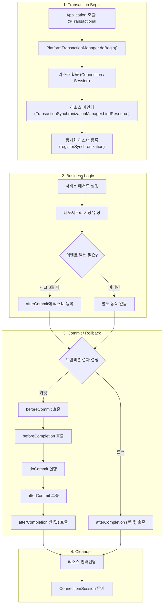

## 개념 및 정의

### 트랜잭션 동기화(Transaction Synchronization)

* **정의**: 하나의 트랜잭션 경계 내에서, 리소스(예: JDBC 커넥션, Hibernate 세션 등)를 바인딩하고, 트랜잭션 라이프사이클(커밋 전·후, 롤백 전·후)에 `콜백을 수행`하도록 하는 메커니즘
* **목적**:

    * 커넥션 풀에서 획득한 `커넥션을 트랜잭션이 끝날 때 안전하게 반환`
    * 커밋 직전·직후, 롤백 직전·직후에 사용자 로직(예: 캐시 무효화, 이벤트 발행 등)을 실행
    * 트랜잭션 전용 자원 관리(`쓰기 잠금 해제`, 세션 flush 등)

### 트랜잭션 리스너(Transaction Listener) / TransactionSynchronization

* **정의**: 트랜잭션 경계의 특정 시점( `beforeCommit` , `afterCommit` , `afterCompletion` 등)에 동작할 로직을 구현한 인터페이스
* **주요 메서드**:

    * `beforeCommit(readOnly: Boolean)` : 커밋 직전 호출
    * `beforeCompletion()` : 커밋/롤백 직전에 호출
    * `afterCommit()` : 커밋 완료 직후 호출
    * `afterCompletion(status)` : 커밋 또는 롤백 완료 직후 호출 (상태 정보 포함)

<br/>


## 배경 지식

1. **`PlatformTransactionManager`**

    * 스프링에서 트랜잭션 경계를 시작·커밋·롤백을 추상화한 핵심 인터페이스
    * 대표 구현체: `DataSourceTransactionManager`, `JpaTransactionManager`, `JtaTransactionManager`

2. **`TransactionSynchronizationManager`**

    * 현재 스레드에 바인딩된 트랜잭션 자원과 동기화 콜백을 관리하는 유틸 클래스
    * `bindResource`/`unbindResource` 로 자원 바인딩
    * `registerSynchronization(...)` 로 `TransactionSynchronization` 등록

3. **선언적 트랜잭션 vs 프로그래밍적 트랜잭션**

    * 선언적(`@Transactional`)만으로 일반적인 커밋·롤백 관리 가능
    * 하지만 `“커밋 후에만 실행되어야 할 작업”을 구현`하려면 동기화/리스너 API 사용 필요

<br/>

## Spring 내부 구현 스니펫

`DataSourceTransactionManager#doBegin(...)` 에서 커넥션을 얻고, 동기화 콜백을 등록하는 부분(의사코드):

```java
protected void doBegin(Object transaction, TransactionDefinition definition) {
    // 1) DataSource에서 Connection 획득
    Connection con = dataSource.getConnection();
    // 2) 트랜잭션 전용 ConnectionHolder 생성 및 바인딩
    ConnectionHolder holder = new ConnectionHolder(con);
    TransactionSynchronizationManager.bindResource(dataSource, holder);

    // 3) 동기화 콜백 등록
    TransactionSynchronizationManager.registerSynchronization(
        new ConnectionSynchronization(holder, dataSource, logger));
    // → ConnectionSynchronization.afterCompletion 에서 커넥션 닫기
}
```

* **`ConnectionSynchronization`**: 커밋/롤백 후 커넥션 반환을 담당
* 이와 유사하게 JPA도 `JpaTransactionManager` 안에서 `SessionHolder` 와 동기화 콜백을 등록

<br/>


### 트랜잭션 프로세스



## 예제 코드 (Kotlin, 도메인: 재고 구매)

### 도메인 설명

* **Inventory**: 상품 재고 정보
* **OutOfStockEvent**: 재고가 0이 되었을 때 발행되는 도메인 이벤트

---

### As-Is: 즉시 이벤트 발행 (롤백 시에도 발행될 위험)

```kotlin
@Service
class InventoryServiceAsIs(
    private val inventoryRepository: InventoryRepository,
    private val eventPublisher: ApplicationEventPublisher
) {
    @Transactional
    fun purchase(itemId: Long, quantity: Int) {
        val item = inventoryRepository.findById(itemId)
            .orElseThrow { IllegalArgumentException("존재하지 않는 상품") }

        item.decreaseStock(quantity)
        inventoryRepository.save(item)

        // 재고 소진 시 즉시 이벤트 발행 → 트랜잭션 롤백돼도 이벤트는 이미 발행됨
        if (item.stock == 0) {
            eventPublisher.publishEvent(OutOfStockEvent(itemId))
        }
    }
}
```

---

### To-Be: 커밋 완료 후에만 이벤트 발행

```kotlin
@Service
class InventoryServiceToBe(
    private val inventoryRepository: InventoryRepository,
    private val eventPublisher: ApplicationEventPublisher
) {
    @Transactional
    fun purchase(itemId: Long, quantity: Int) {
        val item = inventoryRepository.findById(itemId)
            .orElseThrow { IllegalArgumentException("존재하지 않는 상품") }

        item.decreaseStock(quantity)
        inventoryRepository.save(item)

        if (item.stock == 0) {
            // 커밋 완료 시점에 이벤트 발행하도록 동기화 리스너 등록
            TransactionSynchronizationManager.registerSynchronization(
                object : TransactionSynchronization {
                    override fun afterCommit() {
                        eventPublisher.publishEvent(OutOfStockEvent(itemId))
                    }
                }
            )
        }
    }
}
```

> **대안**: 더 고수준 API인 `@TransactionalEventListener` 를 사용하면,
> 이벤트 클래스에 리스너를 걸 때 커밋/롤백 단계를 지정할 수 있습니다.
>
> ```kotlin
> @Component
> class OutOfStockListener {
>   @TransactionalEventListener(phase = TransactionPhase.AFTER_COMMIT)
>   fun onOutOfStock(event: OutOfStockEvent) {
>     // 커밋 후에만 실행
>   }
> }
> ```

<br/>

## 요약

1. **트랜잭션 동기화**는 스프링의 `TransactionSynchronizationManager`를 통해 스레드에 자원을 바인딩하고, 트랜잭션 라이프사이클 시점별(커밋 전·후, 롤백 전·후) 콜백을 수행하는 메커니즘입니다.
2. **리스너**(`TransactionSynchronization`)를 직접 등록하거나, 더 편리한 **`@TransactionalEventListener`** 로 도메인 이벤트를 트랜잭션 단계에 맞춰 처리할 수 있습니다.
3. **실제 활용 포인트**: “커밋이 확정된 뒤에만” 동작해야 하는 로직(캐시 갱신, 외부 API 호출, 이벤트 발행 등)을 안전하게 구현할 때 사용합니다.
4. 예제에서는 **재고 소진 후 이벤트 발행** 시점을 트랜잭션 커밋 완료 이후로 옮겨, 롤백 시 불필요한 발행을 방지하는 패턴을 보여주었습니다.

## 내 생각
> 간단한 예제이지만 다양한 케이스는 직접 손으로 만들어 보면서 테스트 하는 것이 좋을것 같다.
> 일단 헥사고날에서는 도메인별로 서로 커풀링이 되어 있지 않기 때문에 도메인별 통신을 하거나 무언가 요청을 하려면 이벤트를 사용하거나 따로 내부 호출 interface를 거쳐서 호출을 해야 한다.
> 
> 사실 이 방법은 도메인간에 커풀링이 생기지 않으므로 각 도메인별로 본인 도메인을 잘 지킬수 있다. 다만 도메인별로 강하게 트랜잭션 동기화가 필요한 케이스가 생길수 밖에 없다.
> 나도 지금 이 부분에 대해서 어떻게 해야 될지 매번 고민스러운 상황이다. 
> 
> 가장 러프하게는 A에서 트랜잭션이 발생되었고 B에 전파가 되어야 한다. <br/> 
> 나의 경우 주로 After commit을 사용하여 B 로직을 수행한다. 만약 B에 문제가 생긴다면 다시 A를 롤백하는 코드를 작성하는데 
> 만약 A를 롤백하다가 실패를 한다면 재 처리를 하거나 담당자에서 notification을 줘야 한다. 여기까는 그래도 대체로 심플한 편이다. <br/> 
> 이게 전파가 되는 부분이 조금 어려운 부분이다. 예를들면 A->B->C 뭐 이렇게 전파가 되는 경우이다. <br/> 
> 이때는 사실 케이스가 복잡해 지기 시작한다. A,B, C 중 C만 실패, B,A 롤백인데, A만 롤백 실패 등등 이러다보면 스파게티가 시작된다.
> 
> 그래서 그냥 이럴땐 기술의 도움을 받는것이 좋은것 같다. (Saga 등등)

