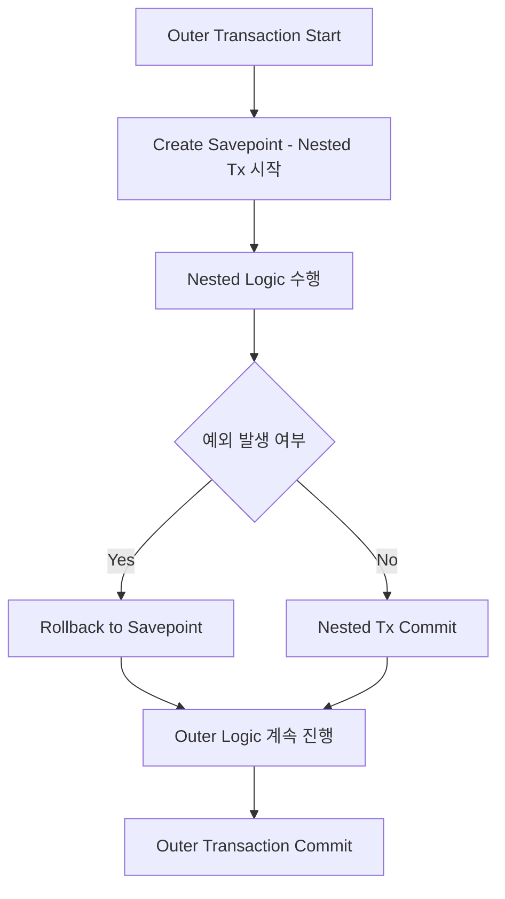

좋아, 오늘 9일차 학습 주제인 \*\*중첩(Nested) 트랜잭션과 저장점(Savepoint)\*\*에 대해 구조적으로 설명하고, Kotlin 예제와 함께 실무 도메인 기반으로 `as-is / to-be` 예제를 제공할게.

---

## 📌 핵심 주제 개요

### 1. ✅ 중첩(Nested) 트랜잭션이란?

* 하나의 트랜잭션 안에서 또 다른 트랜잭션을 시작하는 구조
* Spring에서는 실제 DB 수준의 중첩 트랜잭션을 지원하지 않음 → 대신 **저장점(Savepoint)** 을 이용하여 유사한 중첩 효과 제공
* `PROPAGATION_NESTED` 전파 속성을 사용할 때 저장점을 기준으로 rollback 가능

### 2. ✅ 저장점(Savepoint)이란?

* 트랜잭션 내 특정 시점에 설정하는 **일종의 북마크**
* 전체 트랜잭션을 rollback 하지 않고, 저장점까지 부분 rollback 가능
* JDBC API에서 `Connection.setSavepoint()`, `rollback(Savepoint)` 으로 제어

### 3. ✅ JDBC vs JTA 중첩 트랜잭션 차이

| 항목          | JDBC (Spring 기본)                         | JTA (분산 트랜잭션)        |
| ----------- | ---------------------------------------- | -------------------- |
| 지원 여부       | 저장점 기반으로 중첩 유사 지원 (`PROPAGATION_NESTED`) | 실제 중첩 트랜잭션 불가        |
| 트랜잭션 경계     | 단일 DB 커넥션                                | XAResource, 글로벌 트랜잭션 |
| rollback 대상 | Savepoint 까지                             | 전역 트랜잭션 전체 대상        |
| 복잡도         | 낮음                                       | 높음                   |


### ✅ JDBC 트랜잭션 (`DataSourceTransactionManager`)

### 📌 언제 사용하나?

* **단일 데이터소스(단일 DB)** 를 사용하는 대부분의 Spring 애플리케이션
* 예: MySQL 또는 PostgreSQL 한 개 DB만 사용하는 웹 서비스

### 📌 특징

* 빠르고 설정이 간단함
* 저장점(Savepoint) 등 JDBC의 기능을 그대로 사용 가능
* `PROPAGATION_NESTED` 지원 가능
* 로컬 트랜잭션(1개의 커넥션 기반)


### ✅ JTA 트랜잭션 (`JtaTransactionManager`)

### 📌 언제 사용하나?

* **2개 이상의 데이터소스 또는 분산 자원(DB + MQ + 외부 서비스 등)** 을 하나의 트랜잭션으로 묶고자 할 때
* 예: A DB에 쓰고 B DB에 쓰고 MQ에도 메시지를 넣는 작업을 하나의 트랜잭션으로 묶고 싶을 때

### 📌 특징

* **글로벌(분산) 트랜잭션** 관리
* XA 프로토콜을 통해 각 자원 간 2-phase commit 수행
* 설정 복잡, 성능 오버헤드 있음
* `PROPAGATION_NESTED`은 지원하지 않음 (JTA 트랜잭션에서 savepoint 불가)

---

## 📊 선택 기준 요약

| 상황                                               | 선택할 트랜잭션 매니저                          |
| ------------------------------------------------ | ------------------------------------- |
| 단일 DB만 사용하는 애플리케이션                               | `DataSourceTransactionManager` (JDBC) |
| 다중 DB 또는 DB + MQ, 외부 트랜잭션을 묶어야 함                 | `JtaTransactionManager` (JTA)         |
| `@Transactional(propagation = NESTED)`을 써야 하는 경우 | JDBC 기반만 가능                           |
| 트랜잭션 속도와 단순성이 중요할 경우                             | JDBC 우선 고려                            |
| WAS 독립 트랜잭션 관리가 필요할 때                            | JTA 고려 (예: Spring Boot + Atomikos)    |

---

### 🔧 예시 설정 비교

### ▶ JDBC 기반 설정 (단일 DB)

```kotlin
@Bean
fun transactionManager(dataSource: DataSource): PlatformTransactionManager {
    return DataSourceTransactionManager(dataSource)
}
```

### ▶ JTA 기반 설정 (Atomikos 예)

```kotlin
@Bean
fun transactionManager(): PlatformTransactionManager {
    return JtaTransactionManager()
}
```

### 🧠 결론
대부분의 Spring Boot 애플리케이션은 JDBC 기반으로 충분하며,

JTA는 분산 트랜잭션이 필요한 복잡한 마이크로서비스 아키텍처나 비즈니스 단위에서 원자성이 중요한 작업에만 제한적으로 사용돼.

실무에서는 JDBC 방식 + 보상 트랜잭션(Saga 패턴) 조합으로 `JTA를 피하는 경우가 많아.`

---

## 🧠 함께 학습하면 좋은 개념

* Savepoint와 rollback 흐름 (commit/rollback 관계)
* 예외 발생 시 savepoint rollback 적용 전략
* 트랜잭션 동기화 (`TransactionSynchronizationManager`)
* `DataSourceTransactionManager` 내부 구현

---

## 📊 저장점 기반 롤백 플로우 (Flowchart)



---

## 👨‍💻 Kotlin 예제 (도메인: 주문(Order)과 포인트 처리)

### 📌 As-Is (모든 로직이 하나의 트랜잭션에 묶여 예외 시 전체 롤백)

```kotlin
@Transactional
fun placeOrder(userId: Long, amount: Int) {
    orderService.createOrder(userId, amount) // 주문 생성
    pointService.usePoint(userId, amount)    // 포인트 차감

    // 포인트 차감 실패 → 주문도 롤백
}
```

---

### 📌 To-Be (`@Transactional(propagation = NESTED)`로 중첩 트랜잭션 처리)

```kotlin
@Transactional
fun placeOrder(userId: Long, amount: Int) {
    orderService.createOrder(userId, amount) // 주문 생성

    try {
        pointService.usePointWithNestedTx(userId, amount)
    } catch (e: Exception) {
        log.warn("포인트 차감 실패: {}", e.message)
        // 주문은 유지되지만, 포인트만 rollback 됨
    }
}

@Service
class PointService {

    @Transactional(propagation = Propagation.NESTED)
    fun usePointWithNestedTx(userId: Long, amount: Int) {
        if (amount > 10000) throw IllegalStateException("너무 많은 포인트 사용")
        // 포인트 차감 로직
    }
}
```

---

## 🧩 내부 구현 학습 포인트

* `DataSourceTransactionManager#doBegin()`에서 `ConnectionHolder` 저장
* `AbstractPlatformTransactionManager` → `useSavepointForNestedTransaction() == true`일 때 savepoint 생성
* `ConnectionHolder.createSavepoint()` → 실제 JDBC API 호출
* rollback 시 savepoint 기준으로 처리 (`rollbackToSavepoint`)

---

## 🧾 요약 정리

| 항목             | 내용                                                                   |
| -------------- | -------------------------------------------------------------------- |
| 중첩 트랜잭션        | 트랜잭션 안에서 또 다른 트랜잭션을 시작하는 방식 (Spring에서는 Savepoint로 유사 구현)             |
| 저장점(Savepoint) | 트랜잭션 내 북마크, 해당 시점까지 rollback 가능                                      |
| JDBC           | Savepoint 기반 중첩 트랜잭션 지원                                              |
| JTA            | 저장점 개념 없음, 전역 트랜잭션만 rollback 대상                                      |
| 실무 사용 예        | 보조 작업 실패 시 핵심 도메인 작업 유지 (ex. 주문은 성공, 포인트만 실패)                        |
| 주의사항           | `PROPAGATION_NESTED`는 `DataSourceTransactionManager`에서만 지원됨 (JTA 아님) |

---

## 내생각
> 크게 사용할일은 없을것 같다는 생각이 들긴 함. 위에서도 JDBC 방식과 SAGA 패턴으로 JTA는 피하고 있다고 이야기 함. <br/>
> 오히려 JDBC+방식과 Saga 패턴의 심도있는 학습이 필요하다는 생각이 듬.