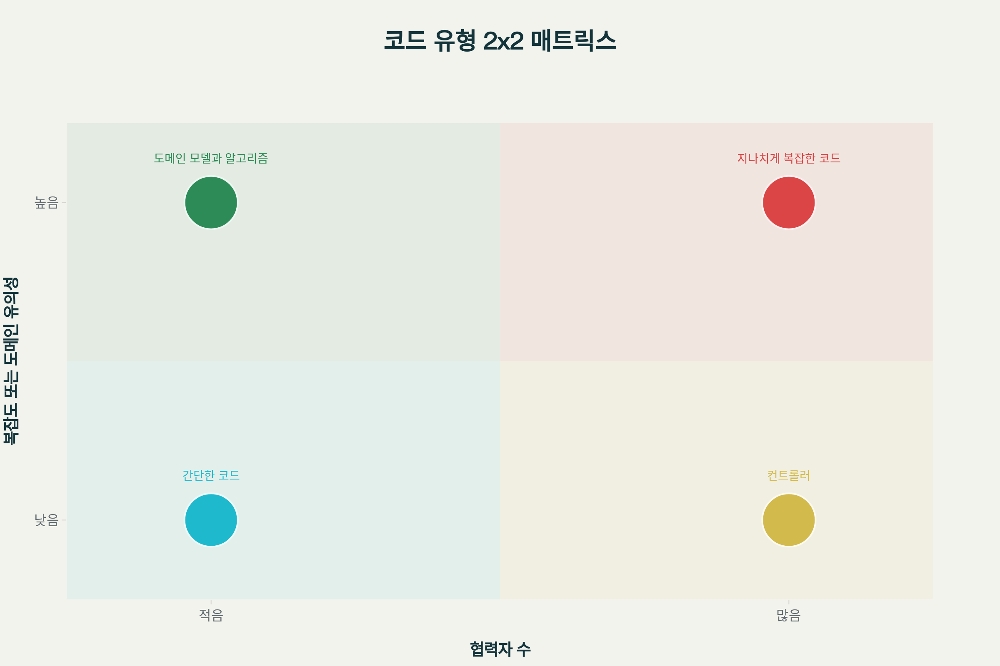
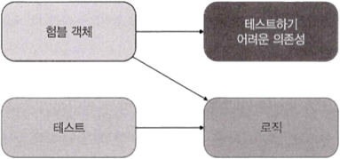

# 7장 가치 있는 단위 테스트를 위한 리팩터링
## 7.1 리팩터링할 코드 식별하기 
### 7.1.1 코드의 네 가지 유형 
가치 있는 단위 테스트를 작성하기 위해서는 먼저 코드를 네 가지 유형으로 분류하여 어떤 코드를 테스트해야 하는지 식별해야 합니다. 모든 제품 코드는 두 차원으로 분류할 수 있습니다:[1][2][3]

**1. 복잡도 또는 도메인 유의성 (Complexity or Domain Significance)**
- **코드 복잡도(Code Complexity)**: 코드 내 의사 결정(분기) 지점 수로 정의합니다. 순환 복잡도는 `1 + `로 계산됩니다.[2][1]
- **도메인 유의성(Domain Significance)**: 코드가 프로젝트의 문제 도메인에 대해 얼마나 의미 있는지를 나타냅니다. 도메인 계층의 모든 코드는 최종 사용자의 목표와 직접적인 연관성이 있어 도메인 유의성이 높습니다.[4][1]

**2. 협력자 수 (Number of Collaborators)**
- 협력자는 가변 의존성이거나 프로세스 외부 의존성(또는 둘 다)입니다.
- 협력자가 많을수록 테스트 비용이 많이 들고, 테스트 크기가 커져 유지 보수성이 떨어집니다. [3][1]
    > 🤔 협력자가 많다는건 그만큼 로직이 복잡하거나, 애초에 잘 모듈화하여 aggregation 해서 사용한다는 의미도 될수 있을 것 같은데.. 일부 로직에서는 피할수 없을수도 있겠다.

**네 가지 코드 유형:**



**네 가지 코드 유형:**
**1. 도메인 모델과 알고리즘 (Domain Model and Algorithms)**
- 복잡도/도메인 유의성: 높음, 협력자 수: 적음
- **단위 테스트에서 가장 이로운 코드**입니다. 복잡하거나 중요한 로직을 수행해서 회귀 방지가 향상되고, 협력자가 적어서 테스트 유지비가 낮습니다.[1][2][3]
    > 🤔 아마도 pure function으로 설계되어 있고 도메인 모델의 경우 독립적으로 설계가 되어야 하므로 이 선행 조건들이 지켜진다면 위의 설명이 유효할거 같다.

**2. 간단한 코드 (Trivial Code)**
- 복잡도/도메인 유의성: 낮음, 협력자 수: 적음
- 매개변수가 없는 생성자, 한 줄 속성 등이 해당됩니다. **테스트할 필요가 전혀 없습니다**.[5][3]

**3. 컨트롤러 (Controllers)**
- 복잡도/도메인 유의성: 낮음, 협력자 수: 많음
- 복잡한 작업을 하지 않고 도메인 클래스와 외부 애플리케이션의 작업을 조정합니다. **포괄적인 통합 테스트의 일부로 간단히 테스트**해야 합니다.[3][5][1]

**4. 지나치게 복잡한 코드 (Overcomplicated Code)**
- 복잡도/도메인 유의성: 높음, 협력자 수: 많음
- **가장 문제가 되는 코드 유형**입니다. 단위 테스트가 어렵지만 **테스트 커버리지 없이 두는 것은 위험**합니다. **알고리즘과 컨트롤러로 분할**해야 합니다.[5][1][3]

### 7.1.2 험블 객체 패턴을 사용해 지나치게 복잡한 코드 분할하기 
**험블 객체 패턴(Humble Object Pattern)**은 테스트하기 어려운 행위와 테스트하기 쉬운 행위를 분리하는 디자인 패턴입니다.[6][7][8]



핵심 아이디어:
- 테스트 가능한 부분을 추출하여 별도의 구성 요소로 만듭니다
- 험블 래퍼(Humble Wrapper)는 테스트하기 어려운 의존성과 새로 추출된 구성 요소를 연결하지만, 자체적인 로직이 거의 없어서 테스트할 필요가 없습니다[9][6][3]

이 패턴은 단일 책임 원칙(SRP)을 따르며, 비즈니스 로직을 오케스트레이션과 분리합니다.[3][5]


## Kotlin 예제 코드
### As-Is: 지나치게 복잡한 코드 예제
```kotlin
// 지나치게 복잡한 코드 예제 - 주문 처리 시스템
class OrderProcessor(
    private val orderRepository: OrderRepository,
    private val paymentGateway: PaymentGateway,
    private val emailService: EmailService,
    private val inventoryService: InventoryService
) {
    // 복잡한 비즈니스 로직과 많은 협력자가 섞여있는 문제적 코드
    fun processOrder(orderRequest: OrderRequest): OrderResult {
        // 주문 유효성 검증 (복잡한 비즈니스 로직)
        if (orderRequest.items.isEmpty()) {
            return OrderResult.failure("주문 항목이 없습니다")
        }
        
        // 할인 계산 (복잡한 비즈니스 로직)
        val totalAmount = calculateTotalWithDiscounts(orderRequest)
        if (totalAmount <= 0) {
            return OrderResult.failure("잘못된 주문 금액입니다")
        }
        
        try {
            // 재고 확인 (외부 의존성)
            val availabilityResult = inventoryService.checkAvailability(orderRequest.items)
            if (!availabilityResult.isAvailable) {
                return OrderResult.failure("재고가 부족합니다: ${availabilityResult.unavailableItems}")
            }
            
            // 결제 처리 (외부 의존성)
            val paymentResult = paymentGateway.processPayment(
                amount = totalAmount,
                cardInfo = orderRequest.paymentInfo
            )
            
            if (!paymentResult.isSuccess) {
                return OrderResult.failure("결제 실패: ${paymentResult.errorMessage}")
            }
            
            // 주문 저장 (외부 의존성)
            val order = Order(
                id = generateOrderId(),
                customerId = orderRequest.customerId,
                items = orderRequest.items,
                totalAmount = totalAmount,
                status = OrderStatus.CONFIRMED,
                paymentId = paymentResult.transactionId
            )
            
            val savedOrder = orderRepository.save(order)
            
            // 재고 차감 (외부 의존성)
            inventoryService.reserveItems(orderRequest.items)
            
            // 이메일 발송 (외부 의존성)
            emailService.sendOrderConfirmation(
                to = orderRequest.customerEmail,
                orderDetails = savedOrder
            )
            
            return OrderResult.success(savedOrder)
            
        } catch (exception: Exception) {
            return OrderResult.failure("주문 처리 중 오류가 발생했습니다: ${exception.message}")
        }
    }
    
    // 복잡한 비즈니스 로직
    private fun calculateTotalWithDiscounts(orderRequest: OrderRequest): BigDecimal {
        val baseTotal = orderRequest.items.sumOf { it.price * it.quantity }
        
        var discountRate = BigDecimal.ZERO
        
        // 수량 할인
        if (orderRequest.items.sumOf { it.quantity } >= 10) {
            discountRate += BigDecimal("0.05") // 5% 할인
        }
        
        // VIP 고객 할인
        if (orderRequest.customerType == CustomerType.VIP) {
            discountRate += BigDecimal("0.10") // 10% 할인
        }
        
        // 시즌 할인
        if (isHolidaySeason()) {
            discountRate += BigDecimal("0.15") // 15% 할인
        }
        
        // 최대 할인율 제한
        discountRate = discountRate.min(BigDecimal("0.25")) // 최대 25%
        
        return baseTotal * (BigDecimal.ONE - discountRate)
    }
    
    private fun isHolidaySeason(): Boolean {
        val now = LocalDate.now()
        return (now.monthValue == 12 && now.dayOfMonth >= 20) || 
               (now.monthValue == 1 && now.dayOfMonth <= 7)
    }
    
    private fun generateOrderId(): String = UUID.randomUUID().toString()
}

// 지원 클래스들
data class OrderRequest(
    val customerId: String,
    val customerEmail: String,
    val customerType: CustomerType,
    val items: List<OrderItem>,
    val paymentInfo: PaymentInfo
)

data class OrderItem(
    val productId: String,
    val name: String,
    val price: BigDecimal,
    val quantity: Int
)

enum class CustomerType { REGULAR, VIP }
enum class OrderStatus { PENDING, CONFIRMED, SHIPPED, DELIVERED, CANCELLED }

// 테스트하기 어려운 복잡한 코드
class OrderProcessorTest : StringSpec({
    "주문 처리 테스트" {
        // 많은 Mock 설정이 필요하고 복잡함
        val orderRepository = mockk<OrderRepository>()
        val paymentGateway = mockk<PaymentGateway>()
        val emailService = mockk<EmailService>()
        val inventoryService = mockk<InventoryService>()
        
        every { inventoryService.checkAvailability(any()) } returns AvailabilityResult(true, emptyList())
        every { paymentGateway.processPayment(any(), any()) } returns PaymentResult(true, "tx123", null)
        every { orderRepository.save(any()) } returns mockk<Order>()
        every { inventoryService.reserveItems(any()) } just Runs
        every { emailService.sendOrderConfirmation(any(), any()) } just Runs
        
        val processor = OrderProcessor(orderRepository, paymentGateway, emailService, inventoryService)
        
        val request = OrderRequest(
            customerId = "customer1",
            customerEmail = "test@example.com",
            customerType = CustomerType.VIP,
            items = listOf(OrderItem("product1", "상품1", BigDecimal("10000"), 2)),
            paymentInfo = PaymentInfo("1234-5678-9012-3456")
        )
        
        val result = processor.processOrder(request)
        
        result.isSuccess shouldBe true
    }
})

```

### To-Be: 험블 객체 패턴 적용 후

```kotlin
// 1. 도메인 모델과 알고리즘 (테스트하기 쉬운 순수한 비즈니스 로직)
class OrderCalculator {
    
    // 복잡한 할인 계산 로직 - 외부 의존성 없음
    fun calculateTotalWithDiscounts(
        items: List<OrderItem>,
        customerType: CustomerType,
        orderDate: LocalDate = LocalDate.now()
    ): BigDecimal {
        val baseTotal = items.sumOf { it.price * it.quantity }
        val discountRate = calculateDiscountRate(items, customerType, orderDate)
        return baseTotal * (BigDecimal.ONE - discountRate)
    }
    
    private fun calculateDiscountRate(
        items: List<OrderItem>,
        customerType: CustomerType,
        orderDate: LocalDate
    ): BigDecimal {
        var discountRate = BigDecimal.ZERO
        
        // 수량 할인
        if (items.sumOf { it.quantity } >= 10) {
            discountRate += BigDecimal("0.05") // 5% 할인
        }
        
        // VIP 고객 할인
        if (customerType == CustomerType.VIP) {
            discountRate += BigDecimal("0.10") // 10% 할인
        }
        
        // 시즌 할인
        if (isHolidaySeason(orderDate)) {
            discountRate += BigDecimal("0.15") // 15% 할인
        }
        
        // 최대 할인율 제한
        return discountRate.min(BigDecimal("0.25")) // 최대 25%
    }
    
    private fun isHolidaySeason(date: LocalDate): Boolean {
        return (date.monthValue == 12 && date.dayOfMonth >= 20) || 
               (date.monthValue == 1 && date.dayOfMonth <= 7)
    }
}

// 주문 도메인 모델 - 비즈니스 규칙을 담고 있는 순수한 객체
class Order private constructor(
    val id: String,
    val customerId: String,
    val items: List<OrderItem>,
    val totalAmount: BigDecimal,
    private var _status: OrderStatus,
    val paymentId: String? = null,
    val createdAt: LocalDateTime = LocalDateTime.now()
) {
    val status: OrderStatus get() = _status
    
    companion object {
        fun create(
            customerId: String,
            items: List<OrderItem>,
            totalAmount: BigDecimal,
            paymentId: String? = null
        ): Order {
            require(items.isNotEmpty()) { "주문 항목이 없습니다" }
            require(totalAmount > BigDecimal.ZERO) { "주문 금액은 0보다 커야 합니다" }
            
            return Order(
                id = UUID.randomUUID().toString(),
                customerId = customerId,
                items = items,
                totalAmount = totalAmount,
                _status = OrderStatus.CONFIRMED,
                paymentId = paymentId
            )
        }
    }
    
    // 도메인 비즈니스 로직
    fun cancel(): Order {
        require(_status == OrderStatus.CONFIRMED) { "확정된 주문만 취소할 수 있습니다" }
        return copy(status = OrderStatus.CANCELLED)
    }
    
    fun ship(): Order {
        require(_status == OrderStatus.CONFIRMED) { "확정된 주문만 배송할 수 있습니다" }
        return copy(status = OrderStatus.SHIPPED)
    }
    
    private fun copy(
        id: String = this.id,
        customerId: String = this.customerId,
        items: List<OrderItem> = this.items,
        totalAmount: BigDecimal = this.totalAmount,
        status: OrderStatus = this._status,
        paymentId: String? = this.paymentId,
        createdAt: LocalDateTime = this.createdAt
    ): Order {
        return Order(id, customerId, items, totalAmount, status, paymentId, createdAt).also {
            it._status = status
        }
    }
}

// 2. 컨트롤러 (험블 객체 - 오케스트레이션만 담당)
class OrderProcessingService(
    private val orderRepository: OrderRepository,
    private val paymentGateway: PaymentGateway,
    private val emailService: EmailService,
    private val inventoryService: InventoryService,
    private val orderCalculator: OrderCalculator = OrderCalculator()
) {
    
    // 단순한 오케스트레이션 로직 - 복잡한 비즈니스 로직은 도메인으로 위임
    suspend fun processOrder(orderRequest: OrderRequest): OrderResult {
        return try {
            // 1. 총액 계산 (도메인 로직으로 위임)
            val totalAmount = orderCalculator.calculateTotalWithDiscounts(
                items = orderRequest.items,
                customerType = orderRequest.customerType
            )
            
            // 2. 재고 확인
            val availabilityResult = inventoryService.checkAvailability(orderRequest.items)
            if (!availabilityResult.isAvailable) {
                return OrderResult.failure("재고가 부족합니다: ${availabilityResult.unavailableItems}")
            }
            
            // 3. 결제 처리
            val paymentResult = paymentGateway.processPayment(totalAmount, orderRequest.paymentInfo)
            if (!paymentResult.isSuccess) {
                return OrderResult.failure("결제 실패: ${paymentResult.errorMessage}")
            }
            
            // 4. 주문 생성 (도메인 로직으로 위임)
            val order = Order.create(
                customerId = orderRequest.customerId,
                items = orderRequest.items,
                totalAmount = totalAmount,
                paymentId = paymentResult.transactionId
            )
            
            // 5. 주문 저장
            val savedOrder = orderRepository.save(order)
            
            // 6. 재고 차감
            inventoryService.reserveItems(orderRequest.items)
            
            // 7. 이메일 발송
            emailService.sendOrderConfirmation(orderRequest.customerEmail, savedOrder)
            
            OrderResult.success(savedOrder)
            
        } catch (exception: Exception) {
            OrderResult.failure("주문 처리 중 오류가 발생했습니다: ${exception.message}")
        }
    }
}

// 결과 클래스
sealed class OrderResult {
    data class Success(val order: Order) : OrderResult()
    data class Failure(val message: String) : OrderResult()
    
    val isSuccess: Boolean get() = this is Success
    val isFailure: Boolean get() = this is Failure
    
    companion object {
        fun success(order: Order): OrderResult = Success(order)
        fun failure(message: String): OrderResult = Failure(message)
    }
}

// 지원 클래스들
data class PaymentInfo(val cardNumber: String)
data class PaymentResult(val isSuccess: Boolean, val transactionId: String?, val errorMessage: String?)
data class AvailabilityResult(val isAvailable: Boolean, val unavailableItems: List<String>)

// 외부 의존성 인터페이스들
interface OrderRepository {
    fun save(order: Order): Order
}

interface PaymentGateway {
    suspend fun processPayment(amount: BigDecimal, paymentInfo: PaymentInfo): PaymentResult
}

interface EmailService {
    suspend fun sendOrderConfirmation(email: String, order: Order)
}

interface InventoryService {
    suspend fun checkAvailability(items: List<OrderItem>): AvailabilityResult
    suspend fun reserveItems(items: List<OrderItem>)
}

```

### 테스트 코드 (Kotest)
```kotlin
// 도메인 로직 테스트 - 외부 의존성 없이 쉽게 테스트
class OrderCalculatorTest : StringSpec({
    
    val calculator = OrderCalculator()
    
    "일반 고객 기본 주문 계산" {
        val items = listOf(
            OrderItem("product1", "상품1", BigDecimal("10000"), 1),
            OrderItem("product2", "상품2", BigDecimal("20000"), 1)
        )
        
        val total = calculator.calculateTotalWithDiscounts(
            items = items,
            customerType = CustomerType.REGULAR,
            orderDate = LocalDate.of(2024, 6, 15) // 비시즌
        )
        
        total shouldBe BigDecimal("30000") // 할인 없음
    }
    
    "VIP 고객 대량 주문 시즌 할인 적용" {
        val items = listOf(
            OrderItem("product1", "상품1", BigDecimal("10000"), 10) // 수량 할인 대상
        )
        
        val total = calculator.calculateTotalWithDiscounts(
            items = items,
            customerType = CustomerType.VIP, // VIP 할인
            orderDate = LocalDate.of(2024, 12, 25) // 시즌 할인
        )
        
        // 기본 금액: 100,000원
        // 수량 할인: 5%, VIP 할인: 10%, 시즌 할인: 15%
        // 총 할인율: 25% (최대값 적용)
        // 최종 금액: 75,000원
        total shouldBe BigDecimal("75000")
    }
    
    "최대 할인율 제한 확인" {
        val items = listOf(
            OrderItem("product1", "상품1", BigDecimal("10000"), 15) // 수량 할인
        )
        
        val total = calculator.calculateTotalWithDiscounts(
            items = items,
            customerType = CustomerType.VIP, // VIP 할인  
            orderDate = LocalDate.of(2024, 12, 25) // 시즌 할인
        )
        
        // 모든 할인을 적용해도 25%를 초과하지 않음
        total shouldBe BigDecimal("112500") // 25% 할인 적용
    }
})

// 도메인 모델 테스트
class OrderTest : StringSpec({
    
    "유효한 주문 생성" {
        val items = listOf(
            OrderItem("product1", "상품1", BigDecimal("10000"), 2)
        )
        
        val order = Order.create(
            customerId = "customer1",
            items = items,
            totalAmount = BigDecimal("20000")
        )
        
        order.customerId shouldBe "customer1"
        order.items shouldBe items
        order.totalAmount shouldBe BigDecimal("20000")
        order.status shouldBe OrderStatus.CONFIRMED
    }
    
    "빈 주문 항목으로 주문 생성 시 예외 발생" {
        shouldThrow<IllegalArgumentException> {
            Order.create(
                customerId = "customer1",
                items = emptyList(),
                totalAmount = BigDecimal("0")
            )
        }.message shouldBe "주문 항목이 없습니다"
    }
    
    "0 이하 금액으로 주문 생성 시 예외 발생" {
        val items = listOf(
            OrderItem("product1", "상품1", BigDecimal("10000"), 1)
        )
        
        shouldThrow<IllegalArgumentException> {
            Order.create(
                customerId = "customer1", 
                items = items,
                totalAmount = BigDecimal.ZERO
            )
        }.message shouldBe "주문 금액은 0보다 커야 합니다"
    }
    
    "확정된 주문 취소" {
        val order = Order.create(
            customerId = "customer1",
            items = listOf(OrderItem("product1", "상품1", BigDecimal("10000"), 1)),
            totalAmount = BigDecimal("10000")
        )
        
        val cancelledOrder = order.cancel()
        
        cancelledOrder.status shouldBe OrderStatus.CANCELLED
        order.status shouldBe OrderStatus.CONFIRMED // 원본은 변경되지 않음
    }
})

// 서비스 통합 테스트 (Mock 사용)
class OrderProcessingServiceTest : StringSpec({
    
    "성공적인 주문 처리" {
        val orderRepository = mockk<OrderRepository>()
        val paymentGateway = mockk<PaymentGateway>()
        val emailService = mockk<EmailService>()
        val inventoryService = mockk<InventoryService>()
        
        // Mock 설정
        coEvery { inventoryService.checkAvailability(any()) } returns AvailabilityResult(true, emptyList())
        coEvery { paymentGateway.processPayment(any(), any()) } returns PaymentResult(true, "tx123", null)
        every { orderRepository.save(any()) } returnsArgument 0
        coEvery { inventoryService.reserveItems(any()) } just Runs
        coEvery { emailService.sendOrderConfirmation(any(), any()) } just Runs
        
        val service = OrderProcessingService(orderRepository, paymentGateway, emailService, inventoryService)
        
        val request = OrderRequest(
            customerId = "customer1",
            customerEmail = "test@example.com",
            customerType = CustomerType.REGULAR,
            items = listOf(OrderItem("product1", "상품1", BigDecimal("10000"), 2)),
            paymentInfo = PaymentInfo("1234-5678-9012-3456")
        )
        
        val result = service.processOrder(request)
        
        result.isSuccess shouldBe true
        coVerify { inventoryService.checkAvailability(request.items) }
        coVerify { paymentGateway.processPayment(BigDecimal("20000"), request.paymentInfo) }
        verify { orderRepository.save(any()) }
        coVerify { inventoryService.reserveItems(request.items) }
        coVerify { emailService.sendOrderConfirmation(request.customerEmail, any()) }
    }
    
    "재고 부족 시 주문 실패" {
        val inventoryService = mockk<InventoryService>()
        val service = OrderProcessingService(
            orderRepository = mockk(),
            paymentGateway = mockk(), 
            emailService = mockk(),
            inventoryService = inventoryService
        )
        
        coEvery { inventoryService.checkAvailability(any()) } returns 
            AvailabilityResult(false, listOf("product1"))
        
        val request = OrderRequest(
            customerId = "customer1",
            customerEmail = "test@example.com", 
            customerType = CustomerType.REGULAR,
            items = listOf(OrderItem("product1", "상품1", BigDecimal("10000"), 2)),
            paymentInfo = PaymentInfo("1234-5678-9012-3456")
        )
        
        val result = service.processOrder(request)
        
        result.isFailure shouldBe true
        (result as OrderResult.Failure).message shouldContain "재고가 부족합니다"
    }
})

```

## 요약**7장 가치 있는 단위 테스트를 위한 리팩터링**의 핵심 내용:

### 코드의 네 가지 유형
| 유형 | 복잡도/도메인 유의성 | 협력자 수 | 테스트 전략 |
|------|---------------------|-----------|-------------|
| 도메인 모델과 알고리즘 | 높음 | 적음 | 단위 테스트 집중 |
| 간단한 코드 | 낮음 | 적음 | 테스트 불필요 |
| 컨트롤러 | 낮음 | 많음 | 통합 테스트 |
| 지나치게 복잡한 코드 | 높음 | 많음 | 분할 후 테스트 |

### 험블 객체 패턴의 이점[6][3][9]
- **비즈니스 로직과 오케스트레이션 분리**: 복잡한 도메인 로직을 순수한 함수로 추출
- **테스트 용이성 향상**: 외부 의존성 없는 도메인 로직은 쉽게 테스트 가능
- **유지보수성 개선**: 관심사 분리로 코드 변경 시 영향 범위 최소화
- **단일 책임 원칙 준수**: 각 클래스가 하나의 명확한 책임만 가짐

### 실무 적용 가이드라인[1][2][3]
1. **코드가 더 중요하거나 복잡할수록 협력자는 더 적어야 합니다**
2. **도메인 모델은 프로세스 외부 의존성을 사용하면 안 됩니다**
3. **지나치게 복잡한 코드를 피하고 도메인 모델과 알고리즘만 단위 테스트하는 것이 가치 있는 테스트 스위트로 가는 길입니다**

## 관련 링크
- [7장 가치 있는 단위 테스트를 위한 리팩터링 - 리팩터링할 코드 식별하기](https://jonghoonpark.com/2023/07/18/identifying-the-code-to-refactor)[1]
- [험블 객체 패턴 - Clean Architecture](https://share-factory.tistory.com/34)[6]
- [테스트는 어떻게 좋은 코드를 만드는가(feat. 험블 객체 패턴)](https://d2.naver.com/helloworld/9921217)[9]


[1] https://jonghoonpark.com/2023/07/18/identifying-the-code-to-refactor
[2] https://velog.io/@crow/%EA%B0%80%EC%B9%98%EC%9E%88%EB%8A%94-%EB%8B%A8%EC%9C%84-%ED%85%8C%EC%8A%A4%ED%8A%B8%EB%A5%BC-%EC%9C%84%ED%95%9C-%EB%A6%AC%ED%8C%A9%ED%84%B0%EB%A7%81
[3] https://baby-care-dev.tistory.com/6
[4] https://www.kimcoder.io/books/unit-testing/7
[5] https://dionysus2074.tistory.com/313
[6] https://share-factory.tistory.com/34
[7] https://dheldh77.tistory.com/entry/Clean-Architecture-%EC%A0%95%EB%A6%AC-23%EC%9E%A5-%ED%94%84%EB%A0%88%EC%A0%A0%ED%84%B0%EC%99%80-%ED%97%98%EB%B8%94-%EA%B0%9D%EC%B2%B4
[8] https://forum.dotnetdev.kr/t/steven-giesel/6258
[9] https://d2.naver.com/helloworld/9921217
[10] https://ppl-ai-file-upload.s3.amazonaws.com/web/direct-files/attachments/32004849/9ddb5b7a-e639-4ea4-8016-e90ca3760cf0/2501-danwi-teseuteu-pages-221-230.pdf
[11] https://healthcoding.tistory.com/44
[12] https://devforme.tistory.com/39
[13] https://narakit.tistory.com/292
[14] https://namhoon.kim/2022/12/13/method-test/033/index.html
[15] https://dev-playground.oopy.io/0248cf20-79cb-4491-a14c-1b600e23e963
[16] https://reimaginer.tistory.com/entry/%ED%85%8C%EC%8A%A4%ED%8A%B8%EC%97%90-%EB%8C%80%ED%95%9C-%EC%8B%A4%EC%9A%A9%EC%A0%81%EC%9D%B8-%EC%A0%91%EA%B7%BC-Humble-Object-Pattern
[17] https://dev-playground.oopy.io/6966add4-1e7c-427f-bf6f-cf980420dc5c
[18] https://feel2.tistory.com/37
[19] https://jonghoonpark.com/2023/10/26/%ED%94%84%EB%A0%88%EC%A0%A0%ED%84%B0%EC%99%80-%ED%97%98%EB%B8%94-%EA%B0%9D%EC%B2%B4
[20] https://jonghoonpark.com/2023/07/28/refactoring-toward-valuable-unit-tests
[21] https://ojt90902.tistory.com/1359
[22] https://cloud.google.com/looker/docs/scatter-options?hl=ko
[23] https://dev.to/krofdrakula/make-testable-components-using-the-humble-object-pattern-1j4o
[24] https://dev-coco.tistory.com/190
[25] https://stackoverflow.com/questions/5324049/what-is-the-humble-object-pattern-and-when-is-it-useful
[26] https://umbum.dev/1206/
[27] https://kotlinlang.org/docs/object-declarations.html
[28] https://www.inflearn.com/community/questions/915012/controller-application-service-domain-%EC%9D%98-%EC%97%AD%ED%95%A0-%EA%B5%AC%EB%B6%84
[29] https://asana.com/ko/resources/eisenhower-matrix
[30] https://www.codingblocks.net/podcast/clean-architecture-what-is-the-humble-object-pattern/
[31] https://parkmuhyeun.github.io/etc/java/2023-12-16-Domain/
[32] https://dev.to/marcellogalhardo/humble-views-proud-viewmodels-od1
[33] https://velog.io/@seoyong-lee/MVC-%EC%A0%9C%EB%8C%80%EB%A1%9C-%EC%95%8C%EA%B8%B0
[34] https://www.goe.go.kr/resource/old/BBSMSTR_000000030179/BBS_202501161038123800.pdf
[35] https://blog.baudson.de/blog/tactical-design-by-example-using-kotlin-and-spring-boot-part-2
[36] https://umbum.tistory.com/1066
[37] https://scienceon.kisti.re.kr/srch/selectPORSrchArticle.do?cn=JAKO201925462478636
[38] https://blog.baudson.de/blog/tactical-design-by-example-using-kotlin-and-spring-boot-part-12-using-kotlin-delegates-for-domain-events