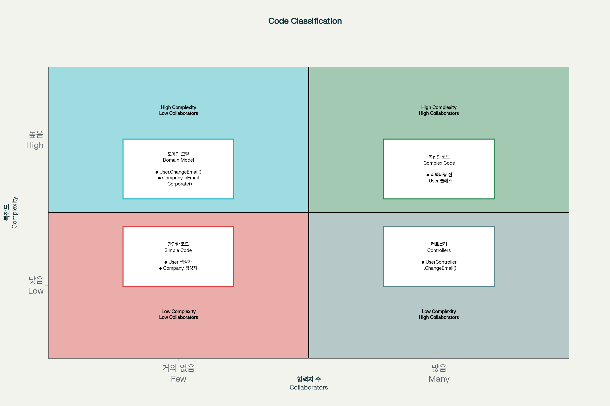

# 7.2 가치 있는 단위 테스트를 위한 리팩터링하기

## 개요
이 장에서는 지나치게 복잡한 코드를 알고리즘과 컨트롤러로 나누는 종합적인 리팩터링 예제를 다룹니다. 험블 객체 패턴을 사용하여 엔터프라이즈급 애플리케이션에 적용할 수 있는 방법을 일반화합니다.

## 7.2.1 고객 관리 시스템(CRM) 소개

CRM 시스템은 사용자 등록을 처리하는 고객 관리 시스템으로, 모든 사용자가 데이터베이스에 저장됩니다. 현재 시스템은 **사용자 이메일 변경**이라는 단 하나의 유스케이스만 지원하며, 다음 세 가지 비즈니스 규칙을 가집니다:

1. **사용자 이메일이 회사 도메인에 속한 경우** 해당 사용자는 직원으로 표시되고, 그렇지 않으면 고객으로 간주
2. **시스템은 회사의 직원 수를 추적**해야 하며, 사용자 유형이 변경되면 이 숫자도 변경
3. **이메일이 변경되면** 시스템은 메시지 버스로 메시지를 보내 외부 시스템에 알림

### AS-IS: 초기 구현 (문제점)
```kotlin
// AS-IS: 지나치게 복잡한 코드 (문제가 있는 초기 구현)
enum class UserType {
    CUSTOMER, EMPLOYEE
}

class User {
    var userId: Int = 0
        private set
    var email: String = ""
        private set  
    var type: UserType = UserType.CUSTOMER
        private set
        
    fun changeEmail(userId: Int, newEmail: String) {
        // 데이터베이스에서 사용자 정보 직접 조회
        val data = Database.getUserById(userId)
        this.userId = userId
        this.email = data[1] as String
        this.type = data[2] as UserType
        
        if (email == newEmail) return
        
        // 데이터베이스에서 회사 정보 직접 조회 
        val companyData = Database.getCompany()
        val companyDomainName = companyData[0] as String
        val numberOfEmployees = companyData[1] as Int
        
        // 비즈니스 로직: 이메일 도메인 검사
        val emailDomain = newEmail.split("@")[1]
        val isEmailCorporate = emailDomain == companyDomainName
        val newType = if (isEmailCorporate) UserType.EMPLOYEE else UserType.CUSTOMER
        
        // 직원 수 업데이트
        if (type != newType) {
            val delta = if (newType == UserType.EMPLOYEE) 1 else -1
            val newNumber = numberOfEmployees + delta
            Database.saveCompany(newNumber) // 데이터베이스에 직접 저장
        }
        
        this.email = newEmail
        this.type = newType
        
        Database.saveUser(this) // 데이터베이스에 직접 저장
        MessageBus.sendEmailChangedMessage(userId, newEmail) // 외부 시스템에 직접 호출
    }
}

```

**문제점 분석:**
- **복잡도**: 높음 (비즈니스 로직 포함)
- **도메인 유의성**: 높음 (핵심 비즈니스 규칙)
- **협력자 수**: 많음 (Database, MessageBus - 프로세스 외부 의존성)
- **결과**: 지나치게 복잡한 코드로 분류되어 테스트하기 매우 어려움

## 7.2.2 1단계: 암시적 의존성을 명시적으로 만들기

첫 번째 단계는 데이터베이스와 메시지 버스에 대한 인터페이스를 만들고 이를 주입하는 것입니다. 하지만 이는 충분하지 않습니다.

**한계점**: 도메인 모델이 여전히 프로세스 외부 의존성에 의존하므로 복잡한 목 체계가 필요하고, 테스트 취약성을 야기할 수 있습니다.

## 7.2.3 2단계: 애플리케이션 서비스 계층 도입

도메인 모델이 외부 시스템과 직접 통신하는 문제를 해결하기 위해 **험블 컨트롤러(Humble Controller)**, 즉 애플리케이션 서비스를 도입합니다.

```kotlin
// 2단계: 애플리케이션 서비스 도입
class UserController {
    private val database = Database()
    private val messageBus = MessageBus()
    
    fun changeEmail(userId: Int, newEmail: String) {
        // 데이터베이스에서 사용자 데이터 조회
        val data = database.getUserById(userId)
        val email = data[1] as String
        val type = data[2] as UserType
        val user = User(userId, email, type)
        
        // 회사 데이터 조회
        val companyData = database.getCompany()
        val companyDomainName = companyData[0] as String
        val numberOfEmployees = companyData[1] as Int
        
        // 도메인 로직 실행
        val newNumberOfEmployees = user.changeEmail(
            newEmail, companyDomainName, numberOfEmployees
        )
        
        // 변경사항 저장 및 외부 시스템 알림
        database.saveCompany(newNumberOfEmployees)
        database.saveUser(user)
        messageBus.sendEmailChangedMessage(userId, newEmail)
    }
}

class User(
    val userId: Int,
    var email: String,
    var type: UserType
) {
    // 순수한 비즈니스 로직만 포함 (프로세스 외부 의존성 제거)
    fun changeEmail(
        newEmail: String, 
        companyDomainName: String, 
        numberOfEmployees: Int
    ): Int {
        if (email == newEmail) return numberOfEmployees
        
        val emailDomain = newEmail.split("@")[1]
        val isEmailCorporate = emailDomain == companyDomainName
        val newType = if (isEmailCorporate) UserType.EMPLOYEE else UserType.CUSTOMER
        
        var updatedEmployeeCount = numberOfEmployees
        if (type != newType) {
            val delta = if (newType == UserType.EMPLOYEE) 1 else -1
            updatedEmployeeCount += delta
        }
        
        this.email = newEmail
        this.type = newType
        
        return updatedEmployeeCount
    }
}

```

## 7.2.4 3단계: 애플리케이션 서비스 복잡도 낮추기

UserController가 확실히 컨트롤러 사분면에 위치하려면 재구성 로직을 추출해야 합니다. 이를 위해 **팩토리 클래스**를 도입합니다.

```kotlin
// 3단계: 팩토리 클래스를 통한 재구성 로직 분리
class UserFactory {
    companion object {
        fun create(data: Array<Any>): User {
            require(data.size >= 3) { "데이터 배열에는 최소 3개의 요소가 있어야 합니다" }
            
            val id = data[0] as Int
            val email = data[1] as String  
            val type = data[2] as UserType
            
            return User(id, email, type)
        }
    }
}

class CompanyFactory {
    companion object {
        fun create(data: Array<Any>): Company {
            require(data.size >= 2) { "데이터 배열에는 최소 2개의 요소가 있어야 합니다" }
            
            val domainName = data[0] as String
            val numberOfEmployees = data[1] as Int
            
            return Company(domainName, numberOfEmployees)
        }
    }
}

```

**재구성 로직의 특징**: 복잡하지만 도메인 유의성이 없는 유틸리티 코드입니다. 숨은 분기점(배열 접근, 타입 캐스팅 등)이 있어 테스트할 가치가 있습니다.

## 7.2.5 4단계: 새 Company 클래스 소개

User에서 회사 관련 로직을 분리하여 책임을 명확히 하고 **"묻지 말고 말하라"** 원칙을 적용합니다.

### TO-BE: 최종 리팩터링된 구현
```kotlin
// TO-BE: 리팩터링 완료된 깔끔한 구현

// 도메인 모델: Company 클래스
class Company(
    val domainName: String,
    private var _numberOfEmployees: Int
) {
    val numberOfEmployees: Int
        get() = _numberOfEmployees
    
    // 직원 수 변경 로직 캡슐화
    fun changeNumberOfEmployees(delta: Int) {
        require(_numberOfEmployees + delta >= 0) { 
            "직원 수는 0보다 작을 수 없습니다" 
        }
        _numberOfEmployees += delta
    }
    
    // 회사 이메일 여부 판단 로직 캡슐화
    fun isEmailCorporate(email: String): Boolean {
        val emailDomain = email.split("@")[1]
        return emailDomain == domainName
    }
}

// 도메인 모델: User 클래스 (최종 버전)
class User(
    val userId: Int,
    private var _email: String,
    private var _type: UserType
) {
    val email: String get() = _email
    val type: UserType get() = _type
    
    // 순수한 비즈니스 로직, Company 객체와 협력
    fun changeEmail(newEmail: String, company: Company) {
        if (_email == newEmail) return
        
        // Company에게 이메일 검증 위임
        val newType = if (company.isEmailCorporate(newEmail)) {
            UserType.EMPLOYEE
        } else {
            UserType.CUSTOMER  
        }
        
        // 타입이 변경되면 Company에게 직원 수 변경 요청
        if (_type != newType) {
            val delta = if (newType == UserType.EMPLOYEE) 1 else -1
            company.changeNumberOfEmployees(delta)
        }
        
        _email = newEmail
        _type = newType
    }
}

// 애플리케이션 서비스: 오케스트레이션만 담당
class UserController(
    private val database: Database,
    private val messageBus: MessageBus
) {
    fun changeEmail(userId: Int, newEmail: String) {
        // 데이터 조회 및 객체 생성
        val userData = database.getUserById(userId)
        val user = UserFactory.create(userData)
        
        val companyData = database.getCompany()
        val company = CompanyFactory.create(companyData)
        
        // 도메인 로직 실행 (순수 비즈니스 로직)
        user.changeEmail(newEmail, company)
        
        // 영속화 및 외부 시스템 알림 (사이드 이펙트)
        database.saveCompany(company)
        database.saveUser(user)
        messageBus.sendEmailChangedMessage(userId, newEmail)
    }
}

```

### KoTest를 활용한 테스트 예제
```kotlin
import io.kotest.core.spec.style.BehaviorSpec
import io.kotest.matchers.shouldBe
import io.kotest.matchers.shouldNotBe

class UserEmailChangeTest : BehaviorSpec({
    
    Given("회사와 고객 사용자가 주어졌을 때") {
        val company = Company("company.com", 10)
        val customer = User(1, "john@external.com", UserType.CUSTOMER)
        
        When("회사 도메인 이메일로 변경하면") {
            customer.changeEmail("john@company.com", company)
            
            Then("사용자는 직원이 되고 직원 수는 증가한다") {
                customer.type shouldBe UserType.EMPLOYEE
                customer.email shouldBe "john@company.com"
                company.numberOfEmployees shouldBe 11
            }
        }
    }
    
    Given("회사 직원이 주어졌을 때") {
        val company = Company("company.com", 10)
        val employee = User(2, "jane@company.com", UserType.EMPLOYEE)
        
        When("외부 이메일로 변경하면") {
            employee.changeEmail("jane@gmail.com", company)
            
            Then("사용자는 고객이 되고 직원 수는 감소한다") {
                employee.type shouldBe UserType.CUSTOMER
                employee.email shouldBe "jane@gmail.com"
                company.numberOfEmployees shouldBe 9
            }
        }
    }
    
    Given("Company 클래스 테스트") {
        val company = Company("company.com", 5)
        
        When("회사 이메일인지 확인하면") {
            val isCorporate = company.isEmailCorporate("user@company.com")
            val isNotCorporate = company.isEmailCorporate("user@gmail.com")
            
            Then("올바르게 판단한다") {
                isCorporate shouldBe true
                isNotCorporate shouldBe false
            }
        }
    }
}

```

## 7.3 최적의 단위 테스트 커버리지 분석


험블 객체 패턴을 사용한 리팩터링 후의 코드 분류는 다음 표와 같습니다:
| 코드 유형 | 협력자 수 | 복잡도와 도메인 유의성 | 예시 메서드 |
|-----------|-----------|----------------------|------------|
| **도메인 모델 및 알고리즘** | 거의 없음 | 높음 | User의 ChangeEmail(newEmail, company), Company의 ChangeNumberOfEmployees(delta)와 IsEmailCorporate(email), CompanyFactory의 Create(data) |
| **간단한 코드** | 거의 없음 | 낮음 | User와 Company의 생성자 |
| **지나치게 복잡한 코드** | 많음 | 높음 | 리팩터링 전 User.ChangeEmail 메서드 |
| **컨트롤러** | 많음 | 낮음 | UserController의 ChangeEmail(userId, newMail) |

### 7.3.1 도메인 계층과 유틸리티 코드 테스트하기

**좌측 상단(도메인 모델 및 알고리즘)** 코드는 비용 편익 측면에서 최상의 결과를 가져다줍니다:
- **높은 복잡도와 도메인 유의성**: 뛰어난 회귀 방지
- **적은 협력자**: 낮은 유지비
- **테스트 용이성**: 출력 기반 및 상태 기반 테스트 가능

## 핵심 개념 및 이점
### 험블 객체 패턴의 원리
> 🤔 나에겐 SOLID하게 리팩토링 정도의 느낌. 뭔가 험블 패턴이라고 이름을 붙여야 되는가..?
1. **분리의 원칙**: 테스트하기 어려운 행위와 쉬운 행위를 분리
2. **책임 분리**: 각 클래스가 단일 책임을 가지도록 설계
3. **의존성 역전**: 도메인 모델이 외부 의존성에 의존하지 않음

### 함수형 아키텍처와의 유사점
- **공통점**: 프로세스 외부 의존성과 격리된 코어
- **차이점**: 
  - 함수형 코어: 사이드 이펙트 전혀 없음
    > 결국 이방식을 계속해서 지향해야 됨.
  - 도메인 모델: 사이드 이펙트가 도메인 모델 내부에 남아있음

### 테스트 용이성 향상
- **사이드 이펙트 지연**: 마지막 순간까지 메모리에 보관
- **프로세스 외부 의존성 불필요**: 목이나 스텁 불필요
- **출력 기반 테스트**: 메모리 객체 검증으로 충분

## 요약
7.2장은 험블 객체 패턴을 통한 체계적인 리팩터링 과정을 보여주었습니다:

**핵심 변화:**
- **AS-IS**: 지나치게 복잡한 User 클래스 → **TO-BE**: 책임이 분리된 여러 클래스
- **AS-IS**: 프로세스 외부 의존성에 직접 결합 → **TO-BE**: 도메인 모델의 완전한 격리
- **AS-IS**: 테스트하기 어려운 구조 → **TO-BE**: 출력/상태 기반으로 쉽게 테스트 가능

**주요 이점:**
1. **테스트 용이성 극대화**: 복잡한 목 체계 불필요
2. **유지보수성 향상**: 각 클래스의 명확한 책임
3. **확장성**: 새로운 요구사항 추가 시 영향 최소화
4. **코드 품질**: 각 코드가 적절한 사분면에 위치

이러한 리팩터링을 통해 비즈니스 로직과 오케스트레이션이 완전히 분리되어, 어느 부분을 테스트 단위로 할지 쉽게 결정할 수 있게 되었습니다.

## 관련 자료
### 험블 객체 패턴 상세 설명
- [Martin Fowler - Humble Object](https://martinfowler.com/bliki/HumbleObject.html) - 험블 객체 패턴의 창시자인 Martin Fowler의 설명
- [Clean Architecture의 험블 객체](https://share-factory.tistory.com/34) - 험블 객체 패턴의 한국어 설명

### 육각형 아키텍처
- [Hexagonal Architecture 이해하기](https://gngsn.tistory.com/258) - 헥사고날 아키텍처의 핵심 개념
- [육각형 아키텍처 상세 가이드](https://velog.io/@mino_dev/육각형-아키텍처Hexagonal-Architecture) - 포트와 어댑터 패턴

### 함수형 코어, 명령형 셸
- [Functional Core, Imperative Shell 패턴](https://kennethlange.com/functional-core-imperative-shell/) - Gary Bernhardt의 아키텍처 패턴


[1] https://ppl-ai-file-upload.s3.amazonaws.com/web/direct-files/attachments/32004849/8fd0a8e0-4d24-427a-8690-d3e9d165924e/2501-danwi-teseuteu-pages-230-242.pdf
[2] https://www.geeksforgeeks.org/computer-science-fundamentals/find-quadrant-of-the-coordinate-point/
[3] https://journal.optivem.com/p/unit-testing-use-cases-or-domain
[4] https://www.mulesoft.com/resources/esb/what-application-orchestration
[5] https://kennethlange.com/functional-core-imperative-shell/
[6] https://www.patterns.dev/vanilla/factory-pattern/
[7] https://www.cis.jhu.edu/~yqin/cvrg/Quadrant_Tree_Classifier.htm
[8] https://matthiasnoback.nl/2021/03/testing-controllers-when-you-have-a-decoupled-core/
[9] https://www.databricks.com/glossary/orchestration
[10] https://github.com/albertllousas/functional-core-imperative-shell
[11] https://en.wikipedia.org/wiki/Factory_method_pattern
[12] https://www.cliffsnotes.com/study-notes/27726553
[13] https://learn.microsoft.com/en-us/aspnet/core/mvc/controllers/testing?view=aspnetcore-9.0
[14] https://www.hitachivantara.com/ko-kr/insights/faq/application-orchestration
[15] https://ricofritzsche.me/applying-functional-core-and-imperative-shell-in-practice/
[16] https://refactoring.guru/design-patterns/factory-method
[17] https://www.alibabacloud.com/blog/602134
[18] https://enterprisecraftsmanship.com/posts/domain-model-purity-completeness/
[19] https://www.advsyscon.com/blog/service-orchestration-what-is/
[20] https://www.reddit.com/r/ExperiencedDevs/comments/1hwtpj1/do_you_use_the_functional_core_imperative_shell/
[21] https://www.geeksforgeeks.org/system-design/factory-method-for-designing-pattern/
[22] https://share-factory.tistory.com/34
[23] https://www.ibm.com/kr-ko/think/topics/technical-debt
[24] https://jja2han.tistory.com/296
[25] https://velog.io/@mino_dev/%EC%9C%A1%EA%B0%81%ED%98%95-%EC%95%84%ED%82%A4%ED%85%8D%EC%B3%90Hexagonal-Architecture
[26] https://jonghoonpark.com/2023/10/26/%ED%94%84%EB%A0%88%EC%A0%A0%ED%84%B0%EC%99%80-%ED%97%98%EB%B8%94-%EA%B0%9D%EC%B2%B4
[27] https://ko.russianponovo.com/power-amplifier-for-real-time-dynamic-simulation/4-quadrant-power-amplifier/
[28] https://doomdevlog.tistory.com/37
[29] https://github.com/rlaisqls/TIL/blob/main/%EC%95%84%ED%82%A4%ED%85%8D%EC%B2%98%E2%80%85%EB%B0%8F%E2%80%85%EB%B0%A9%EB%B2%95%EB%A1%A0/HexagonalArchitecture.md
[30] https://ocwokocw.tistory.com/43
[31] https://kss.or.kr/homepage/custom/statistics
[32] https://ssico.tistory.com/76
[33] https://gngsn.tistory.com/258
[34] https://dheldh77.tistory.com/entry/Clean-Architecture-%EC%A0%95%EB%A6%AC-23%EC%9E%A5-%ED%94%84%EB%A0%88%EC%A0%A0%ED%84%B0%EC%99%80-%ED%97%98%EB%B8%94-%EA%B0%9D%EC%B2%B4
[35] https://patents.google.com/patent/KR20160087775A/ko
[36] https://velog.io/@hyun6ik/Layer-%EA%B3%84%EC%B8%B5
[37] https://devocean.sk.com/blog/techBoardDetail.do?ID=165581&boardType=techBlog
[38] https://reimaginer.tistory.com/entry/%ED%85%8C%EC%8A%A4%ED%8A%B8%EC%97%90-%EB%8C%80%ED%95%9C-%EC%8B%A4%EC%9A%A9%EC%A0%81%EC%9D%B8-%EC%A0%91%EA%B7%BC-Humble-Object-Pattern
[39] https://www.appbuilder.dev/ko/blog/reduce-tech-debt-with-low-code-tools
[40] https://tjdtls690.github.io/studycontents/java/2023-04-24-service_layer/
[41] https://nodejs.myeongjae.kim/pages/002-hexagonal-architecture/