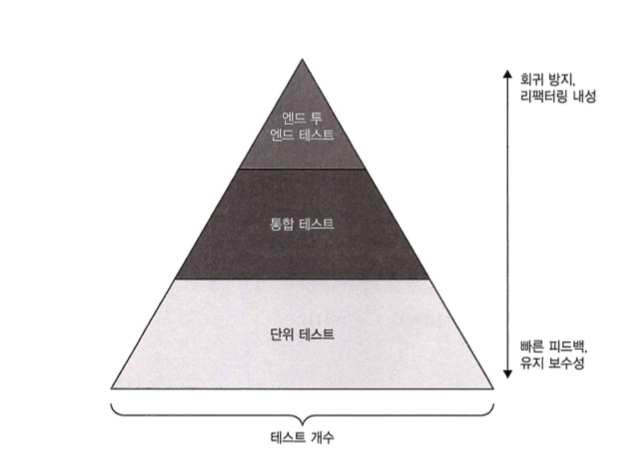

## 8.1 통합 테스트는 무엇인가

### 8.1.1 통합 테스트의 역할

* 단위 테스트는 **단일 동작 단위 검증 · 빠른 수행 · 테스트 간 격리**를 만족해야 한다. 이 중 하나라도 만족하지 못하면 **통합 테스트**에 속한다.&#x20;
* 통합 테스트는 보통 **프로세스 외부 의존성과의 통합**이 올바른지 검증하며, 주로 **컨트롤러 사분면**(도메인 모델과 외부 의존성을 연결하는 코드)을 다룬다.&#x20;
* 반대로 단위 테스트는 **도메인 모델/알고리즘 사분면**을 다루고, **지나치게 단순한 코드**나 **지나치게 복잡한 코드**는 테스트 대상이 아니다(리팩터링 대상). &#x20;

> #### 그림 8.1 (요지 재구성)
>
> * 단위: 도메인·알고리즘
> * 통합: 컨트롤러(외부 의존성 연결)
> * **너무 단순/너무 복잡**: 테스트 X&#x20;

### 8.1.2 다시 보는 테스트 피라미드
**테스트 피라미드 구조**


* 통합 테스트는 **느리고 유지비가 높다**(외부 시스템 운영 필요, 협력자 수 증가). 대신 **회귀 방지·리팩터링 내성**은 뛰어나다.&#x20;
* **전략**:

  * 단위 테스트로 **가능한 많은 예외 상황**을 커버
  * 통합 테스트는 **주요 흐름(happy path)** 과 단위 테스트로 다루지 못한 **특별 예외(edge case)** 위주로 적게 유지한다.&#x20;
* 이 전략은 **테스트 피라미드 형태**를 만든다(대부분 단위 테스트, 일부 통합 테스트, E2E는 통합의 하위 집합). 단순한 프로젝트는 직사각형에 가까울 수 있다.&#x20;

> #### 그림 8.2/8.3 (요지 재구성 표)

>
> | 층                                               | 주 대상          |    개수 | 비용/속도    | 목적          |
> | ----------------------------------------------- | ------------- | ----: | -------- | ----------- |
> | E2E(통합 하위)                                      | 전체 사용자 여정     | 매우 적음 | 가장 느림/비쌈 | 최종 시나리오 확인  |
> | 통합                                              | 컨트롤러 + 외부 의존성 |    적음 | 느림/비용↑   | 시스템 정확성 보장  |
> | 단위                                              | 도메인·알고리즘      |    많음 | 빠름/저렴    | 예외/규칙 촘촘 커버 |
> | *요지: “빠르고 저렴한 단위 테스트 다수 + 느리지만 강력한 통합 테스트 소수” * |               |       |          |             |

### 8.1.3 통합 테스트와 빠른 실패

* 비즈니스 시나리오당 **가장 긴 주요 흐름**을 통합 테스트로 검증하되, 모든 외부 상호작용을 통과하지 못하면 필요한 만큼 추가한다.&#x20;
* **빠른 실패(Fail-Fast)**: 예외를 던져 즉시 중단해 **피드백 루프 단축**과 **상태(데이터) 보호**를 달성한다. 이런 경우는 별도의 통합 테스트 가치가 낮다(실행 즉시 드러남). 관련 전제조건 검증은 **단위 테스트**가 적합.  &#x20;

---

## 8.2 어떤 프로세스 외부 의존성을 직접 테스트해야 하는가

### 8.2.1 프로세스 외부 의존성의 두 가지 유형

* **관리 의존성(애플리케이션만 접근, 외부에서 상호작용 보이지 않음)**: 보통 **데이터베이스**. 통합 테스트에서는 **실제 인스턴스 사용** → 외부 클라이언트 관점의 **최종 상태**를 확인하고 DB 리팩터링에도 도움. &#x20;
* **비관리 의존성(외부에서 상호작용이 보임)**: 예) **SMTP/메시지 버스**. **통신 패턴(계약)** 이 시스템의 **식별 가능한 동작**이므로 **목/스텁으로 대체**해 **패턴 유지**를 검증한다.  &#x20;

> #### 그림 8.4 (요지 재구성)
>
> * DB(관리): 구현 세부 → **실물 사용 & 최종 상태 검증**
> * SMTP/버스(비관리): 계약/메시지 형태 → **목으로 통신 패턴 검증**&#x20;

### 8.2.2 “공유 DB”처럼 두 속성을 모두 가진 경우

* 다른 시스템도 접근하는 **공유 테이블**은 **비관리 의존성**으로 보고 **목(계약 유지)**, 그 외 테이블은 **관리 의존성**으로 보고 **최종 상태만 검증**한다. (공유 DB는 가급적 피하고 API/버스 권장)&#x20;

> #### 그림 8.5 (요지)
>
> * **공유 테이블 = 메시지 버스처럼 취급(목)**
> * **나머지 DB = 실제 사용, 상태 확인**&#x20;

### 8.2.3 실제 DB를 테스트에서 쓸 수 없다면?

* (보안/레거시 등으로) 실제 DB를 쓸 수 없어도 **DB를 목으로 대체하지 말라**: 리팩터링 내성과 회귀 방지가 크게 떨어진다. 이 경우 **통합 테스트를 버리고 도메인 단위 테스트에 집중**하는 편이 낫다.&#x20;

> DB를 목으로 대체하지 말라 - 오늘의 포인트
---

## 요약

* **무엇을 통합 테스트할까?** 컨트롤러·외부 의존성과의 **주요 흐름**을 적게·굵게. 단위 테스트는 도메인 예외까지 **폭넓게**.&#x20;
* **DB 같은 관리 의존성**은 **실물 사용** 후 **최종 상태** 검증. **SMTP/버스 같은 비관리 의존성**은 **목/계약 검증**. &#x20;
* **Fail-Fast**는 통합 테스트 대체가 아니다. **전제조건/구성 오류**는 예외로 빨리 드러나게 하고 **단위 테스트**로 다룬다.&#x20;

---

## 샘플 코드 1 — **as‑is**: 통합 테스트에서 DB를 목으로 검증(지양)

> “관리 의존성(DB)을 목킹해 리포지터리 호출만 확인” — 회귀 방지/리팩터링 내성 약함(피해야 함).&#x20;

```kotlin
// 도메인: 주문 생성 시 DB 저장 + 결제 승인되면 영수증 이메일 발송
interface OrderRepository {
    fun save(order: Order): Order
    fun findById(id: Long): Order?
}

interface PaymentGateway { fun authorize(amount: Money): PaymentResult }
interface EmailSender { fun sendReceipt(to: String, orderId: Long) }

data class Money(val value: Long)
data class Order(val id: Long? = null, val email: String, val amount: Money)

class OrderService(
    private val repository: OrderRepository,     // 관리 의존성(실물 사용해야 좋은 편)
    private val payment: PaymentGateway,         // 비관리 의존성
    private val email: EmailSender               // 비관리 의존성
) {
    fun placeOrder(emailAddr: String, amount: Money): Long {
        // (예시) 간단 로직: 결제 승인 후 저장 & 이메일
        val result = payment.authorize(amount)
        require(result.approved) { "결제 실패" }   // 빠른 실패(전제조건 위반 시 즉시 중단)
        val saved = repository.save(Order(email = emailAddr, amount = amount))
        email.sendReceipt(emailAddr, saved.id!!)
        return saved.id!!
    }
}

data class PaymentResult(val approved: Boolean)
```

```kotlin
// Kotest - as-is(지양): DB를 mockk으로 대체
class OrderServiceIntegration_AsIsTest : io.kotest.core.spec.style.StringSpec({
    val repo = io.mockk.mockk<OrderRepository>()
    val pg = io.mockk.mockk<PaymentGateway>()
    val mail = io.mockk.mockk<EmailSender>()
    val service = OrderService(repo, pg, mail)

    "주문 생성 - DB 목킹(지양): 리포지터리 호출만 검증" {
        io.mockk.every { pg.authorize(any()) } returns PaymentResult(true)
        io.mockk.every { repo.save(any()) } answers { firstArg<Order>().copy(id = 1L) }
        io.mockk.every { mail.sendReceipt(any(), any()) } returns Unit

        val id = service.placeOrder("u@ex.com", Money(1000))
        id shouldBe 1L

        // 결국 '호출 여부'만 확인… 스키마/트랜잭션/쿼리 문제는 잡지 못함
        io.mockk.verify { repo.save(any()) }
        io.mockk.verify { mail.sendReceipt("u@ex.com", 1L) }
    }
})
```

---

## 샘플 코드 2 — **to‑be**: DB는 실제로, 외부 서비스는 목/계약으로

> “관리 의존성(DB) = **실제 인스턴스(H2/JPA 등)** / 비관리 의존성(결제·메일) = **목 or 계약 테스트**” 전략. &#x20;

```kotlin
// Spring Data JPA 예시 (간단한 형태)
import jakarta.persistence.*
import org.springframework.data.jpa.repository.JpaRepository
import org.springframework.stereotype.Service
import org.springframework.transaction.annotation.Transactional

@Entity
@Table(name = "orders")
data class OrderJpa(
    @Id @GeneratedValue(strategy = GenerationType.IDENTITY)
    val id: Long? = null,
    val email: String,
    val amount: Long
)

interface OrderJpaRepository : JpaRepository<OrderJpa, Long>

// 어댑터: 도메인 OrderRepository -> JPA
class OrderRepositoryJpaAdapter(private val jpa: OrderJpaRepository) : OrderRepository {
    override fun save(order: Order): Order =
        jpa.save(OrderJpa(email = order.email, amount = order.amount.value))
            .let { Order(id = it.id, email = it.email, amount = Money(it.amount)) }

    override fun findById(id: Long): Order? =
        jpa.findById(id).orElse(null)?.let { Order(id = it.id, email = it.email, amount = Money(it.amount)) }
}

@Service
class OrderAppService(
    private val repo: OrderRepositoryJpaAdapter,
    private val payment: PaymentGateway,     // 비관리: 목/계약
    private val email: EmailSender           // 비관리: 목/계약
) {
    @Transactional
    fun placeOrder(emailAddr: String, amount: Money): Long {
        val result = payment.authorize(amount)
        require(result.approved) { "결제 실패" } // Fail-Fast: 전제조건 위반 시 즉시 실패
        val saved = repo.save(Order(email = emailAddr, amount = amount))
        email.sendReceipt(emailAddr, saved.id!!)
        return saved.id!!
    }
}
```

```kotlin
// Kotest - to-be: H2 실 DB + 비관리 의존성은 mockk (또는 계약 테스트)
// Gradle: spring-boot-starter-data-jpa, h2, kotest-runner, mockk
@org.springframework.boot.test.context.SpringBootTest
@org.springframework.test.context.ActiveProfiles("test")
class OrderServiceIntegration_ToBeTest(
    private val jpa: OrderJpaRepository
) : io.kotest.core.spec.style.StringSpec({

    val repo = OrderRepositoryJpaAdapter(jpa) // 실제 DB(H2) 사용
    val pg = io.mockk.mockk<PaymentGateway>() // 비관리 의존성: 목
    val mail = io.mockk.mockk<EmailSender>()  // 비관리 의존성: 목
    val service = OrderService(repo, pg, mail)

    beforeTest {
        jpa.deleteAll() // 깨끗한 상태로
    }

    "주요 흐름: 결제 승인 -> 주문 저장 -> 영수증 메일 발송 (실 DB)" {
        io.mockk.every { pg.authorize(any()) } returns PaymentResult(true)
        io.mockk.every { mail.sendReceipt(any(), any()) } returns Unit

        val id = service.placeOrder("u@ex.com", Money(1000))

        // ✅ 최종 상태 검증: DB에 행이 실제로 생겼는가?
        val saved = jpa.findById(id).orElseThrow()
        saved.email shouldBe "u@ex.com"
        saved.amount shouldBe 1000L

        // ✅ 비관리 의존성은 통신 패턴(계약) 검증
        io.mockk.verify { mail.sendReceipt("u@ex.com", id) }
    }

    "Fail-Fast: 결제 거부 시 즉시 중단(도메인/전제조건) — 통합 테스트로 과하게 커버하지 않음" {
        io.mockk.every { pg.authorize(any()) } returns PaymentResult(false)
        shouldThrow<IllegalArgumentException> {
            service.placeOrder("u@ex.com", Money(1000))
        }
        jpa.count() shouldBe 0 // 상태 오염 방지
        io.mockk.verify(exactly = 0) { mail.sendReceipt(any(), any()) }
    }
})
```

> **해설**
>
> * **DB(관리)**: 실제(H2)로 최종 상태를 본다(스키마/쿼리/트랜잭션 이슈를 잡는다).&#x20;
> * **메일/결제(비관리)**: 목으로 **계약(메시지/호출 형태)** 을 검증한다. 필요하면 **계약 테스트(Pact 등)** 를 병행.&#x20;

---

## 보너스: 참고 자료(요지 + 링크)

* **Practical Test Pyramid** — 통합 테스트는 단위보다 느리고 비싸므로 전략적으로 적게 운영하라는 실무적 가이드. ([martinfowler.com][1])
* **Fail‑Fast 원칙** — 실패를 빠르게 표면화하여 비용을 줄이고 안정성을 높인다(개념/예시). ([위키백과][2], [Telliant][3], [Testsigma][4])
* **DB를 통합 테스트에서 실제로 써야 하나?** — DB와의 통합을 시험할 거라면 가능한 실제 DB를 사용하라는 논지. ([Software Engineering Stack Exchange][5])
* **비관리 의존성의 계약 테스트(Pact)** — HTTP/메시지 기반 통합의 **계약 유지**를 소비자/제공자 양쪽에서 자동화. ([Pact Docs][6], [DEV Community][7], [HyperTest][8])

---

## 최종 요약(한 줄씩)

* 통합 테스트는 **컨트롤러+외부 의존성**을 적은 수로 굵게 검증하고, 단위 테스트가 **도메인 예외**를 넓게 커버한다.&#x20;
* **DB(관리)**=실물로 **최종 상태**, **SMTP/버스(비관리)**=**목/계약**으로 **통신 패턴** 검증. &#x20;
* **Fail‑Fast**로 전제조건·설정 오류는 즉시 폭로 → 통합 테스트를 **덜어내고** 단위 테스트로 충분히 커버.&#x20;

---


[1]: https://martinfowler.com/articles/practical-test-pyramid.html?utm_source=chatgpt.com "The Practical Test Pyramid"
[2]: https://en.wikipedia.org/wiki/Fail-fast_system?utm_source=chatgpt.com "Fail-fast system"
[3]: https://www.telliant.com/failing-fast-the-key-to-agile-software-development?utm_source=chatgpt.com "Failing Fast: The Key to Agile Software Development | Blog"
[4]: https://testsigma.com/blog/test-automation-achieve-fail-fast-fail-often/?utm_source=chatgpt.com "Test Automation To Achieve Fail Fast, Fail Often"
[5]: https://softwareengineering.stackexchange.com/questions/382637/should-integration-tests-use-database?utm_source=chatgpt.com "Should integration tests use database? [closed]"
[6]: https://docs.pact.io/?utm_source=chatgpt.com "Pact Docs: Introduction"
[7]: https://dev.to/frosnerd/message-pact-contract-testing-in-event-driven-applications-1aej?utm_source=chatgpt.com "Message Pact - Contract Testing In Event-Driven Applications"
[8]: https://www.hypertest.co/contract-testing/pact-contract-testing?utm_source=chatgpt.com "PACT Contract Testing: A Step-by-Step Guide"
