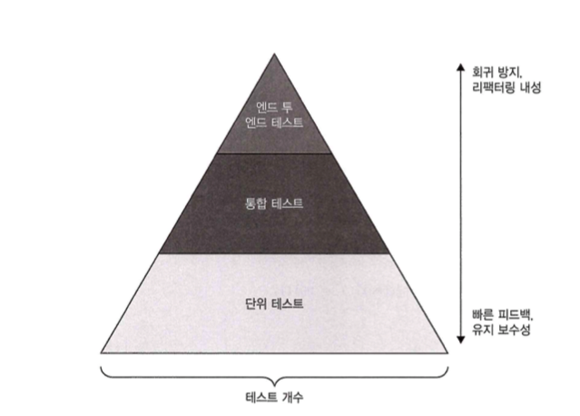
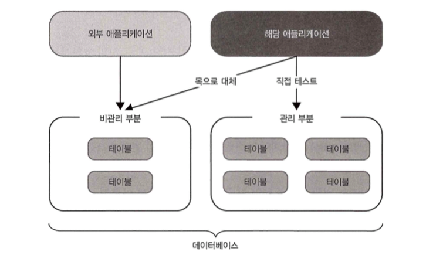

# 통합 테스트와 단위 테스트 심화 가이드 (8.1 & 8.2 챕터)

## 8.1 통합 테스트는 무엇인가?

### 8.1.1 통합 테스트의 역할 (p.272)
통합 테스트는 단위 테스트가 충족해야 하는 세 가지 조건 중 하나라도 만족하지 못하는 테스트를 의미합니다.[1]

**단위 테스트의 필수 조건:**
- 단일 동작 단위 검증
- 빠른 실행 속도  
- 다른 테스트와의 격리성

**테스트 분류표**
| 테스트 유형 | 테스트 대상 | 실행 속도 | 격리성 | 주요 특징 |
|------------|------------|----------|--------|----------|
| 단위 테스트 | 도메인 모델 및 알고리즘 | 빠름 | 높음 | 단일 기능 검증 |
| 통합 테스트 | 컨트롤러 및 외부 의존성 | 느림 | 낮음 | 시스템 간 상호작용 검증 |

### 8.1.2 테스트 피라미드 재조명 (p.273-274)

**테스트 피라미드 구조**



**피라미드 구성 요소별 특성표**
| 계층 | 비율 | 실행 속도 | 유지비용 | 회귀 방지 | 리팩터링 내성 |
|------|------|----------|----------|----------|---------------|
| 단위 테스트 | 높음 | 빠름 | 낮음 | 보통 | 낮음 |
| 통합 테스트 | 중간 | 보통 | 높음 | 높음 | 높음 |
| E2E 테스트 | 낮음 | 느림 | 매우 높음 | 매우 높음 | 매우 높음 |

### 8.1.3 빠른 실패 원칙 (p.275-277)

**빠른 실패 원칙의 핵심 개념:**
- 예기치 않은 오류 발생 시 즉시 현재 연산 중단
- 피드백 루프 단축으로 버그 조기 발견
- 지속성 상태 보호로 데이터 손상 방지[2][3]

## 8.2 프로세스 외부 의존성 테스트 전략

### 8.2.1 외부 의존성의 두 가지 유형 (p.277-278)

**의존성 분류 및 처리 방법**
| 의존성 유형 | 정의 | 예시 | 테스트 방법 | 이유 |
|------------|------|------|------------|-----|
| 관리 의존성 | 애플리케이션에서만 접근 가능 | 데이터베이스 | 실제 인스턴스 사용 | 최종 상태 확인이 중요 |
| 비관리 의존성 | 외부에서 상호작용 관찰 가능 | SMTP, 메시지 버스 | 목(Mock) 사용 | 통신 패턴 유지가 중요 |

### 8.2.2 복합 의존성 처리 (p.279-280)

**공유 데이터베이스 처리 전략**



### 8.2.3 제약 상황에서의 대응 (p.280-281)
실제 데이터베이스 사용이 불가능한 경우:
- 관리 의존성을 목으로 대체하지 말 것
- 통합 테스트 작성을 포기하고 단위 테스트에 집중
- 가치 없는 테스트는 작성하지 않는 것이 나음

***

## 요약

**통합 테스트의 핵심 원리:**
1. **정의**: 단위 테스트 조건(단일 동작, 빠른 실행, 격리성) 중 하나라도 불충족하는 모든 테스트
2. **테스트 피라미드**: 많은 단위 테스트 + 적당한 통합 테스트 + 최소한의 E2E 테스트
3. **의존성 처리**: 관리 의존성은 실제 사용, 비관리 의존성은 목 사용
4. **빠른 실패**: 오류 발생 시 즉시 중단하여 피드백 루프 단축

***

## Kotlin 예제 코드

### AS-IS: 잘못된 통합 테스트 접근법

```kotlin
// 도메인 모델 - 주문 관리 시스템
data class Order(
    val id: Long,
    val customerId: Long,
    val items: List,
    val status: OrderStatus = OrderStatus.PENDING
) {
    fun calculateTotal(): BigDecimal {
        return items.sumOf { it.price * it.quantity.toBigDecimal() }
    }
    
    fun canCancel(): String? {
        return when (status) {
            OrderStatus.SHIPPED, OrderStatus.DELIVERED -> "배송 완료된 주문은 취소할 수 없습니다"
            OrderStatus.CANCELLED -> "이미 취소된 주문입니다"
            else -> null
        }
    }
}

data class OrderItem(val productId: Long, val price: BigDecimal, val quantity: Int)
enum class OrderStatus { PENDING, CONFIRMED, SHIPPED, DELIVERED, CANCELLED }

// AS-IS: 잘못된 접근법 - 관리 의존성(DB)을 목으로 대체
class BadOrderController(
    private val orderRepository: OrderRepository,
    private val emailService: EmailService // 비관리 의존성
) {
    fun cancelOrder(orderId: Long): String {
        val order = orderRepository.findById(orderId)
            ?: return "주문을 찾을 수 없습니다"
        
        val error = order.canCancel()
        if (error != null) return error
        
        val cancelledOrder = order.copy(status = OrderStatus.CANCELLED)
        orderRepository.save(cancelledOrder)
        emailService.sendCancellationEmail(order.customerId, orderId)
        
        return "주문이 취소되었습니다"
    }
}

interface OrderRepository {
    fun findById(id: Long): Order?
    fun save(order: Order): Order
}

interface EmailService {
    fun sendCancellationEmail(customerId: Long, orderId: Long)
}
```

**AS-IS 테스트 (잘못된 방식)**

```kotlin
import io.kotest.core.spec.style.BehaviorSpec
import io.kotest.matchers.shouldBe
import io.mockk.every
import io.mockk.mockk
import io.mockk.verify
import java.math.BigDecimal

class BadOrderControllerTest : BehaviorSpec({
    given("주문 취소 컨트롤러") {
        val mockOrderRepository = mockk() // 관리 의존성을 목으로 대체 (잘못된 방법)
        val mockEmailService = mockk()
        val controller = BadOrderController(mockOrderRepository, mockEmailService)

        `when`("유효한 주문을 취소할 때") {
            val orderId = 1L
            val order = Order(
                id = orderId,
                customerId = 100L,
                items = listOf(OrderItem(1L, BigDecimal("10.00"), 2)),
                status = OrderStatus.PENDING
            )
            
            every { mockOrderRepository.findById(orderId) } returns order
            every { mockOrderRepository.save(any()) } returns order.copy(status = OrderStatus.CANCELLED)
            every { mockEmailService.sendCancellationEmail(any(), any()) } returns Unit

            val result = controller.cancelOrder(orderId)

            then("성공 메시지를 반환한다") {
                result shouldBe "주문이 취소되었습니다"
                // 문제: DB 실제 저장 상태를 확인할 수 없음
                // 문제: 목 상호작용만 검증하므로 리팩터링 내성이 낮음
                verify { mockOrderRepository.save(match { it.status == OrderStatus.CANCELLED }) }
                verify { mockEmailService.sendCancellationEmail(100L, 1L) }
            }
        }
    }
})
```

### TO-BE: 올바른 통합 테스트 접근법

```kotlin
// TO-BE: 올바른 접근법
class GoodOrderController(
    private val orderRepository: OrderRepository,
    private val emailService: EmailService
) {
    fun cancelOrder(orderId: Long): String {
        val order = orderRepository.findById(orderId)
            ?: return "주문을 찾을 수 없습니다"
        
        // 빠른 실패 원칙 적용 - 사전 조건 확인
        val error = order.canCancel()
        if (error != null) return error
        
        val cancelledOrder = order.copy(status = OrderStatus.CANCELLED)
        orderRepository.save(cancelledOrder) // 관리 의존성 - 실제 DB 사용
        emailService.sendCancellationEmail(order.customerId, orderId) // 비관리 의존성 - 목 사용
        
        return "주문이 취소되었습니다"
    }
}

// 실제 DB 구현체 (테스트용 인메모리 DB)
class InMemoryOrderRepository : OrderRepository {
    private val orders = mutableMapOf()
    
    override fun findById(id: Long): Order? = orders[id]
    
    override fun save(order: Order): Order {
        orders[order.id] = order
        return order
    }
    
    fun clear() = orders.clear()
    fun findAll(): List = orders.values.toList()
}
```

**TO-BE 테스트 (올바른 방식)**

```kotlin
import io.kotest.core.spec.style.BehaviorSpec
import io.kotest.matchers.shouldBe
import io.mockk.mockk
import io.mockk.verify
import java.math.BigDecimal

class GoodOrderControllerIntegrationTest : BehaviorSpec({
    given("주문 취소 통합 테스트") {
        val realOrderRepository = InMemoryOrderRepository() // 관리 의존성 - 실제 인스턴스 사용
        val mockEmailService = mockk(relaxed = true) // 비관리 의존성 - 목 사용
        val controller = GoodOrderController(realOrderRepository, mockEmailService)

        beforeEach {
            realOrderRepository.clear()
        }

        `when`("유효한 주문을 취소할 때 - 주요 흐름(Happy Path)") {
            val orderId = 1L
            val originalOrder = Order(
                id = orderId,
                customerId = 100L,
                items = listOf(OrderItem(1L, BigDecimal("10.00"), 2)),
                status = OrderStatus.PENDING
            )
            
            // 준비: 실제 DB에 주문 저장
            realOrderRepository.save(originalOrder)

            val result = controller.cancelOrder(orderId)

            then("성공 메시지를 반환하고 실제 DB 상태가 변경된다") {
                result shouldBe "주문이 취소되었습니다"
                
                // 관리 의존성: 실제 DB 최종 상태 검증
                val updatedOrder = realOrderRepository.findById(orderId)!!
                updatedOrder.status shouldBe OrderStatus.CANCELLED
                
                // 비관리 의존성: 통신 패턴 검증
                verify { mockEmailService.sendCancellationEmail(100L, 1L) }
            }
        }

        `when`("이미 배송된 주문을 취소하려 할 때 - 예외 상황") {
            val orderId = 2L
            val shippedOrder = Order(
                id = orderId,
                customerId = 200L,
                items = listOf(OrderItem(2L, BigDecimal("20.00"), 1)),
                status = OrderStatus.SHIPPED
            )
            
            realOrderRepository.save(shippedOrder)

            val result = controller.cancelOrder(orderId)

            then("에러 메시지를 반환하고 DB 상태는 변경되지 않는다") {
                result shouldBe "배송 완료된 주문은 취소할 수 없습니다"
                
                // 관리 의존성: DB 상태 변경되지 않음을 확인
                val unchangedOrder = realOrderRepository.findById(orderId)!!
                unchangedOrder.status shouldBe OrderStatus.SHIPPED
                
                // 비관리 의존성: 이메일 발송되지 않음
                verify(exactly = 0) { mockEmailService.sendCancellationEmail(any(), any()) }
            }
        }
    }
})

// 단위 테스트는 도메인 모델에 집중
class OrderUnitTest : BehaviorSpec({
    given("주문 도메인 모델") {
        `when`("취소 가능성을 확인할 때") {
            then("대기중 주문은 취소 가능하다") {
                val order = Order(1L, 100L, listOf(), OrderStatus.PENDING)
                order.canCancel() shouldBe null
            }
            
            then("배송된 주문은 취소 불가능하다") {
                val order = Order(1L, 100L, listOf(), OrderStatus.SHIPPED)
                order.canCancel() shouldBe "배송 완료된 주문은 취소할 수 없습니다"
            }
        }
        
        `when`("총액을 계산할 때") {
            then("모든 아이템의 가격 * 수량 합계를 반환한다") {
                val items = listOf(
                    OrderItem(1L, BigDecimal("10.00"), 2),
                    OrderItem(2L, BigDecimal("5.00"), 3)
                )
                val order = Order(1L, 100L, items)
                order.calculateTotal() shouldBe BigDecimal("35.00")
            }
        }
    }
})
```

## 인터넷 자료 정리

### 1. 테스트 피라미드의 현대적 해석
Martin Fowler의 "The Practical Test Pyramid"에 따르면, 원래의 테스트 피라미드는 너무 단순화되어 있으며, 현대 개발에서는 각 계층의 명칭과 비율을 프로젝트에 맞게 조정해야 한다고 강조합니다.[4]

**핵심 원칙:**
- 다양한 세분화 수준에서 테스트 작성
- 상위 레벨로 갈수록 테스트 수 감소
- 팀과 코드베이스 내에서 일관성 유지

### 2. 빠른 실패 원칙의 실무 적용
CodeReliant의 자료에 따르면, 빠른 실패 원칙은 분산 시스템에서 특히 중요하며, 네트워크 호출 타임아웃, 시작 시 헬스 체크, API 요청 검증 등에 적용됩니다.[5]

**참고 링크:**
- [Martin Fowler - The Practical Test Pyramid](https://martinfowler.com/articles/practical-test-pyramid.html)
- [CircleCI - Testing Pyramid Guide](https://circleci.com/blog/testing-pyramid/)
- [Enterprise Craftsmanship - Fail Fast Principle](https://enterprisecraftsmanship.com/posts/fail-fast-principle/)

---


[1] https://www.geeksforgeeks.org/software-engineering/difference-between-unit-testing-and-integration-testing/
[2] https://www.lambdatest.com/learning-hub/fail-fast
[3] https://enterprisecraftsmanship.com/posts/fail-fast-principle/
[4] https://martinfowler.com/articles/practical-test-pyramid.html
[5] https://www.codereliant.io/p/fail-fast-pattern
[6] https://ppl-ai-file-upload.s3.amazonaws.com/web/direct-files/attachments/32004849/65e74743-48d2-43d7-b484-ab70aeaaee54/2501-danwi-teseuteu-pages-264-273.pdf
[7] https://circleci.com/blog/testing-pyramid/
[8] https://www.browserstack.com/guide/unit-testing-vs-integration-testing
[9] https://dev.to/ann55/guide-to-the-software-testing-pyramid-3mob
[10] https://www.practitest.com/resource-center/article/unit-test-vs-integration-test/
[11] https://codefresh.io/learn/unit-testing/unit-testing-vs-integration-testing-5-key-differences-and-why-you-need-both/
[12] https://thectoclub.com/software-development/testing-pyramid/
[13] https://katalon.com/resources-center/blog/stop-test-execution-fail-fast
[14] https://brightsec.com/blog/unit-testing-vs-integration-testing-4-key-differences-and-how-to-choose/
[15] https://testomat.io/blog/testing-pyramid-role-in-modern-software-testing-strategies/
[16] https://en.wikipedia.org/wiki/Fail-fast_system
[17] https://www.youtube.com/watch?v=pf6Zhm-PDfQ
[18] https://www.parasoft.com/blog/testing-automation-pyramids-for-software-development/
[19] https://www.telliant.com/failing-fast-the-key-to-agile-software-development
[20] https://circleci.com/blog/unit-testing-vs-integration-testing/
[21] https://www.leapwork.com/blog/testing-pyramid