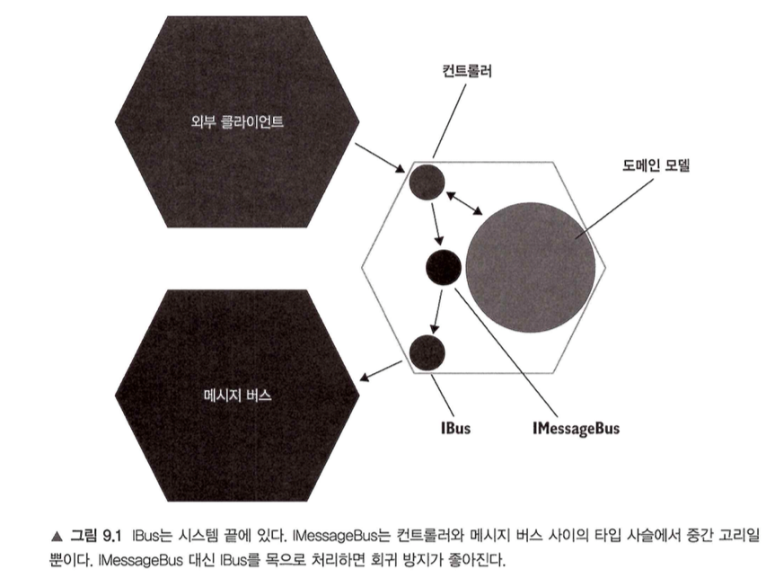

## 9장 목 처리에 대한 모범 사례

### 9.1 목의 가치를 극대화하기 [p.313-323]

**핵심 개념**
- 목(Mock)은 비관리 의존성(외부 애플리케이션과 통신하는 부분)에만 사용해야 함.
- 하지만 이 원칙만으로는 충분치 않고, 시스템 끝에서 상호작용을 검증해야 회귀 방지와 리팩터링 내성을 극대화할 수 있다.

**예제 (CRM 시스템)**
- 기능: 사용자의 이메일을 변경하면 메시지 버스와 로거에 기록.
- IMessageBus → IBus 계층 구조가 있음.
- 잘못된 접근: `중간 계층`(IMessageBus)을 목 처리.
- 권장 접근: 시스템 끝(IBus)을 목 처리 → 더 많은 코드가 실행되며, 외부와 실제 교환되는 메시지 형식이 검증됨.
    - 리팩터링으로 IMessageBus가 없어지거나 구조가 변하면 테스트가 바로 깨져버림. → 테스트가 "구현 세부사항"에 묶여버리게 됨.

#### 9.1.1 시스템 끝에서 검증 [p.317-320]
- IMessageBus 대신 IBus를 대상으로 검증.
- 외부와 교환되는 메시지의 실제 텍스트를 검증하므로 회귀 방지 효과↑, 리팩터링 내성↑.
- 컨트롤러, EventDispatcher 등은 내부 구현 세부사항일 뿐 → 테스트가 그것에 묶이면 취약해짐.
- "시스템 끝(system boundary)에 있는 의존성을 목 처리하라." 
    - 즉, 가장 마지막에 외부와 직접 통신하는 계층(IBus)을 목으로 만들어야 합니다.


#### 9.1.2 목 대신 스파이 사용 [p.321-323]
- 스파이(Spy)는 직접 작성한 Mock.
- 장점: 
    - 검증 로직을 재사용 → 테스트 크기 축소, 가독성 ↑.
    - 플루언트 인터페이스 제공 가능.
    - 테스트는 제품 코드의 클래스(MessageBus)가 아니라 독립적인 Spy를 사용해야 신뢰성 ↑.

#### 9.1.3 IDomainLogger 다루기 [p.323]
- 메시지 버스는 외부 시스템과 직접 통신하므로 구조가 중요 → 시스템 끝에서 검증 필요.
- 로그는 외부 독자(운영자, 관리자)에게 정보만 전달하면 되므로, IDomainLogger 인터페이스 수준에서 목 처리해도 충분.

---

### 💡 제 생각
- 메시지 버스는 **진짜 외부 계약**이므로 반드시 끝단 메시지를 검증해야 한다는 점이 핵심.
- 로깅은 단순 모니터링 용도이므로 굳이 끝단까지 검증할 필요 없음 → 테스트 비용과 가치의 균형을 잘 설명한 부분.
- 실무에서도 메시지 큐(Kafka, RabbitMQ) 통합 테스트 시 **실제 발행된 메시지**를 검증하는 습관이 중요하다고 느낌.
- 테스트는 **외부 세계와의 약속**을 검증해야지, **내부 구현이 어떻게 돌아가는지**에 집착하면 안 된다는 뜻.

---

### 9.2 목 처리에 대한 모범 사례 [p.324-328]

**모범 사례 정리**
1.	목은 통합 테스트에서만 사용
	- `단위 테스트`에서는 `목 사용 금지`.
	- 도메인 모델 = 순수 로직 → 단위 테스트.
	- 컨트롤러 = 외부 의존성 통신 → 통합 테스트 (여기서 목 활용).
2.	목은 여러 개 사용 가능
	- “테스트당 목 하나”는 잘못된 규칙.
	- 필요한 만큼(=동작 단위에 필요한 만큼) 사용 가능.
3.	호출 횟수 검증 필수
	- 기대한 호출이 있는지 + 불필요한 호출이 없는지 둘 다 확인해야 함.
	- Times.Once + VerifyNoOtherCalls() 사용.
	- Spy라면 ShouldSendNumberOfMessages(1) 같은 메서드로 통합 검증.
4.	보유 타입만 목으로 처리
	- 서드파티 라이브러리 위에 어댑터를 만들고, 그 어댑터를 목 처리.
	- 이유: 서드파티 변경에 따른 파급효과 최소화(anti-corruption layer).
	- 예: 메시지 버스 SDK → IBus 어댑터 → 목 처리.

---

💡 제 생각
	- “보유 타입만 목으로 처리” 원칙이 특히 인상 깊음. -> 쉽게 이야기 하면 인터페이스를 목으로 처리해야 한다. 
	- 실무에서도 외부 API/라이브러리를 그대로 목 처리하면 깨지기 쉬운 테스트가 됨.
	- 어댑터 계층을 두는 것이 DDD, 헥사고날 아키텍처와도 잘 맞음. -> 외부 호출 어댑터는 대부분 인터페이스로 구현이 되어 있으며, 구현체는 해당 도메인에서 알지 못함.

---

요약
- 목은 비관리 의존성 + 시스템 끝에서만 사용.
- 중간 계층이 아니라 외부로 나가는 최종 인터페이스를 목/스파이 처리해야 회귀 방지와 리팩터링 내성이 높아짐.
- 스파이는 목보다 유리 (코드 재사용, 가독성, 독립성).
- 로깅은 끝단까지 검증할 필요 없음 → 인터페이스 수준으로 충분.
- 모범 사례:
    1.	통합 테스트에서만 목 사용
    2.	필요한 만큼 목 사용
    3.	호출 횟수 반드시 검증
    4.	서드파티 라이브러리 대신 보유 타입을 목 처리

---

### Kotlin 예제 코드

**도메인 시나리오: 고객 이메일 변경 시 메시지 발송**

#### As-Is (잘못된 목 사용: 중간 계층 목 처리)

```kotlin
class UserController(
    private val database: Database,
    private val messageBus: IMessageBus,
    private val logger: DomainLogger
) {
    fun changeEmail(userId: Int, newEmail: String): String {
        val user = database.getUser(userId)
        val company = database.getCompany()

        user.changeEmail(newEmail, company)
        database.saveUser(user)
        database.saveCompany(company)

        messageBus.sendEmailChanged(user.id, newEmail) // 중간 계층 호출
        logger.userTypeChanged(user.id, "Employee", "Customer")

        return "OK"
    }
}

interface IMessageBus {
    fun sendEmailChanged(userId: Int, newEmail: String)
}
```

테스트 (중간 계층 목)

```kotlin
class UserControllerTest : StringSpec({
    "이메일 변경 시 IMessageBus 호출 검증" {
        val db = InMemoryDatabase()
        val messageBus = mockk<IMessageBus>(relaxed = true)
        val logger = mockk<DomainLogger>(relaxed = true)

        val sut = UserController(db, messageBus, logger)

        sut.changeEmail(1, "new@gmail.com")

        verify(exactly = 1) { messageBus.sendEmailChanged(1, "new@gmail.com") }
    }
})
```


To-Be (끝단 계층 목/스파이 사용)
```kotlin
class MessageBus(private val bus: Bus) {
    fun sendEmailChanged(userId: Int, newEmail: String) {
        val message = "Type: USER EMAIL CHANGED; Id: $userId; NewEmail: $newEmail"
        bus.send(message)
    }
}

interface Bus {
    fun send(message: String)
}

class BusSpy : Bus {
    private val sentMessages = mutableListOf<String>()

    override fun send(message: String) {
        sentMessages.add(message)
    }

    fun shouldSendEmailChanged(userId: Int, newEmail: String) {
        val expected = "Type: USER EMAIL CHANGED; Id: $userId; NewEmail: $newEmail"
        require(sentMessages.contains(expected)) { "Expected message not found" }
    }

    fun shouldSendNumberOfMessages(count: Int) {
        require(sentMessages.size == count) { "Expected $count messages but got ${sentMessages.size}" }
    }
}
```
테스트 (끝단 계층 검증)
```kotlin
class UserControllerIntegrationTest : StringSpec({
    "이메일 변경 시 메시지 버스에 실제 메시지가 발송된다" {
        val db = InMemoryDatabase()
        val busSpy = BusSpy()
        val messageBus = MessageBus(busSpy)
        val logger = mockk<DomainLogger>(relaxed = true)

        val sut = UserController(db, messageBus, logger)

        sut.changeEmail(1, "new@gmail.com")

        busSpy.shouldSendNumberOfMessages(1)
        busSpy.shouldSendEmailChanged(1, "new@gmail.com")
    }
})
```

---

### 참고할 만한 외부 자료

### 1. Martin Fowler: *Mocks Aren’t Stubs*

* **내용**: 목(Mock)과 스텁(Stub)의 차이를 명확히 정의.

  * **Stub**: 테스트 중 고정된 값을 반환하는 객체.
  * **Mock**: 특정 상호작용(호출 여부, 횟수, 인자 등)을 검증하는 객체.
* **의의**: 테스트 대역(Test Double)을 올바르게 구분하는 데 도움.
* **링크**: [martinfowler.com/articles/mocksArentStubs.html](https://martinfowler.com/articles/mocksArentStubs.html)

---

### 2. Steve Freeman & Nat Pryce: *Growing Object-Oriented Software, Guided by Tests*

* **내용**: TDD 실무 지침서.

  * 객체지향 설계와 테스트를 함께 발전시키는 방법 제시.
  * “**보유 타입만 목 처리**” 원칙 강조 → 외부 라이브러리가 아닌 **우리 코드의 추상화 계층**을 목 처리해야 안정적인 테스트 가능.
* **링크**: [amazon.com – 책 소개](https://www.amazon.com/Growing-Object-Oriented-Software-Guided-Tests/dp/0321503627)

---

### 3. Eric Evans: *Domain-Driven Design*

* **내용**: DDD(도메인 주도 설계)의 고전.

  * **Anti-Corruption Layer (ACL)** 개념 제시 → 외부 시스템과 도메인 모델 사이에 보호 계층을 둬서 외부 영향 최소화.
  * 서드파티 시스템이나 레거시 코드와의 결합도를 낮추는 핵심 패턴.
* **링크**: [Microsoft Docs – Anti-Corruption Layer 패턴](https://learn.microsoft.com/en-us/azure/architecture/patterns/anti-corruption-layer)

