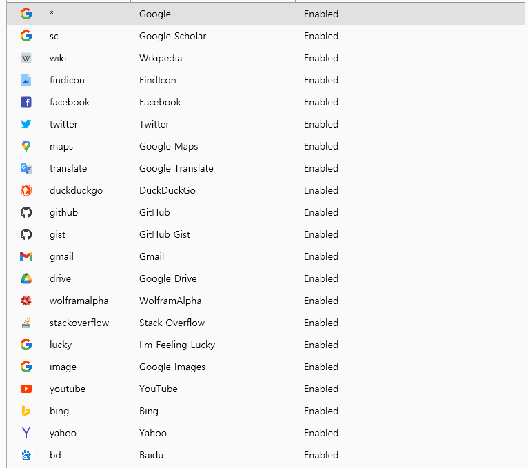

## ✅ Day 2: 앱, 파일, 웹 검색 활용법

---

### 🎯 오늘의 목표

* 앱 실행을 더 빠르게
* 로컬 파일 찾기
* 웹 검색 커맨드 사용해보기

---

### 🔍 1. 앱 실행 (빠르게 찾기)

`Alt + Space` 실행 후 아래처럼 입력해보세요:

```
chrome
notepad
cmd
```

→ 설치된 앱이 자동 완성으로 추천됨
→ 방향키 ↓ / ↑ 로 고르기 → Enter 실행

> 자주 실행하면 **자동 학습**되어 더 빠르게 떠요.

---

### 📂 2. 로컬 파일 검색

* 예: `report.xlsx`, `회의록.docx`, `memo.txt` 입력

> **TIP**: 파일 인덱싱을 위해 `Everything` 플러그인을 설치하면 더 강력해짐 (Day 6에서 다룰 예정)

---

### 🌐 3. 웹 검색하기 (기본 내장)

아래처럼 입력해보세요:

```
goo GPT란 무엇인가
```

* `goo` = google 웹 검색 명령어
* Enter → 브라우저에서 검색 결과 열림
* 추가 웹검색 단축어
* 


### ⚡ 예제 실습

| 입력                   | 설명             |
|----------------------| -------------- |
| `chrome`             | 크롬 실행          |
| `cmd`                | 명령 프롬프트 실행     |
| `memo.txt`           | 해당 파일 찾기       |
| `오퍼월 광고란`            | Bing/Google 검색 |
| `goo Kotlin MapStruct` | 구글 검색          |

---

### ⌨️ Hotkeys

| Hotkey                                                                    | Description                                     |
| ------------------------------------------------------------------------- | ----------------------------------------------- |
| <kbd>Alt</kbd>+<kbd>Space</kbd>                                           | Open search window (default and configurable)   |
| <kbd>Enter</kbd>                                                          | Execute                                         |
| <kbd>Ctrl</kbd>+<kbd>Enter</kbd>                                          | Open containing folder                          |
| <kbd>Ctrl</kbd>+<kbd>Shift</kbd>+<kbd>Enter</kbd>                         | Run as admin                                    |
| <kbd>↑</kbd>/<kbd>↓</kbd>, <kbd>Shift</kbd>+<kbd>Tab</kbd>/<kbd>Tab</kbd> | Previous / Next result                          |
| <kbd>←</kbd>/<kbd>→</kbd>                                                 | Back to result / Open Context Menu              |
| <kbd>Ctrl</kbd>+<kbd>O</kbd> , <kbd>Shift</kbd>+<kbd>Enter</kbd>          | Open Context Menu                               |
| <kbd>Ctrl</kbd>+<kbd>Tab</kbd>                                            | `Autocomplete`                                    |
| <kbd>F1</kbd>                                                             | Toggle Preview Panel (default and configurable) |
| <kbd>Esc</kbd>                                                            | Back to results / hide search window            |
| <kbd>Ctrl</kbd>+<kbd>C</kbd>                                              | Copy folder / file                              |
| <kbd>Ctrl</kbd>+<kbd>Shift</kbd>+<kbd>C</kbd>                             | Copy folder / file path                         |
| <kbd>Ctrl</kbd>+<kbd>I</kbd>                                              | Open Flow's settings                            |
| <kbd>Ctrl</kbd>+<kbd>R</kbd>                                              | Run the current query again (refresh results)   |
| <kbd>F5</kbd>                                                             | Reload all plugin data                          |
| <kbd>Ctrl</kbd>+<kbd>F12</kbd>                                            | Toggle Game Mode when in search window          |
| <kbd>Ctrl</kbd>+<kbd>+</kbd>,<kbd>-</kbd>                                 | Adjust maximum results shown                    |
| <kbd>Ctrl</kbd>+<kbd>[</kbd>,<kbd>]</kbd>                                 | Adjust search window width                      |
| <kbd>Ctrl</kbd>+<kbd>H</kbd>                                              | `Open search history`                             |
| <kbd>Ctrl</kbd>+<kbd>Backspace</kbd>                                      | Back to previous directory                      |
| <kbd>PageUp</kbd>/<kbd>PageDown</kbd>                                     | Previous / Next Page                            |

## System Command List

| Command                            | Description                                                                 |
| ---------------------------------- | --------------------------------------------------------------------------- |
| Shutdown                           | Shutdown computer                                                           |
| Restart                            | Restart computer                                                            |
| Restart With Advanced Boot Options | Restart the computer with Advanced Boot option for safe and debugging modes |
| Log Off/Sign Out                   | Log off                                                                     |
| Lock                               | Lock computer                                                               |
| Sleep                              | Put computer to sleep                                                       |
| Hibernate                          | Hibernate computer                                                          |
| Empty Recycle Bin                  | Empty recycle bin                                                           |
| Open Recycle Bin                   | Open recycle bin                                                            |
| Exit                               | Close Flow Launcher                                                         |
| Save Settings                      | Save all Flow Launcher settings                                             |
| Restart Flow Launcher              | Restart Flow Launcher                                                       |
| Settings                           | Tweak this app                                                              |
| Reload Plugin Data                 | Refreshes plugin data with new content                                      |
| Check For Update                   | Check for new Flow Launcher update                                          |
| Open Log Location                  | Open Flow Launcher's log location                                           |
| Index Option                       | Open Windows Search Index window                                            |
| Flow Launcher Tips                 | Visit Flow Launcher's documentation for more help and how to use tips       |
| Flow Launcher UserData Folder      | Open the location where Flow Launcher's settings are stored                 |
| Toggle Game Mode                   | Toggle Game Mode                                                            |
