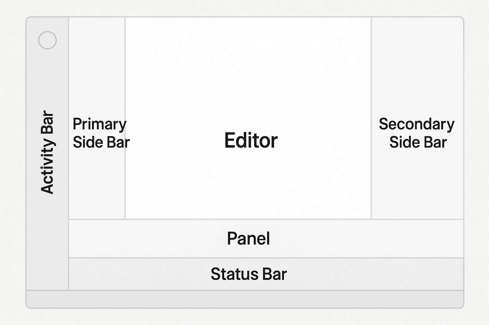

## VSCode UI 구조의 6대 영역
VSCode의 사용자 인터페이스는 효율적인 개발을 위해 6개 주요 영역으로 구성됩니다:[3]


### 1. **Activity Bar (활동 표시줄)  **
- **위치**: 맨 왼쪽
- **기능**: 다양한 뷰 간 전환 및 컨텍스트별 정보 표시 (예: Git 변경사항 수)
- **이동 가능**: 오른쪽으로 이동 가능하며, 우클릭으로 위치 변경
- **단축키**: 
    - `⌘⇧E` Explorer
    - `⌃⇧G` Source control

### 2. **Primary Side Bar (기본 사이드바) **
- **위치**: Activity Bar 옆
- **주요 뷰**: 탐색기(Explorer), 검색, 소스 제어, 실행 및 디버그, 확장 프로그램
- **단축키**: `⌘B`

### 3. **Editor (에디터)**
- **위치**: 중앙의 메인 작업 영역
- **기능**: 파일 편집, 탭으로 여러 파일 관리
- **분할**: 수직/수평으로 여러 에디터 그룹 생성 가능
- **단축키**: 
    - `⌘+1~9` 에디터 그룹별 이동
    - `⌘⇧]` 에디터 그룹내 `다음` 에디터로 이동
    - `⌘⇧[` 에디터 그룹내 `이전` 에디터로 이동
    - `⌘K, ⌘←` `이전` 에디터 그룹으로 포커스 
    - `⌘K, ⌘→` `다음` 에디터 그룹으로 포커스


### 4. **Secondary Side Bar (보조 사이드바)**
- **위치**: Primary Side Bar 반대편 (기본적으로 오른쪽)
- **기본 포함**: Chat 뷰
- **기능**: Primary Side Bar의 뷰를 드래그 앤 드롭으로 이동 가능
- **단축키**: 코파일럿 토글 `⌃⌘I`

### 5. **Panel (패널)**
- **위치**: 에디터 하단 (왼쪽/오른쪽 이동 가능)
- **포함 내용**: 출력, 디버그 정보, 오류/경고, 통합 터미널
- **용도**: 수직 공간 확보를 위해 위치 조정 가능
- **단축키**: 터미널 등이 위치함.  `⌃+백틱`(**`**)

### 6. **Status Bar (상태 표시줄)**
- **위치**: 화면 최하단
- **정보**: 현재 열린 프로젝트 및 편집 중인 파일에 대한 정보 표시

**참고사항**: VSCode는 마지막 종료 시의 상태(폴더, 레이아웃, 열린 파일)를 그대로 복원하여 시작됩니다. 이러한 구조는 최대한의 편집 공간을 확보하면서도 프로젝트 전체 맥락에 쉽게 접근할 수 있도록 설계되었습니다.

[1] https://code.visualstudio.com/docs/getstarted/userinterface

## 단축키 꼼꼼하게 마스터하기
VSCode의 생산성은 단축키 숙련도에 직결됩니다. 아래는 필수 단축키들을 체계적으로 정리한 것입니다:
### VSCode 단축키 가이드

| 카테고리 | 기능 | Windows/Linux | Mac |
|---------|------|---------------|-----|
| 기본 편집 | 행 이동 (위로) | Alt+↑ | ⌥+↑ |
| 기본 편집 | 행 이동 (아래로) | Alt+↓ | ⌥+↓ |
| 기본 편집 | 행 복사 (위로) | Shift+Alt+↑ | ⇧+⌥+↑ |
| 기본 편집 | 행 복사 (아래로) | Shift+Alt+↓ | ⇧+⌥+↓ |
| 기본 편집 | 행 삭제 | Ctrl+Shift+K | ⌘+⇧+K |
| 기본 편집 | 다중 커서 추가 | Alt+클릭 | ⌥+클릭 |
| 기본 편집 | 같은 단어 선택 | Ctrl+D | ⌘+D |
| 검색 및 탐색 | 파일 빠른 열기 | Ctrl+P | ⌘+P |
| 검색 및 탐색 | 전체 검색 | Ctrl+Shift+F | ⌘+⇧+F |
| 검색 및 탐색 | 심볼로 이동 | Ctrl+Shift+O | ⌘+⇧+O |
| 검색 및 탐색 | 줄로 이동 | Ctrl+G | ⌘+G |
| 검색 및 탐색 | 정의로 이동 | F12 | F12 |
| 화면 관리 | 사이드바 토글 | Ctrl+B | ⌘+B |
| 화면 관리 | 터미널 토글 | Ctrl+` | ⌃+` |
| 화면 관리 | 에디터 분할 | Ctrl+\ | ⌘+\ |
| 화면 관리 | 패널 토글 | Ctrl+J | ⌘+J |
| 커맨드 및 디버깅 | 명령 팔레트 | Ctrl+⇧+P | ⌘+⇧+P |


### 단축키 학습 전략
1. **Command Palette (`⌘+⇧+P`)**: VSCode의 만능 도구로, 모든 명령어 검색 및 실행 가능[4][5]
2. **파일 검색 (`Ctrl+P` / `Cmd+P`)**: 프로젝트 내 파일 빠른 탐색[4]
3. **심볼 검색**: Command Palette에서 `@` 입력으로 함수/클래스 검색[4]
4. **줄 이동**: Command Palette에서 `:` 입력 후 줄 번호로 바로 이동[4]

### Kotlin/Java 개발자를 위한 핵심 단축키
- **정의로 이동 (F12)**: IntelliJ의 Ctrl+B와 유사[6]
- **참조 찾기 (Shift+F12)**: 사용처 검색[6]
- **리팩토링 (F2)**: 변수/함수명 일괄 변경[7]
- **빠른 수정 (Ctrl+.)**: IntelliJ의 Alt+Enter와 유사

## 간단한 프로젝트/폴더 오픈
### 기본 프로젝트 열기
- `File > Open Folder...` 또는 `Ctrl+K Ctrl+O`
- 터미널에서 `code .` 명령어로 현재 디렉토리 열기[8]

### Workspace 개념 이해
**Workspace**는 여러 프로젝트 폴더를 하나로 관리하는 VSCode의 강력한 기능입니다:[9][10]
- 단일 폴더 workspace: 하나의 프로젝트 폴더
- Multi-root workspace: 여러 폴더를 `.code-workspace` 파일로 묶어서 관리
- 프로젝트별 설정 분리 가능 (`.vscode/settings.json`)

## 설정(Settings) 꼼꼼 정복
### 설정 접근 방법 3가지
1. **UI 설정**: `Ctrl+,` / `Cmd+,`로 GUI 설정 화면[11]
2. **JSON 설정**: Command Palette → "Preferences: Open Settings (JSON)"[12][13]
3. **키보드 단축키**: `Ctrl+K Ctrl+S`로 단축키 설정 화면[14]

### 사용자 설정 vs 작업공간 설정
VSCode는 두 가지 설정 레벨을 제공합니다:[15][16]

**사용자 설정 (User Settings)**
- 모든 VSCode 인스턴스에 적용되는 전역 설정
- 위치: `%AppData%/Code/User/settings.json` (Windows)

**작업공간 설정 (Workspace Settings)**  
- 특정 프로젝트에만 적용되는 설정
- 위치: `.vscode/settings.json` (프로젝트 루트)
- 팀 협업 시 설정 공유 가능
- 사용자 설정보다 우선순위 높음

## 핵심 설정 항목들
### 언어별 맞춤 설정
**Java 환경 설정**:[17]
```json
{
  "java.home": "/path/to/java",```"java.compile.nullAnalysis.mode": "```omatic",
  "java.configuration.runtimes": [
    {
      "name": "JavaSE-17", 
      "path": "/usr/lib/jvm/java-17-openjdk"
    }
  ]
}
```

**Kotlin 환경 설정**:
```json
{
  "[kotlin]": {
    "editor.defaultFormatter": "mathiasfrohlich.Kotlin",```  "editor.formatOnSave": true,
    "editor.tabSize": 4
  }
}
```

**Python 환경 설정**:[18]
```json
{
  "python.defaultInterpreterPath```"./venv/bin/python",```"python.formatting.provider": "black",
  "[python]": {
    "editor.formatOnSave": true,```  "editor.codeActionsOnSave": {
      "source.organizeImports":```ue
    }
  }
}
```

## Settings Sync으로 환경 동기화
VSCode 1.48.0부터 내장된 Settings Sync 기능으로 여러 디바이스간 설정을 쉽게 동기화할 수 있습니다.[19][20]

### Settings Sync 활성화 방법
1. **톱니바퀴 메뉴** → "Turn on Settings Sync..."[20]
2. **동기화할 항목 선택**: Settings, Extensions, Keyboard shortcuts, UI State 등
3. **계정 선택**: GitHub 또는 Microsoft 계정 연동
4. **자동 동기화**: 백그라운드에서 자동으로 설정 동기화

### 다른 디바이스에서 설정 불러오기
1. 새 디바이스에서 동일한 계정으로 Settings Sync 활성화
2. **병합 옵션 선택**:[19]
   - **Merge**: 로컬과 원격 설정 병합 (권장)
   - **Replace Local**: 원격 설정으로 덮어쓰기 (주의!)
   - **Accept Remote**: 원격 설정만 사용

## 실습 체크리스트### Day 1: 기본 설정
- [ ] VSCode 설치 및 한국어 언어팩 설치[21][22]
- [ ] 기본 UI 영역 파악 및 Activity Bar 기능 테스트
- [ ] Command Palette (`Ctrl+Shift+P`) 활용법 연습
- [ ] 기본 단축키 10개 연습 (파일 열기, 검색, 이동 등)

### Day 2: 고급 설정 
- [ ] settings.json 파일 직접 편집 경험
- [ ] 사용자 설정 vs 작업공간 설정 차이 실습
- [ ] Settings Sync 설정 및 테스트
- [ ] 다양한 단축키 조합 연습 (멀티커서, 행 조작 등)

## 꼼꼼한 개발자를 위한 추가 팁
1. **설정 백업**: settings.json 파일을 별도 저장해두어 복구 시 활용
2. **단축키 커스터마이징**: 자주 사용하는 기능에 대해 개인 맞춤 단축키 설정
3. **Workspace 템플릿**: 프로젝트 유형별 workspace 설정 템플릿 미리 준비
4. **설정 문서화**: 팀 협업을 위한 프로젝트별 설정 가이드 작성

이 오리엔테이션을 통해 VSCode의 기본기를 탄탄히 다져두면, 이후 확장 기능과 고급 기능 학습이 훨씬 수월해집니다. 특히 꼼꼼한 성격을 가진 개발자라면 설정 하나하나의 의미를 이해하고 활용하는 것이 장기적으로 큰 도움이 될 것입니다.

[1] https://priming.tistory.com/55
[2] https://hbase.tistory.com/346
[3] https://code.visualstudio.com/docs/getstarted/userinterface
[4] https://www.daleseo.com/vscode-command-palette/
[5] https://ssimplay.tistory.com/673
[6] https://coding-harry.tistory.com/1
[7] https://maeryo88.tistory.com/210
[8] https://code-boki.tistory.com/112
[9] https://code-algo.tistory.com/178
[10] https://heyoonow.tistory.com/54
[11] https://hackmd.io/@essensee-post/SyuqswX9d
[12] https://uiweb.tistory.com/163
[13] https://gnews365.tistory.com/entry/vscode-settingjson-%EC%97%90-%EB%93%A4%EC%96%B4%EA%B0%80%EA%B8%B0-%EB%B9%84%EC%A3%BC%EC%96%BC-%EC%8A%A4%ED%8A%9C%EB%94%94%EC%98%A4-%EC%BD%94%EB%93%9C
[14] https://s-notee.tistory.com/49
[15] https://crackyachae.tistory.com/70
[16] https://www.inflearn.com/community/questions/849682/settings-json-%EC%95%88%EB%B3%B4%EC%9D%B4%EC%8B%9C%EB%8A%94-%EB%B6%84%EB%93%A4
[17] https://mojing.tistory.com/entry/Visual-Studio-Code-VS-Code-C-%EA%B0%9C%EB%B0%9C-%ED%99%98%EA%B2%BD-%EC%84%A4%EC%A0%95
[18] https://with-rl.tistory.com/entry/VSCode-%EC%84%A4%EC%B9%98-%EB%B0%8F-python-%EA%B0%9C%EB%B0%9C-%ED%99%98%EA%B2%BD-%EA%B5%AC%EC%B6%95
[19] https://pottatt0.tistory.com/entry/VScode-%EC%84%A4%EC%A0%95-%EA%B0%84%EB%8B%A8%ED%95%98%EA%B2%8C-%EB%8F%99%EA%B8%B0%ED%99%94%ED%95%98%EA%B8%B0
[20] https://blog.metafor.kr/211
[21] https://study4silver.tistory.com/252
[22] https://goddaehee.tistory.com/287
[23] https://coding-yun.tistory.com/6
[24] https://www.youtube.com/watch?v=B-fcpCvCpGo
[25] https://oh-bingo.tistory.com/23
[26] https://spartacodingclub.kr/blog/vscode
[27] https://tdoodle.tistory.com/entry/VS-Code-%EC%82%AC%EC%9A%A9%EB%B2%95-%EC%A0%95%EB%A6%AC
[28] https://crazykim2.tistory.com/748
[29] https://vscode.mogumogu.dev/docs/editor/custom-layout
[30] https://learn.microsoft.com/ko-kr/visualstudio/ide/reference/implement-interface?view=vs-2022
[31] https://www.youtube.com/watch?v=-FLbvJAM_eU
[32] https://kh-kim.github.io/nlp_with_deep_learning_blog/docs/1-01-environmental_setup/02-ide_setup/
[33] https://yeseobaek.tistory.com/entry/%EB%B9%84%EC%A3%BC%EC%96%BC-%EC%8A%A4%ED%8A%9C%EB%94%94%EC%98%A4-%EC%BD%94%EB%93%9C-HTML5-%EA%B8%B0%EB%B3%B8-%EA%B5%AC%EC%A1%B0-%EC%84%B8%ED%8C%85
[34] https://bttrthn-ystrdy.tistory.com/125
[35] https://velog.io/@jjoung-2j/Visual-Studio-Code-%EC%84%A4%EC%B9%98-%EB%B0%8F-%EC%84%A4
[36] https://www.youtube.com/live/KKtE6yDhEus
[37] https://speedspeed.tistory.com/143
[38] https://demun.github.io/vscode-tutorial/shortcuts/
[39] https://inpa.tistory.com/entry/VS-Code-%E2%8F%B1%EF%B8%8F-%EC%9C%A0%EC%9A%A9%ED%95%9C-%EB%8B%A8%EC%B6%95%ED%82%A4-%EC%A0%95%EB%A6%AC
[40] https://www.youtube.com/watch?v=37UeMIdlGug
[41] https://www.biew.co.kr/entry/Visual-Studio-CodeVS-Code-%EC%9C%A0%EC%9A%A9%ED%95%9C-%EB%8B%A8%EC%B6%95%ED%82%A4-%EC%82%AC%EC%9A%A9-%EB%B0%A9%EB%B2%95
[42] https://kkotkkio.tistory.com/101
[43] https://velog.io/@fizzy/VSCode-%EC%BB%A4%EB%A7%A8%EB%93%9C-%ED%8C%94%EB%A0%88%ED%8A%B8
[44] https://mutpp.tistory.com/entry/Visual-Studio-Code-%EB%8B%A8%EC%B6%95%ED%82%A4
[45] https://velog.io/@woohm402/no-mouse-1-vscode
[46] https://docs.github.com/ko/codespaces/reference/using-the-vs-code-command-palette-in-codespaces
[47] https://www.youtube.com/watch?v=EVxCdenPbFs
[48] https://bo-10000.tistory.com/185
[49] https://puddingcamp.com/page/942a72a0-c478-42f8-b9cb-e1f07017e056
[50] https://dev-handbook.tistory.com/129
[51] https://monsters-dev.tistory.com/7
[52] https://gwonsungjun.github.io/articles/2018-06/vscodeSetting
[53] https://jjongguet.tistory.com/73
[54] https://chinsun9.github.io/2020/11/02/vscode-%EC%9B%8C%ED%81%AC%EC%8A%A4%ED%8E%98%EC%9D%B4%EC%8A%A4-%ED%94%84%EB%A1%9C%EC%A0%9D%ED%8A%B8%EB%B3%84%EB%A1%9C-%EC%84%A4%EC%A0%95-%EB%8B%A4%EB%A5%B4%EA%B2%8C%ED%95%98%EA%B8%B0/
[55] https://whitekeyboard.tistory.com/884
[56] https://parkjh7764.tistory.com/entry/vscode-%EA%B0%9C%EB%B0%9C-%ED%99%98%EA%B2%BD-%EC%84%A4%EC%A0%95-%EB%8F%99%EA%B8%B0%ED%99%94-%ED%95%98%EA%B3%A0-%EB%B6%88%EB%9F%AC%EC%98%A4%EA%B8%B0-%EB%B9%84%EC%A3%BC%EC%96%BC%EC%8A%A4%ED%8A%9C%EB%94%94%EC%98%A4%EC%BD%94%EB%93%9C-%EC%84%B8%ED%8C%85-%EC%84%A4%EC%A0%95-%EB%8F%99%EA%B8%B0%ED%99%94
[57] https://velog.io/@deveq/vs-code-%EC%9B%8C%ED%81%AC%EC%8A%A4%ED%8E%98%EC%9D%B4%EC%8A%A4-%EB%B3%84-language-mode-%EC%84%A4%EC%A0%95%EB%B2%95
[58] https://steady-record.tistory.com/entry/VSC-visual-studio-code-%EC%84%A4%EC%B9%98-%EB%B0%8F-%ED%99%98%EA%B2%BD%EC%84%A4%EC%A0%95
[59] https://www.servicenow.com/docs/ko-KR/bundle/washingtondc-application-development/page/build/applications/task/setup-workspace.html
[60] https://yeseobaek.tistory.com/entry/%EB%B9%84%EC%A3%BC%EC%96%BC-%EC%8A%A4%ED%8A%9C%EB%94%94%EC%98%A4-%EC%BD%94%EB%93%9C-%EC%84%B8%ED%8C%85-settingsjson
[61] https://dev.to/emmanuelthecoder/vs-code-settings-sync-basics-troubleshooting-and-more-3hm
[62] https://betterprogramming.pub/sync-visual-studio-code-settings-extensions-shortcuts-across-multiple-devices-9fa6a980f25e
[63] https://kimyang-sun.tistory.com/entry/VSCode-vscode-%EC%84%A4%EC%A0%95-%EC%A0%80%EC%9E%A5Settings-Sync-%EB%8F%99%EA%B8%B0%ED%99%94-%EC%82%AC%EC%9A%A9%ED%95%98%EA%B8%B0
[64] https://code.visualstudio.com/docs/configure/settings-sync
[65] https://developer-carmel.tistory.com/4
[66] https://www.youtube.com/watch?v=Q1z7x5eLtS8
[67] https://geonlee.tistory.com/237
[68] https://code.visualstudio.com/docs/configure/settings
[69] https://defian.tistory.com/entry/VSCode-%EA%B0%9C%EB%B0%9C%ED%99%98%EA%B2%BD-%EB%8F%99%EC%9D%BC%ED%95%98%EA%B2%8C-%EA%B4%80%EB%A6%AC%ED%95%98%EA%B8%B0-Settings-Sync-%EC%82%AC%EC%9A%A9%EB%B2%95
[70] https://stackoverflow.com/questions/76939783/enabling-settings-sync-deleted-all-local-settings-without-merging
[71] https://www.youtube.com/watch?v=1vTp5g-1Z58
[72] https://inpa.tistory.com/entry/VS-Code-%E2%8F%B1%EF%B8%8F-%EC%84%A4%EC%A0%95-%EB%8F%99%EA%B8%B0%ED%99%94-%ED%95%98%EA%B8%B0-%EB%8B%A4%EB%A5%B8-%EC%BB%B4%ED%93%A8%ED%84%B0%EC%97%90%EC%84%9C%EB%8F%84-%EA%B0%99%EC%9D%80-%EC%BD%94%EB%94%A9%ED%99%98%EA%B2%BD%EC%9D%84
[73] https://github.com/zokugun/vscode-sync-settings
[74] https://80000coding.oopy.io/9822b952-339f-49bb-8c41-7a852bfe9b3e
[75] https://stdhsw.tistory.com/131